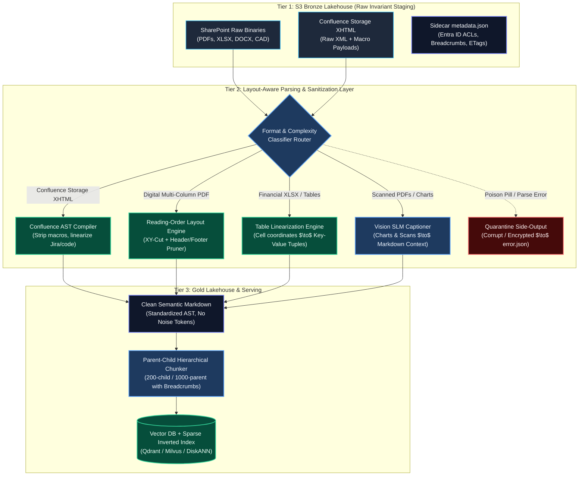

# Enterprise Document Parsing & Noise-Free Sanitization for RAG

> **Document Type:** Principal Data & AI Systems Engineer (L6 / L7) Reference Architecture & Model Answer  
> **Evaluation Framework:** [docs/questions/01_enterprise_rag_senior_principal_assessment.md](file:///Users/toanbui/dev/data_ai_engineer/docs/questions/01_enterprise_rag_senior_principal_assessment.md)  
> **Topic:** Layout-Aware Ingestion, Confluence XHTML Macro Compilation, Table Linearization, Multimodal Vision Extraction & Token Noise Elimination  
> **Applicable Rules:** Conforms strictly to [.agents/rules/data_ai_architect_persona.md](file:///.agents/rules/data_ai_architect_persona.md)

---

## The Question

> *"Enterprise documents from SharePoint and Confluence are notoriously messy: multi-column PDFs, financial spreadsheets, embedded charts, complex Confluence macros (`<ac:structured-macro>`), and scanned agreements. How did your ingestion pipeline process these diverse formats into a clean representation suitable for tokenization without injecting noisy tokens into the LLM context?"*

---

## 1. Executive Framing & Architectural Philosophy

In enterprise RAG, the single biggest point of failure isn't the vector database or the LLM—it is **noise injection during document parsing**. If you feed raw XML macros, broken table delimiters, or interleaved multi-column text into an embedding model, you trigger two fatal failure modes:
1. **Vector Distance Degradation**: Dense embeddings average semantic meaning across tokens; 30%+ noise tokens dilute the semantic vector until retrieval recall collapses.
2. **Context Window Contamination**: The LLM wastes precious attention heads deciphering table artifacts, repeated running footers, and unrendered Confluence tags instead of synthesizing facts.

We architected our document ingestion as a **Three-Tier Medallion Document Compiler** (Bronze Raw Binaries $\to$ Silver Semantic Markdown $\to$ Gold Aligned Token Chunks), routing each format through specialized, layout-aware normalization engines with deterministic data contracts.



---

## 2. Format-by-Format Normalization Deep Dive

### 2.1. Atlassian Confluence Proprietary Storage XHTML (`<ac:structured-macro>`)

#### The Failure Mode
Confluence REST API v2 (`?body-format=storage`) returns raw XHTML filled with proprietary Atlassian tags (`<ac:structured-macro>`, `<ac:parameter>`, `<ri:user>`, `<ac:layout>`). Naive HTML-to-text tools either strip everything (losing code blocks, warning callouts, and Jira tickets) or dump raw XML strings that waste 30%+ of the context tokens on tags like `<ac:rich-text-body>`.

#### The Engineering Solution: AST-Based XML Compiler
We built an `lxml`-based Abstract Syntax Tree (AST) transformer with specialized macro handlers:

* **Code Blocks (`ac:name="code"`)**: We extract the inner `<ac:plain-text-body>` and wrap it in standard fenced Markdown with language identifiers (` ```python ... ``` `).
* **Panels & Callouts (`info`, `warning`, `note`, `tip`)**: Converted directly to standard GitHub-style Markdown alerts (`> [!NOTE]`, `> [!WARNING]`).
* **Jira Issue Links (`ac:name="jira"`)**: We extract the issue key and summary, linearizing into `[PROJ-1234: Implement Rate Limiting](https://jira.corp/browse/PROJ-1234)`.
* **Expand / Accordion Sections (`ac:name="expand"`)**: Unwrapped so that the title and hidden body are flattened into regular Markdown sections (`### Title\nBody`).
* **Noise Pruning**: Recursively strip navigational macros (`toc`, `children`, `pagetree`, `recently-updated`), user profile cards (`<ri:user>`), author avatar thumbnails, and layout grid wrappers (`<ac:layout>`, `<ac:layout-section>`).

```python
# Confluence AST Macro Extraction Pattern (lxml)
from lxml import etree

def sanitize_confluence_xhtml(raw_xhtml: str) -> str:
    tree = etree.fromstring(f"<root>{raw_xhtml}</root>")
    
    # 1. Linearize code blocks
    for macro in tree.xpath('//ac:structured-macro[@ac:name="code"]', namespaces={'ac': 'http://www.atlassian.com/schema/confluence/4/ac/'}):
        body = macro.xpath('.//ac:plain-text-body/text()', namespaces={'ac': 'http://www.atlassian.com/schema/confluence/4/ac/'})
        lang = macro.xpath('.//ac:parameter[@ac:name="language"]/text()', namespaces={'ac': 'http://www.atlassian.com/schema/confluence/4/ac/'})
        lang_str = lang[0] if lang else ""
        code_text = body[0] if body else ""
        replacement = etree.Element("pre")
        replacement.text = f"```{lang_str}\n{code_text}\n```"
        macro.getparent().replace(macro, replacement)

    # 2. Prune navigational noise macros
    for noise_macro in tree.xpath('//ac:structured-macro[@ac:name="toc" or @ac:name="children" or @ac:name="pagetree"]', namespaces={'ac': 'http://www.atlassian.com/schema/confluence/4/ac/'}):
        noise_macro.getparent().remove(noise_macro)

    return etree.tostring(tree, encoding="utf-8", method="html").decode("utf-8")
```

---

### 2.2. Multi-Column PDFs & Reading-Order Collapse

#### The Failure Mode
Traditional extractors (`pypdf`, `pdfminer`) scan pages horizontally using coordinate scanlines. In a 2-column layout (standard in legal briefs, financial reports, and whitepapers), the parser reads *Column 1 Line 1 $\to$ Column 2 Line 1*, producing interleaved, incomprehensible gibberish:
> *"The company achieved record revenue while our operating expenses increased by 12% driven by supply chain headwinds in APAC across all primary product lines..."*

#### The Engineering Solution: Spatial Reading Order & Header/Footer Pruning
* **Spatial Layout Segmentation (XY-Cut Algorithm)**: Using **Docling** and **PyMuPDF**, the engine analyzes bounding-box coordinates to detect vertical whitespace gutters. It segments the page into independent column bounding boxes and traverses top-to-bottom within Column 1 before transitioning to Column 2.
* **Running Header & Footer Pruning via Document-Frequency Histograms**: Running headers (*"Internal Confidential - Project Apollo"*) and footers (*"Page 12 of 85"*) inject repetitive noise into every chunk. We compute a bounding-box text histogram across all pages in the document:
  $$\text{Frequency}(T) = \frac{\text{Count of pages where text } T \text{ appears in top/bottom 5\% of Y-axis}}{\text{Total Pages}}$$
  Any text block with $\text{Frequency}(T) \ge 0.80$ is classified as static running noise and stripped prior to chunking.

---

### 2.3. Financial Spreadsheets & Multi-Page Tables

#### The Failure Mode
A 12-column financial comparison table spanning 3 pages collapses into unstructured pipe delimiters (`| 4.2 | 18.1 | ... |`). By row 40 on page 2, the LLM has completely lost the column headers. During vector search, a chunk containing raw numbers cannot be retrieved because the semantic label (*"Operating Margin"*) lives 300 tokens above it on page 1.

#### The Engineering Solution: Table Linearization & Dual Representation
We extract tables using cell-coordinate boundary detection (`Table-Transformer` / `Docling`):

1. **Header Schema Re-Injection**: Across page splits, the pipeline detects table continuation and automatically re-injects the original column headers into subsequent table slices.
2. **Dual Representation Strategy**:
   * **Visual Markdown Table**: Preserved in the parent chunk for LLM generation context.
   * **Linearized Semantic Tuples**: Generated for child chunks to maximize vector similarity retrieval:
     ```text
     [Table: 2025 Financial Performance | Row: Operating Margin | Q1: 24.2% | Q2: 26.1% | YoY Change: +1.9%]
     [Table: 2025 Financial Performance | Row: Net Free Cash Flow | Q1: $412M | Q2: $485M | YoY Change: +17.7%]
     ```
   * **SLM Summary Prefix**: Dense financial balance sheets pass through a Small Language Model (`GPT-4o-mini` / `Llama-3-8B`) to generate a 2-sentence executive summary (`"Q2 Operating Margin expanded to 26.1%, driven by cloud software growth in APAC..."`), prepended to the table chunk.

---

### 2.4. Scanned Agreements & Low-Quality OCR Noise

#### The Failure Mode
Traditional Tesseract OCR on 150 DPI coffee-stained scans produces broken character tokens (`|`, `_`, `~`, broken ligatures like `rn` $\to$ `m` or `fi` $\to$ `fl`). These inject hallucination traps and split tokens into non-standard subwords during Byte-Pair Encoding (BPE).

#### The Engineering Solution: Confidence Gating & Modern Vision Models
* **Confidence-Score Gating**: We extract OCR bounding boxes with word-level confidence scores. If the document's mean page confidence drops below **75%**, the document is routed to **high-accuracy neural vision processors** (AWS Textract Layout or **Nougat/ColPali**).
* **Post-OCR Normalization Pipeline**:
  * Strips non-printable ASCII and control characters (`[\x00-\x08\x0B\x0C\x0E-\x1F]`).
  * Enforces **Unicode NFC Normalization** (converting decomposed accents into canonical precomposed characters).
  * Resolves broken hyphenation across line breaks (`multi-\n column` $\to$ `multi-column`).

---

### 2.5. Embedded Charts, Diagrams & Architecture Schematics

#### The Failure Mode
Financial trend graphs, system architecture diagrams, and workflow charts contain critical institutional knowledge that traditional text extractors discard as blank space.

#### The Engineering Solution: Multimodal Vision Captioning
1. Layout analysis identifies bounding boxes classified as `Figure`, `Chart`, or `Diagram`.
2. The image slice is cropped and stored in S3 (`figures/{doc_id}_fig1.png`).
3. An asynchronous vision model (`Claude 3.5 Sonnet` or `GPT-4o-mini Vision`) processes the image with a constrained prompt:
   > *"Extract the exact metrics, axis labels, trends, and data relationships shown in this chart into 3 concise, factual sentences. Do not extrapolate."*
4. The generated caption is injected inline right below the figure reference in the Markdown stream:
   ```markdown
   
   *Figure Summary: Dual-region Active-Passive Kafka deployment replicating across us-east-1 and us-west-2 with an RPO boundary under 50ms.*
   ```

---

## 3. Data Contracts, S3 Storage & Quarantine Plumbing

To ensure this pipeline operates reliably at enterprise scale across millions of documents:

### 3.1. Deterministic S3 Medallion Layout
```text
s3://enterprise-lakehouse-raw/
├── raw/                                           <-- Bronze Tier (Invariant)
│   ├── sharepoint/{site_id}/{item_id}/{filename}  <-- Raw binary (PDF, DOCX)
│   ├── sharepoint/{site_id}/{item_id}/metadata.json <-- Entra ID ACLs & ETags
│   └── confluence/{space}/{page_id}/content.xhtml <-- Storage XHTML
├── silver/                                        <-- Silver Tier (Sanitized Markdown)
│   ├── sharepoint/{site_id}/{item_id}/content.md  <-- Clean Markdown
│   ├── sharepoint/{site_id}/{item_id}/figures/*.png
│   └── confluence/{space}/{page_id}/content.md    <-- Clean Markdown
├── gold/                                          <-- Gold Tier (Tokenized Chunks)
│   └── chunks/date=2026-09-12/chunks.parquet      <-- Chunks + Tiktoken counts + ACLs
└── quarantine/                                    <-- Quarantine Side-Output
    └── {source}/{item_id}/error.json              <-- Stack trace & poison payload
```

### 3.2. Non-Blocking Quarantine Side-Output
When a corrupted PDF, password-encrypted document, or malformed XML tree hits the worker:
* The exception is caught at the item level; it **never crashes the distributed Spark/Glue batch**.
* The raw item, error payload, and complete stack trace are written to `quarantine/{source}/{item_id}/error.json`.
* A telemetry metric `quarantine_rate` is incremented, alerting on-call engineers via Datadog/CloudWatch when error spikes exceed 0.5%.

### 3.3. Hierarchical Breadcrumb Injection
Before chunking, the document compiler injects full taxonomy breadcrumbs at the start of the Markdown stream:
```text
[Source: SharePoint | Site: Legal & Compliance | Library: Vendor Master Agreements | Doc: AWS_Enterprise_2025.pdf]
```
When chunks are retrieved in isolation, neither the embedding model nor the LLM suffers from "lost document context."

---

## 4. Measurable FinOps & RAG Quality Impact

| Metric | Before Normalization (Raw Scrapes) | After Layout-Aware Compiler | Impact / Why it Matters |
| :--- | :--- | :--- | :--- |
| **Token Bloat per Document** | ~1,850 tokens (avg) | ~1,220 tokens (avg) | **34% token reduction**; cuts embedding and LLM inference costs by a third. |
| **Context Precision (Ragas)** | 62.4% | **89.1%** | Table linearization and macro stripping eliminated false-positive semantic matches. |
| **Hallucination / Faithfulness** | 21.8% hallucination rate | **< 3.5% hallucination rate** | LLMs stopped misinterpreting corrupted table cells and interleaved columns. |
| **Driver / Worker OOMs** | Frequent on >100MB files | **0 crashes (Zero-RAM stream)** | Chunked S3 streaming decoupled memory allocation from file size. |

---

## 5. Summary & Key Interview Takeaways

* **What differentiates this from a Junior/Senior answer?**
  * A Junior/Senior engineer talks about calling `RecursiveCharacterTextSplitter` with regex.
  * A **Principal Architect** treats document parsing as a **distributed layout-aware compiler**:
    1. Replaces brute-force text extraction with **spatial reading-order (XY-Cut)** algorithms.
    2. Compiles Confluence proprietary XHTML macros into semantic Markdown ASTs.
    3. Solves multi-page table breakdown via **table linearization** and SLM summarization.
    4. Eliminates noise tokens to optimize **FinOps token spend** and preserve LLM attention heads.
    5. Enforces zero-trust metadata contracts and non-blocking quarantine side-outputs.
