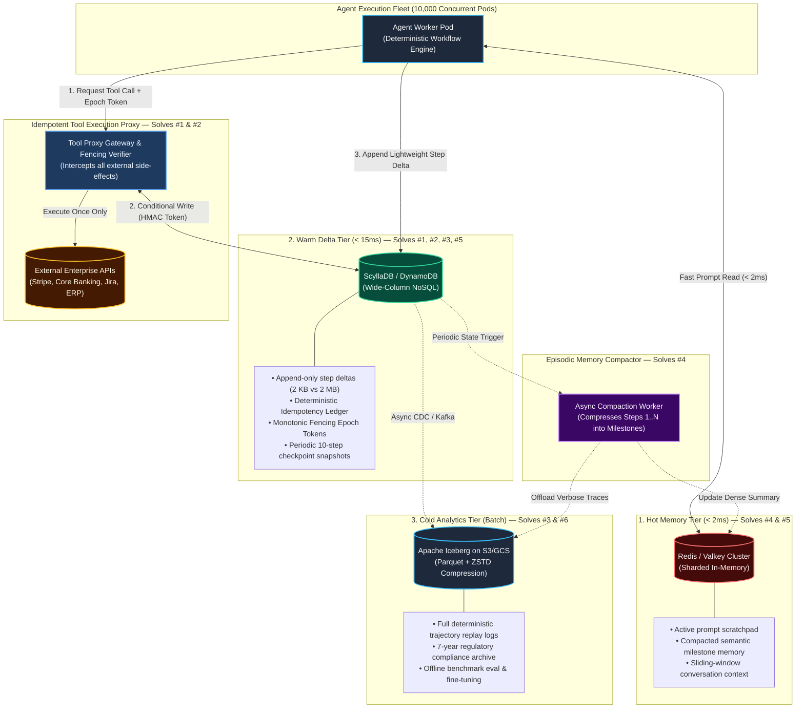
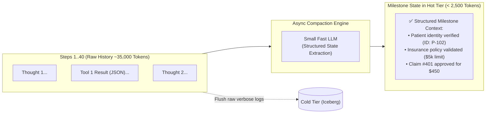

# Multi-Tiered Memory & Checkpoint Engine for 10,000 Concurrent AI Agents

> **Document Type:** System Architecture & Production Failure-Mode Analysis  
> **Scenario:** Scenario 2 — Long-Running Autonomous Agent Workflows (30–80 Steps)  
> **Level:** L6 Staff Engineer Reference Architecture  
> **Scale:** 10,000 Concurrent Agent Workers · Sub-Second Recovery (< 1s) · Zero Duplicate Side-Effects

---

## 1. Production Failure Modes & Real-World Challenges

Operating a fleet of 10,000 long-running, autonomous AI agents in production exposes critical distributed systems bottlenecks. The 6 most catastrophic production issues are:

```
┌─────────────────────────────────────────────────────────────────────────────────────────────┐
│                             6 FATAL PRODUCTION ISSUES IN AGENT SYSTEMS                       │
├────────────────────────────────┬────────────────────────────────────────────────────────────┤
│ 1. Duplicate Tool Execution    │ Crash on step 47 causes worker to re-run non-idempotent    │
│    (The Double-Charge Problem) │ actions (e.g., charging credit card twice, duplicate wire).│
├────────────────────────────────┼────────────────────────────────────────────────────────────┤
│ 2. Split-Brain Zombie Workers  │ Worker A pauses on GC / network glitch; Worker B spawns.   │
│    (Concurrent Execution)      │ Both execute step 48 simultaneously, corrupting state.     │
├────────────────────────────────┼────────────────────────────────────────────────────────────┤
│ 3. Extreme Write Amplification │ Dumping full 2MB conversation JSON every step creates      │
│    (Database I/O Meltdown)     │ 16 TB/day of writes, overwhelming the primary database.    │
├────────────────────────────────┼────────────────────────────────────────────────────────────┤
│ 4. Context Window Degradation  │ By step 60, raw reasoning history exceeds token budgets,   │
│    (Attention Loss & Cost)     │ driving up LLM latency and degrading decision accuracy.    │
├────────────────────────────────┼────────────────────────────────────────────────────────────┤
│ 5. Cold Restart Latency        │ Replaying 80 full steps on pod crash takes 15–30 seconds,  │
│    (Violating < 1s SLA)        │ blowing past enterprise SLAs for real-time customer triage.│
├────────────────────────────────┼────────────────────────────────────────────────────────────┤
│ 6. Compliance Amnesia          │ Inability to reconstruct exact prompt, seed, tool inputs,  │
│    (Audit & Debug Failure)     │ and model version when auditing a hallucinated decision.   │
└────────────────────────────────┴────────────────────────────────────────────────────────────┘
```

---

## 2. Architecture Blueprint

To eliminate all 6 failure modes, the system decouples state into a **3-Tier Storage Hierarchy** coordinated by an **Idempotent Tool Proxy Gateway** and an **Asynchronous Compaction Engine**:



---

## 3. How the Architecture Handles Each Production Problem

| # | Production Problem | Architecture Component | How the Architecture Neutralizes the Issue |
|---|---|---|---|
| **1** | **Duplicate Tool Execution** | **Idempotent Tool Gateway + ScyllaDB Ledger** | Derives deterministic keys $\text{HMAC\_SHA256}(\text{wf}, \text{step}, \text{tool}, \text{args})$. Issues conditional locks before calling third-party APIs. On worker crash, the recovered worker fetches the cached `COMPLETED` output rather than re-executing. |
| **2** | **Split-Brain Zombie Workers** | **Monotonic Epoch Fencing Tokens** | When a new worker adopts a workflow, it increments `workflow_epoch` ($3 \to 4$). Any late requests from a stalled zombie worker carrying `epoch = 3` are rejected by both ScyllaDB and the Tool Proxy Gateway with a `409 Conflict`. |
| **3** | **Extreme Write Amplification** | **Event-Sourced Step Deltas (Warm Tier)** | Replaces full 2MB state dumps with lightweight 2KB state transition deltas. Saves full checkpoints only every 10 steps, reducing daily database write volume by **95%** (from 16 TB/day to < 500 GB/day). |
| **4** | **Context Window Degradation** | **Episodic Memory Compactor (Hot Tier)** | An async worker condenses older execution steps (1 to $N-1$) into dense, structured semantic milestones. Keeps active prompt size under **4,000 tokens** while streaming raw tokens to Cold Storage. |
| **5** | **Cold Restart Latency (< 1s SLA)** | **Checkpoint + Delta Replay Engine** | Upon node crash, the replacement worker loads the nearest 10-step checkpoint ($\approx 20\text{ms}$) and replays $<10$ lightweight deltas ($\approx 30\text{ms}$). Total state restoration time: **$< 80\text{ms}$**, well within the 1-second SLA. |
| **6** | **Compliance Amnesia** | **Apache Iceberg Cold Lakehouse** | Stores the complete immutable trajectory (prompt hashes, model IDs, temperature seeds, tool arguments, reasoning traces) with point-in-time time-travel support for full deterministic audits. |

---

## 4. Deep-Dive Technical Mechanics

### 4.1. The Idempotency Protocol (Solving Issue #1)

```
[Agent Step 47] ──► [Tool Gateway] ──► Query Warm Tier [idempotency_key]
                           │
             ┌─────────────┴─────────────┐
             ▼                           ▼
      [Status = None]             [Status = COMPLETED]
             │                           │
   1. Lock key (IN_FLIGHT)       Return cached result
   2. Execute external API       (Zero duplicate API call!)
   3. Update state (COMPLETED)
```

1. **Deterministic Key Generation**:
   $$\text{IdempotencyKey} = \text{HMAC\_SHA256}(\text{SecretKey}, \text{WorkflowID} \parallel \text{StepIndex} \parallel \text{ToolName} \parallel \text{CanonicalArgs})$$
2. **Conditional Ledger Write**:
   ```sql
   INSERT INTO tool_idempotency_ledger (
       idempotency_key, workflow_id, step_index, status, created_at
   ) VALUES (
       'idemp_8a7f...', 'wf_82910', 47, 'IN_FLIGHT', NOW()
   ) IF NOT EXISTS;
   ```
3. If the write fails because the key already exists with status `COMPLETED`, the gateway intercepts the call and directly returns the cached result, guaranteeing **exact-once external execution**.

---

### 4.2. Monotonic Epoch Fencing (Solving Issue #2)

```
Worker A (Zombie / GC Pause)  ──[Step 48: Charge $500 (Epoch 3)]──► [REJECTED (409 Conflict)]
                                                                          ▲
Worker B (Promoted Active)   ──[Step 48: Charge $500 (Epoch 4)]──► [ACCEPTED & Executed]
```

* Every workflow has an atomically incremented `workflow_epoch` counter in ScyllaDB/DynamoDB.
* When Worker B takes over, it performs an atomic compare-and-swap:
  $$\text{CAS}(\text{epoch}, \text{old\_epoch}=3, \text{new\_epoch}=4)$$
* All subsequent tool proxy and delta writes enforce `WHERE epoch == current_epoch`. Any delayed write from Zombie Worker A is rejected at the database and gateway layer.

---

### 4.3. Event-Sourced Delta Logging vs. Snapshots (Solving Issues #3 & #5)

* **Naive Approach (Senior L5)**: Writes full state ($2\text{ MB}$) at every step $\implies 80\text{ steps} \times 2\text{ MB} \times 10,000\text{ agents} \times 10\text{ runs/day} = \mathbf{16\text{ TB/day}}$ of write traffic.
* **Event-Sourced Approach (Staff L6)**:
  * **Steps 1–9**: Append lightweight deltas ($\approx 2\text{ KB}$ each):
    ```json
    {
      "workflow_id": "wf_82910",
      "step_index": 47,
      "epoch": 4,
      "delta_type": "TOOL_RESULT",
      "tool_name": "triage_medical_bill",
      "output_diff": {"approved_amount": 450.00, "status": "APPROVED"}
    }
    ```
  * **Step 10, 20, 30...**: Write a consolidated full checkpoint snapshot.
  * **Recovery at Step 47**: Load Step 40 Snapshot ($20\text{ms}$) + Replay Deltas 41–46 ($30\text{ms}$) $\implies \mathbf{50\text{ms total resume time}}$.

---

### 4.4. Episodic Memory Compaction (Solving Issue #4)



---

## 5. Senior (L5) vs. Staff (L6) Engineering Leveling Matrix

| Engineering Dimension | Senior Engineer (L4 / L5) | Staff Engineer (L6+) |
| :--- | :--- | :--- |
| **State Storage Strategy** | Serializes full agent state JSON into Redis after each step; falls back to Postgres. | **Tiered Storage Hierarchy**: Ephemeral Hot Tier (Redis), Event-Sourced Warm Tier (ScyllaDB/DynamoDB), and Cold Lakehouse (Iceberg). |
| **Crash Recovery & Idempotency** | Wraps tool calls in `try/catch` and retries failed steps from the beginning. | **Deterministic State Machine + Fencing Tokens**: Derives cryptographic idempotency keys; prevents duplicate non-idempotent tool execution. |
| **Concurrency Control** | Relies on basic distributed locks (e.g., Redlock) which fail under clock drift. | **Optimistic Concurrency Control with Monotonic Epochs** enforced at the database transaction layer. |
| **Write Amplification & Cost** | Writes entire conversation JSON every step ($>15\text{ TB/day}$). | **Delta Logging + Episodic Compaction**: Writes 2KB deltas per step, full snapshots every 10 steps ($<500\text{ GB/day}$). |
| **Audit & Replayability** | Logs basic application error strings to Datadog/CloudWatch. | **Deterministic Trajectory Replay**: Captures full causal graph (seeds, prompt versions, model IDs, tool payloads) in Iceberg for offline replay. |

---

## 6. FinOps Cost & Capacity Model

At enterprise scale of **10,000 concurrent agents** running 80 steps per workflow:

```
+--------------------------------------------------------------------------------------------------+
|                                    STORAGE & FINOPS ANALYSIS                                     |
+----------------------+--------------------------+-----------------------+------------------------+
| Tier                 | Read / Write Volume      | Storage Footprint     | Estimated Cost / Mo    |
+----------------------+--------------------------+-----------------------+------------------------+
| Hot Tier (Redis)     | 10,000 active sessions   | ~50 GB in-memory RAM  | ~$350 / month          |
| Warm Tier (ScyllaDB) | 15,000 delta writes/sec  | ~3.5 TB (7-day TTL)   | ~$1,200 / month        |
| Cold Tier (Iceberg)  | ~5 TB/day raw logs       | ~150 TB/mo (ZSTD)     | ~$3,450 / month (S3)   |
+----------------------+--------------------------+-----------------------+------------------------+
| TOTAL RUN-RATE COST  | Sub-second recovery with full 7-year audit trail  | ~$5,000 / month        |
+--------------------------------------------------------------------------------------------------+
```

---

## 7. Interview Stress Tests & Failure Mode Playbooks

### Probe 1: "How do you handle an external tool API that does not support idempotency keys natively?"
* **Staff Solution**: The **Idempotent Tool Gateway** maintains an in-flight reservation ledger in ScyllaDB. When calling a legacy external service:
  1. Record an `IN_PROGRESS` state with a timestamp.
  2. If the worker crashes before receiving the HTTP response, the recovery worker checks the gateway ledger.
  3. If status is `IN_PROGRESS`, the gateway invokes a **Reconciliation / Query Endpoint** on the legacy system (e.g., `GET /orders?client_ref=wf_82910_step47`) to discover whether the action succeeded before deciding to retry.

### Probe 2: "How do you debug an agent that produced a hallucinated financial decision 2 weeks ago?"
* **Staff Solution**: Query the **Apache Iceberg Cold Tier** using time-travel queries:
  ```sql
  SELECT step_index, model_id, system_prompt_hash, tool_input, tool_output, reasoning_trace
  FROM agent_trajectories
  FOR SYSTEM_TIME AS OF '2026-08-17 14:30:00Z'
  WHERE workflow_id = 'wf_82910'
  ORDER BY step_index ASC;
  ```
  The causal state machine can deterministically replay the exact decision tree in a test sandbox.
