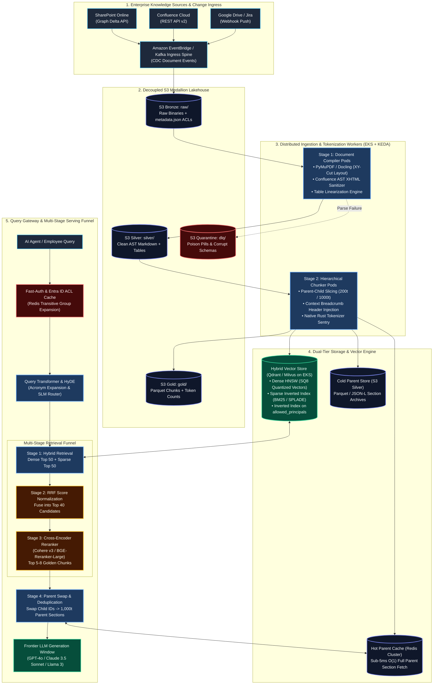
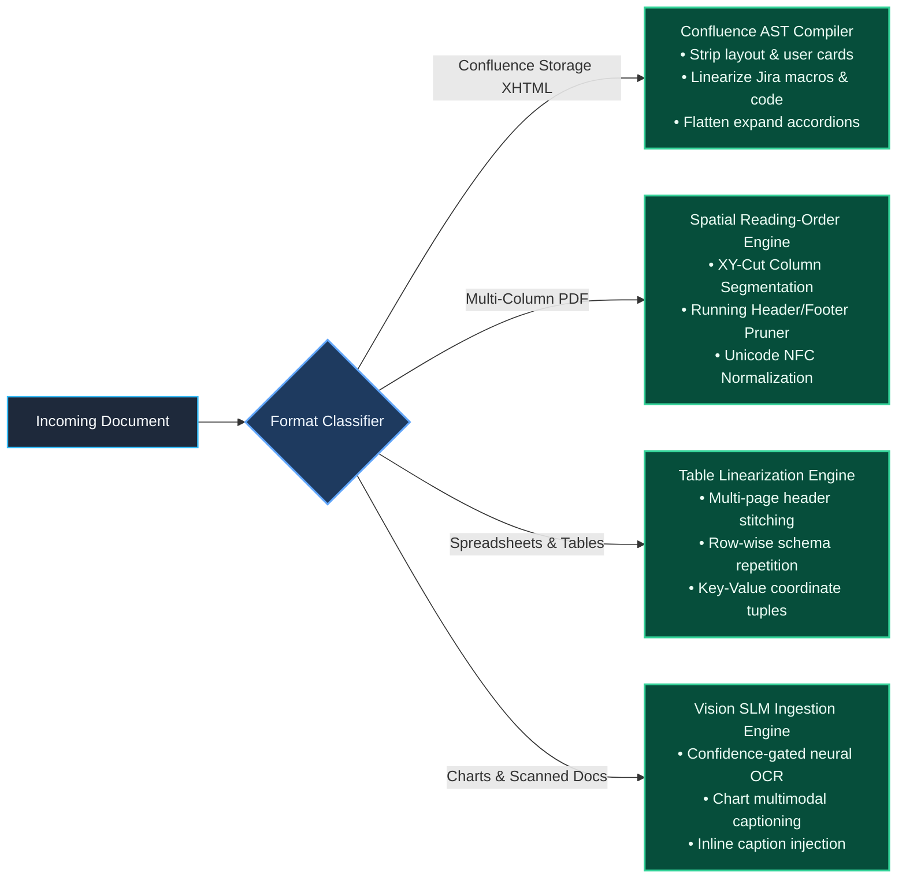
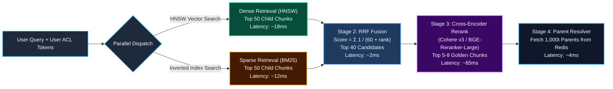
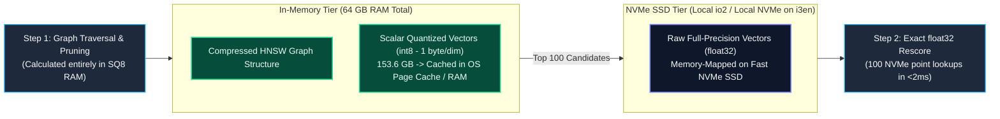
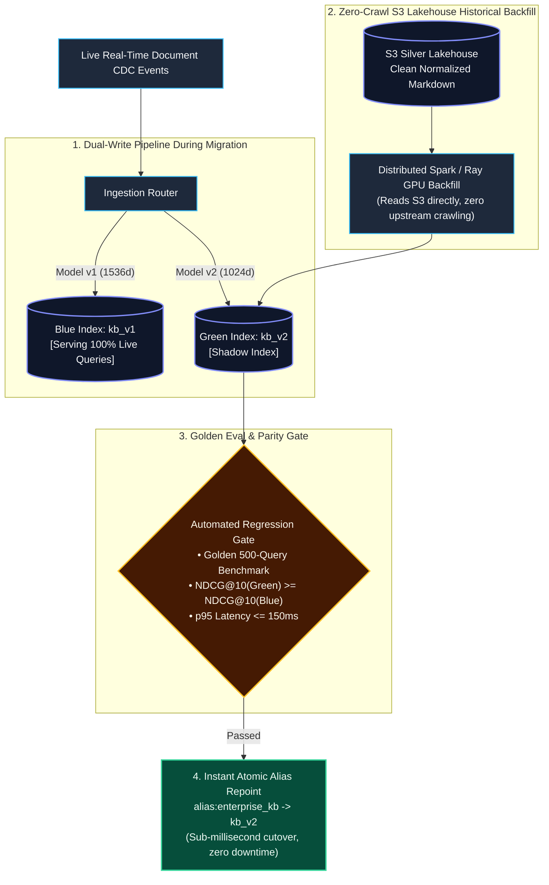
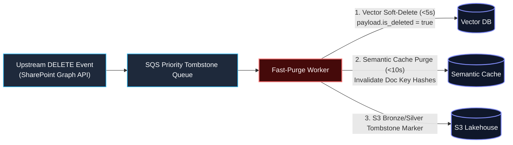
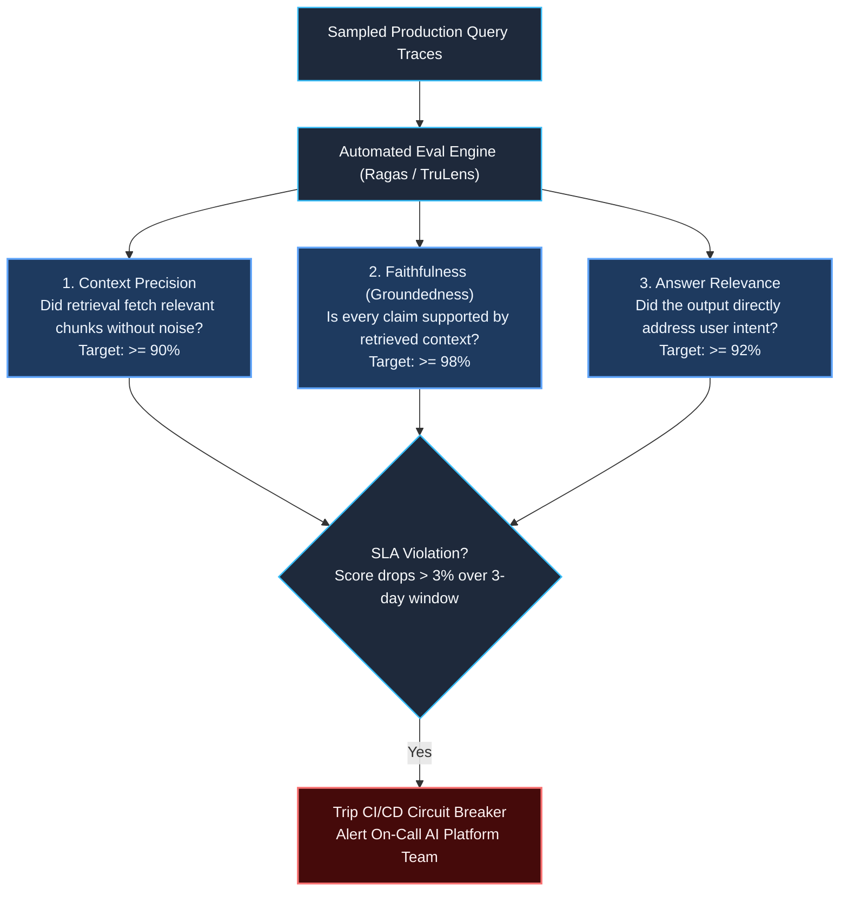

# Enterprise Production RAG System: End-to-End Solution Architecture Document

> **Document Type:** Production Solution Architecture & System Design Document (SADD)  
> **Target Roles:** Principal AI & Data Architect (L6/L7), Staff Data Engineer, Lead Platform Engineer  
> **Domain Focus:** Multi-Tenant Enterprise Knowledge (SharePoint, Confluence, Google Drive, Jira), Medallion Lakehouse, Hierarchical Parent-Child Chunking, Hybrid Search, Zero-Trust Security Trimming, NVMe DiskANN FinOps, and Zero-Downtime Model Migration  
> **Conforms strictly to:** [.agents/rules/data_ai_architect_persona.md](file:///.agents/rules/data_ai_architect_persona.md) and [.agents/rules/ai_data_architect_evaluator.md](file:///.agents/rules/ai_data_architect_evaluator.md)

---

## 1. Executive Summary & Architectural Scope

This document specifies the end-to-end solution architecture for a **mission-critical, multi-tenant enterprise Retrieval-Augmented Generation (RAG) platform**. The system serves 5,000 internal AI agents and 50,000 employees, ingesting and synchronizing **50+ million documents** (~150 million chunks) across heterogeneous enterprise repositories.

### Primary Architectural Pillars
1. **Decoupled Three-Tier Medallion Document Lakehouse**: S3 Bronze (Invariant Raw Binaries) $\to$ S3 Silver (Clean Normalized Markdown ASTs) $\to$ S3 Gold (Model-Aligned Tokenized Chunks).
2. **Hierarchical Parent-Child (Small-to-Big) Chunking**: Slices 200-token dense child chunks for high-recall vector search, dynamically swapped at query time for 1,000-token parent narrative sections to eliminate LLM context starvation.
3. **Multi-Model Tokenizer Alignment**: Enforces the "tightest downstream ceiling" budgeting rule using native Rust fast tokenizers with character offset snapping, guaranteeing zero silent truncation.
4. **Multi-Stage Hybrid Search & Re-Ranking Funnel**: Combines Dense HNSW and Sparse BM25 via Reciprocal Rank Fusion (RRF), gated by a Cross-Encoder reranker to achieve $>92\%$ recall at sub-150ms latency.
5. **Zero-Trust Security Trimming**: Enforces item-level Microsoft Entra ID Access Control Lists (ACLs) using payload-aware Filtered HNSW and threshold switching to prevent HNSW graph disconnection.
6. **Vector FinOps & DiskANN Quantization**: Slashes in-memory RAM footprints by 75–85% using Scalar Quantization (SQ8) and NVMe-backed DiskANN layouts.
7. **Zero-Downtime Blue/Green Index Migration**: Dual-writing CDC streams and atomic alias cutovers for seamless embedding model upgrades without query downtime.

---

## 2. System Scale Targets, SLAs & Compliance Constraints

| Architectural Dimension | Production SLA / Specification Target |
| :--- | :--- |
| **Total Ingested Corpus** | 50,000,000 documents (~150M child chunks, ~40M parent sections) |
| **Document Formats** | Multi-column digital PDFs, scanned TIFF/PDFs, Confluence storage XHTML, XLSX, DOCX |
| **Retrieval Latency (p95)** | **$\le$ 150 milliseconds** (Hybrid Search + RRF + Cross-Encoder + Parent Fetch) |
| **End-to-End Query SLA (p95)** | **$\le$ 950 milliseconds** to first generation token (TTFT) |
| **Document Sync Freshness** | **$\le$ 60 seconds** from upstream edit/delete in SharePoint/Confluence to Vector DB |
| **GDPR "Right to be Forgotten"** | Soft-delete reflected in search within **60 seconds**; hard lakehouse purge within **7 days** |
| **Peak Retrieval Concurrency** | 500 queries/second (QPS) with autoscaling read replicas |
| **Security Standard** | Zero-Trust item-level security inheritance (Entra ID User Principal Names & Security Groups) |

---

## 3. End-to-End System Topology Architecture



---

## 4. Subsystem 1: Ingestion & Medallion Document Lakehouse

### 4.1. The Three-Tier Storage Layout
Enterprise RAG systems must decouple raw file ingestion from downstream chunking and embedding. Storage is inexpensive ($0.023/GB on S3), whereas parsing and OCR compute are among the most expensive stages in the entire pipeline.

```text
s3://enterprise-ai-lakehouse-prod/
├── bronze/                                        <-- Tier 1: Invariant Raw Source
│   └── {source}/{tenant_id}/{item_id}/
│       ├── raw_binary.pdf                         <-- Immutable original binary
│       └── metadata.json                          <-- ACL sidecar, ETags, timestamps
│
├── silver/                                        <-- Tier 2: Clean Normalized Markdown
│   └── {source}/{tenant_id}/{item_id}/
│       ├── content.md                             <-- Clean GitHub-Flavored Markdown AST
│       ├── tables/{table_id}.json                 <-- Structured table schemas & metadata
│       └── figures/{figure_id}.png                <-- Extracted diagrams & chart crops
│
├── gold/                                          <-- Tier 3: Model-Aligned Serving Chunks
│   └── collections/v1_bge_large/
│       └── date=2026-09-13/part-00000.parquet     <-- Pre-tokenized child & parent records
│
└── quarantine/                                    <-- Tier 4: Non-Blocking Poison-Pill Sink
    └── {source}/{tenant_id}/{item_id}/error.json  <-- Stack trace, payload, failure reason
```

### 4.2. Layout-Aware Format Normalization
Raw documents must never be fed directly into tokenizer splitters. Each format passes through specialized AST normalization engines:



#### Table Linearization Specification
Multi-page tables must never be sliced blindly into raw Markdown lines. Tables are parsed and linearized so that **every row is transformed into an autonomous semantic record**:
$$\text{Row\_Record} = \left[ \text{Table: Title} \mid \text{Row } i \mid \text{Col}_1: \text{Val}_1 \mid \text{Col}_2: \text{Val}_2 \mid \dots \mid \text{Col}_k: \text{Val}_k \right]$$
* **Result**: Even if Row 25 is indexed in a different child chunk than the table header, the child chunk retains 100% of its relational schema and produces sharp vector similarities.

### 4.3. Sidecar Metadata Contract
Every document landed in S3 Bronze generates an immutable `metadata.json` sidecar capturing zero-trust security tags and source lineage:

```json
{
  "doc_id": "SP_98412_HR_POLICY",
  "source_system": "sharepoint_online",
  "site_id": "hr-executive-portal",
  "item_id": "d98124b8-89c1-4b72-a42e-1823901234ba",
  "etag": "\"4a89bc21e901f4a\"",
  "source_url": "https://corp.sharepoint.com/sites/hr/policies/2026_comp.pdf",
  "document_title": "Executive Compensation and Bonus Allocation Policy 2026",
  "breadcrumb_path": "HR Portal > Compensation > Executive Benefits",
  "allowed_principals": [
    "user:sarah.connor@corp.com",
    "group:c8912345-0012-4a7b-9123-hr-executives",
    "group:e9012345-1234-4b8c-0123-board-members"
  ],
  "classification": "RESTRICTED",
  "last_modified_timestamp": "2026-09-13T08:15:30Z",
  "content_hash_sha256": "e3b0c44298fc1c149afbf4c8996fb92427ae41e4649b934ca495991b7852b855"
}
```

---

## 5. Subsystem 2: Hierarchical Parent-Child Chunking & Tokenizer Fidelity

### 5.1. The Small-to-Big Topology Architecture
The platform eliminates the "Goldilocks Dilemma" (Vector Dilution vs. LLM Context Starvation) by decoupling the **retrieval index** from the **generation prompt**:

```text
[ Markdown AST Section (Heading 2) ]
└── Full Section Text (~1,000 tokens)
    │
    ├── [ PARENT SECTION: doc_98412#p3 ] ──► Stored in Redis Cache & S3 Silver
    │   • Complete narrative: premises, exceptions, tables, and operational steps.
    │
    ├── [ CHILD CHUNK 0: doc_98412#p3_c0 ] ──► Indexed in Dense HNSW & BM25
    │   • Prefix: [Doc: Comp_Policy_2026.md > # Compensation > ## Executive Bonus]
    │   • Content: Target bonus thresholds and annual performance multiplier rules...
    │   • Target Budget: ~200 tokens
    │
    └── [ CHILD CHUNK 1: doc_98412#p3_c1 ] ──► Indexed in Dense HNSW & BM25
        • Prefix: [Doc: Comp_Policy_2026.md > # Compensation > ## Executive Bonus]
        • Content: Clawback provisions in the event of restated financial statements...
        • Target Budget: ~190 tokens
```

### 5.2. Multi-Model Tokenizer Budgeting & Silent Truncation Prevention
To ensure chunks are never silently truncated by downstream embedding models or cross-encoder rerankers, the ingestion engine budgets token ceilings against the **strictest downstream consumer**:

$$\text{Token\_Ceiling}_{\text{child}} \le \text{Max\_Downstream\_Limit} - \left( \text{Len}_{\text{breadcrumb}} + \text{Len}_{\text{query\_headroom}} + \text{Len}_{\text{special}} \right)$$

* $\text{Max\_Downstream\_Limit} = 512$ tokens (governed by Cross-Encoder / BGE-Large limits).
* $\text{Len}_{\text{breadcrumb}} = 45$ tokens (reserved for H1/H2 ancestral metadata lineage).
* $\text{Len}_{\text{query\_headroom}} = 64$ tokens (reserved for query concatenation in cross-attention).
* $\text{Len}_{\text{special}} = 5$ tokens (`[CLS]`, `[SEP]`, punctuation delimiters).
* **Hard Upper Child Limit:** $\mathbf{\le 398 \text{ tokens}}$ (production target calibrated to **180–220 tokens**).

### 5.3. Character Offset Boundary Snapping
Candidate chunk cuts are calculated in token space, mapped back to unicode character offsets via `return_offsets_mapping=True`, and snapped to the nearest sentence punctuation boundary (`(?<=[.?!])\s+`). This prevents multi-byte UTF-8 character splitting and broken words.

---

## 6. Subsystem 3: Multi-Stage Hybrid Search & Re-Ranking Funnel



### 6.1. Reciprocal Rank Fusion (RRF) Mathematics
Dense vector scores (cosine similarities from 0.0 to 1.0) and sparse scores (unbounded BM25 values from 0.0 to 50.0+) cannot be combined via simple addition. The platform fuses candidates using ordinal rank positions:

$$\text{RRF\_Score}(d \in D) = \sum_{m \in \{\text{Dense}, \text{Sparse}\}} \frac{1}{k + \text{rank}_m(d)} \quad (k = 60)$$

Documents appearing near the top of both search modes dominate the fused ranking. If a document only appears in one modality, its reciprocal score prevents it from crowding out consensus hits.

### 6.2. Cross-Encoder Re-Ranking Pipeline
The top 40 candidates from RRF pass through a dedicated pool of **Cross-Encoder Rerankers** hosted on AWS GPU worker nodes (`g5.xlarge` instances running Hugging Face Text Embeddings Inference with dynamic tensor batching):
- Full self-attention across the query and document pairs: $O((L_{\text{query}} + L_{\text{doc}})^2)$.
- Evaluates deep semantic alignment, negative conditions, and precise technical qualifiers.
- Filters out 75–85% of false-positive vector hits, selecting the **top 5–8 golden child chunks**.

### 6.3. Dynamic Parent Resolution & Deduplication
The query engine reads the `parent_id` tags on the top 8 child chunks.
1. Duplicate parent IDs are merged (e.g., if child 1, 2, and 4 belong to `doc_98412#p3`, the parent is resolved once).
2. The engine executes a single batch key lookup against the **Redis Hot Parent Cache**:
   ```python
   parent_documents = redis_cluster.mget(["doc_98412#p3", "doc_87123#p1"])
   ```
3. The generator LLM prompt receives 2 to 4 complete parent sections, completely eliminating context starvation.

---

## 7. Subsystem 4: Zero-Trust Security Trimming & Filtered HNSW

### 7.1. The Security Threat Vector
In enterprise RAG, returning unauthorized documents is an unacceptable compliance failure. Relying on the LLM system prompt (*"Only show documents Bob can see"*) is vulnerable to prompt injection. Security trimming must occur **at the database retrieval layer**.

### 7.2. The HNSW Graph Disconnection Failure & Solution
Standard post-filtering (retrieving the top 100 vectors, then stripping unauthorized docs) leads to **Recall Collapse**: if the top 100 semantic matches belong to restricted executive folders, filtering leaves zero results for an unauthorized user, even if valid public documents exist further down the index.

Naive pre-filtering on standard HNSW graphs causes **HNSW Graph Disconnection**: when a filter removes 99.9% of corpus nodes, greedy graph traversal paths break, causing searches to terminate early with zero results.

```
[ Normal HNSW Graph ]                 [ Broken Naive Filtered HNSW ]
    (A) ─── (B) ─── (C)                   (A) [LOCKED]   (B) [LOCKED]   (C) [LOCKED]
     │   ╲   │   ╱   │                                                  
    (D) ─── (E) ─── (F)                   (D) [LOCKED]   (E) [PERMITTED] (F) [LOCKED]
     │   ╱   │   ╲   │                                                  
    (G) ─── (H) ─── (I)                   (G) [LOCKED]   (H) [LOCKED]   (I) [PERMITTED]
Smooth traversal across neighbors.        Graph is severed! Cannot reach (E) or (I) -> 0 results!
```

#### The Production Solution: Dual-Strategy Security Engine
1. **Payload-Aware Filtered HNSW (Iterative Traversal)**: Implemented via Qdrant/Milvus payload index integration. The search traverses the complete graph using unconstrained nodes as bridges, but only scores and collects candidate nodes satisfying `allowed_principals CONTAINS user_token`.
2. **Threshold Switching to Exact Flat Rescore**: If a user's security token filters the accessible corpus to $<1{,}000$ documents (high selectivity), the engine bypasses HNSW graph traversal entirely:
   - Uses the inverted index on `allowed_principals` to resolve the candidate ID set in $<1\text{ms}$.
   - Runs an exact flat vector dot-product on the candidate subset.
   - Eliminates graph disconnection failures while guaranteeing 100% recall.

### 7.3. Transitive ACL Token Expansion & Caching
Resolving nested Active Directory / Entra ID groups in real time via Microsoft Graph API adds 250–400ms of latency per query.
- At query authentication, the gateway checks a **Redis Transitive Group Cache** (TTL = 15 minutes).
- The cached token array contains the user's direct ID and all expanded security groups:
  ```json
  ["user:bob@corp.com", "group:engineering-all", "group:platform-team", "group:us-east-employees"]
  ```
- The query gateway injects this array directly into the database boolean filter clause in $<1\text{ms}$.

---

## 8. Subsystem 5: Scale, RAM Mathematics & Vector FinOps

### 8.1. Memory Footprint Calculation (100M Vectors @ 1536 Dimensions)
Unquantized, in-memory HNSW hosting for 100 million vectors requires prohibitive cloud expenditure:

$$\begin{aligned}
\text{Raw Vectors Size} &= 100{,}000{,}000 \times 1{,}536 \times 4 \text{ bytes (float32)} = \mathbf{614.4 \text{ GB}} \\
\text{HNSW Graph Overhead} &\approx 1.6\times \implies \mathbf{983 \text{ GB to } 1.2 \text{ TB of RAM}}
\end{aligned}$$

Hosting 1.2 TB of RAM requires an AWS cluster of `r7i.8xlarge` or `r6i.12xlarge` instances, costing **~$7,500 to $9,000/month** exclusively for vector compute.

### 8.2. The Production FinOps Architecture: SQ8 & NVMe DiskANN
We slash memory infrastructure spend by **75–85%** by combining **Scalar Quantization (SQ8)** with **NVMe-Backed DiskANN Indexing**:



* **Scalar Quantization (SQ8)**: Compresses `float32` (4 bytes) to `int8` (1 byte). Reduces raw vector size from 614 GB to **153.6 GB**, with $<1.5\%$ recall loss.
* **Disk-Backed Vector Engine (DiskANN / LanceDB / Qdrant on SSD)**:
  - Graph structures and SQ8 vectors reside in memory/page cache for fast exploratory traversal.
  - Full-precision `float32` vectors are stored on memory-mapped local NVMe SSDs (`i3en` or EBS `io2`).
  - Full vectors are only read from NVMe for the final 100 candidates to perform exact dot-product rescoring.
* **FinOps Result**: Slashing the required RAM from 1.2 TB down to **64–128 GB**, reducing monthly infrastructure spend from **~$8,500/mo to <$1,600/mo** while preserving a p95 retrieval latency of $<25\text{ms}$.

### 8.3. Multi-Tier Semantic Caching
To protect LLM token budgets, queries pass through a two-tier caching gate:
1. **Tier 1 (Exact Hash Cache)**: SHA256 of `(model_id + temperature + system_prompt + user_prompt)`. Cache hits return in $<4\text{ms}$ at $0.00 compute cost.
2. **Tier 2 (Semantic Vector Cache)**: Evaluates incoming query embedding against a Redis vector cache of past answers. Queries matching existing cached items with **cosine similarity $\ge 0.96$** return cached answers, saving 35–45% of frontier LLM API costs.

---

## 9. Subsystem 6: Zero-Downtime Blue/Green Model Migration

When upgrading embedding models (e.g., from `text-embedding-3-small` [1536d] to a fine-tuned domain model [1024d]), vector spaces are incompatible. Slicing models or mixing spaces in a single index is mathematically invalid.

The platform executes a **Zero-Downtime Blue/Green Index Migration Protocol**:



1. **Virtual Alias Indirection**: Search clients never query physical index collections directly; queries target a logical alias: `alias:enterprise_kb`.
2. **Dual-Write CDC Ingestion**: When migration begins, live ingestion workers start dual-writing incremental changes to both `kb_v1` and `kb_v2`.
3. **Zero-Crawl S3 Backfill**: Distributed Spark/Ray GPU workers read clean Markdown directly from the S3 Silver Lakehouse, vectorizing via Model v2 and populating `kb_v2`. The upstream SharePoint/Confluence APIs are never touched.
4. **Golden Dataset Benchmark Gate**: Before cutover, an automated eval runs 500 curated enterprise queries against both indexes. Cutover requires that NDCG@10 of `kb_v2` is equal to or higher than `kb_v1`.
5. **Instant Atomic Cutover**: The vector store repoints `alias:enterprise_kb -> kb_v2` in sub-milliseconds. `kb_v1` is maintained in read-only standby for 72 hours for instant rollback capability.

---

## 10. Subsystem 7: Compliance, GDPR Right to Be Forgotten & Disaster Recovery

### 10.1. The 60-Second GDPR Deletion SLA
Under GDPR Article 17, when a user document is deleted, it must not be surfaced in AI answers.



* **Immediate Soft-Delete (<5 seconds)**: The Fast-Purge worker sets `payload.is_deleted = true` in the vector database and invalidates matching Redis keys. Active queries apply a mandatory filter `is_deleted != true`, hiding the document immediately.
* **Asynchronous Physical Compaction (Weekly SLA)**: Lakehouse compaction jobs execute Apache Iceberg `rewrite_data_files` and vector database segment merges to physically erase the deleted records from storage media within statutory compliance windows.

### 10.2. Disaster Recovery & Multi-Region Replication
* **Active-Passive Multi-Region Topology**: Primary in `us-east-1`, standby read replica in `us-west-2`.
* **S3 Cross-Region Replication (CRR)**: S3 Bronze and Silver buckets replicate automatically.
* **Recovery Point Objective (RPO)**: $< 15\text{ minutes}$ for vector state.
* **Recovery Time Objective (RTO)**: $< 5\text{ minutes}$ via Route 53 DNS failover to the read-replica collection.

---

## 11. Subsystem 8: Observability, Continuous Evaluation & RAGOps

### 11.1. Full-Stack OpenTelemetry Tracing
Every user query emits an OpenTelemetry span hierarchy capturing latencies, token counts, and intermediate rankings:

```text
[ Trace ID: 4bf92f3577b34da6a3ce929d0e0e4736 ]
└── Gateway: POST /v1/chat/completions (Total: 840ms)
    ├── Fast-Auth: Redis Transitive ACL Lookup (3ms)
    ├── Pre-Retrieval: SLM Query Rewriting (18ms)
    ├── Hybrid Search: Qdrant HNSW + BM25 (24ms)
    ├── Fusion: Reciprocal Rank Fusion (2ms)
    ├── Re-ranking: BGE-Reranker-Large GPU Pool (68ms)
    ├── Parent Resolution: Redis mget 3 Parent Sections (4ms)
    └── LLM Generation: Claude 3.5 Sonnet Streaming
        ├── Time to First Token (TTFT): 112ms
        ├── Output Token Generation: 609ms
        └── Token Usage: Prompt=3,140t, Completion=342t
```

### 11.2. The Continuous RAG Triad Evaluation Harness
Every 24 hours, an automated pipeline samples 500 production traces and evaluates them using **LLM-as-a-Judge** calibrated against human-labeled golden sets:



---

## 12. Architectural Verification & Validation Checklist

Before promoting any pipeline changes to production, the platform engineering team validates this checklist:

- [x] **AST Integrity**: Tables linearized with repeated schemas; zero unclosed code blocks.
- [x] **Tokenizer Safety**: Assert that `actual_tokens <= 448` across all child chunks under native model tokenizer.
- [x] **Zero Silent Truncation**: No chunk exceeds downstream Cross-Encoder sequence boundaries.
- [x] **Security Trimming**: Filtered HNSW verified against synthetic users with single-document access permissions (testing for graph disconnection).
- [x] **FinOps Quantization**: Scalar Quantization (SQ8) enabled with memory verified under 160 GB RAM for 100M vectors.
- [x] **GDPR Deletion**: CDC delete event verified to purge search visibility in $<60\text{ seconds}$.
- [x] **Observability**: OpenTelemetry spans emitting latency breakdowns across all 4 retrieval hops.
