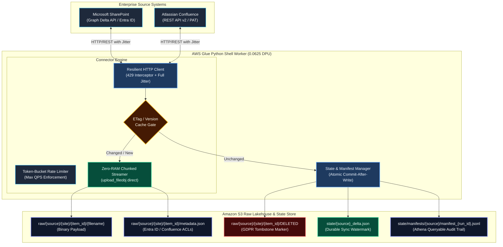
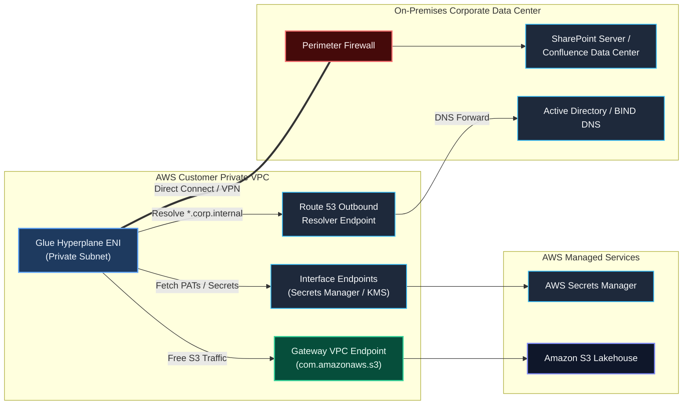

# Custom Ingestion Connectors: Common Architectural Framework

> **Document Type:** System Architecture & Enterprise Engineering Standards  
> **Engine:** AWS Glue Python Shell (Python 3.9+, 0.0625 DPU) & Amazon S3 Data Lakehouse  
> **Target Connectors:** Microsoft SharePoint Online / Server, Atlassian Confluence Cloud / Data Center  
> **Applicable Rules:** Conforms strictly to [.agents/rules/data_engineer_persona.md](file:///.agents/rules/data_engineer_persona.md)

---

## 1. Executive Summary & Design Tenets

Ingesting enterprise knowledge bases (wikis, office documents, PDFs, CAD diagrams, recordings) from SaaS or on-premises systems into a cloud Lakehouse presents distinct distributed systems challenges:
* **Large & Unbounded Payloads:** Files range from 5 KB text files to 5 GB video or CAD recordings.
* **Aggressive API Rate Limiting:** Upstream platforms enforce stringent tenant quotas and return `HTTP 429 Too Many Requests`.
* **State Drift & Invalidation:** Delta cursor watermarks can expire (e.g., `HTTP 410 Gone`), requiring self-healing crawls.
* **Security & Permission Trimming:** Downstream Retrieval-Augmented Generation (RAG) systems require item-level Access Control Lists (ACLs) to prevent unauthorized document exposure.

To solve these challenges without the operational overhead and high DBU cost of distributed Spark clusters, this framework uses **AWS Glue Python Shell** as a serverless, decoupled extraction engine landing immutable raw data into **Amazon S3**.



---

## 2. Compute Runtime Selection: Python Shell vs. Spark

A common anti-pattern is provisioning multi-node Apache Spark clusters (Glue Spark or Databricks) to pull data from REST APIs. REST API ingestion is **I/O-bound and network latency-bound**, not CPU-bound:

| Metric / Dimension | AWS Glue Spark (2 DPU Minimum) | AWS Glue Python Shell (0.0625 DPU) | Architectural Impact |
| :--- | :--- | :--- | :--- |
| **Minimum Provisioning** | 2 DPUs (8 vCPUs, 32 GB RAM) | **0.0625 DPU** (1 vCPU, 1 GB RAM) | **32x reduction** in compute footprint |
| **Cold Start Latency** | 2 to 3 minutes (JVM / cluster setup) | **10 to 15 seconds** | Instant execution for frequent syncs |
| **Hourly Cost** | ~$0.88 / hour | **~$0.0027 / hour** | Sub-cent execution costs for batch syncs |
| **API Rate Limit Idle Cost** | Pays for 8 idle vCPUs while sleeping on 429 | Pays fractional pennies during backoff | FinOps optimization under upstream throttling |
| **RAM Failure Mode** | Managed binary readers OOM on >100 MB | Zero-RAM chunked streaming handles multi-GB | Immune to Out-Of-Memory container kills |

---

## 3. Network, VPC & Hybrid Security Architecture

When ingesting from on-premises installations (SharePoint Server, Confluence Data Center) or adhering to corporate zero-trust network boundaries:



1. **Glue `NETWORK` Connection:** Attaching a network connection injects AWS Hyperplane Elastic Network Interfaces (ENIs) directly into the customer's private subnet.
2. **Self-Referencing Security Group Rule:** AWS Glue mandates an inbound rule allowing `ALL` traffic where source is the **Security Group itself** to enable internal node health monitoring.
3. **Route 53 Outbound Resolvers:** Internal hostnames (e.g., `https://sharepoint.corp.internal`) cannot be resolved by standard VPC DNS. Route 53 Outbound Resolver rules forward private domain queries across Direct Connect/VPN to corporate DNS.
4. **S3 Gateway VPC Endpoint:** All S3 writes route through a free **Gateway VPC Endpoint** (`com.amazonaws.s3`), completely bypassing NAT Gateways and eliminating $0.045/GB data processing fees.
5. **Corporate PKI Trust:** Enterprise servers sign SSL certificates using private internal Certificate Authorities. The environment variable `REQUESTS_CA_BUNDLE` points to an in-job mounted corporate CA bundle to prevent `SSLCertVerificationError` without insecure `verify=False`.

---

## 4. Concurrency & Resilient HTTP Engine

To handle upstream rate limits safely without overwhelming the source or triggering bans:

### 1. Token-Bucket Rate Limiter (`BoundedRateLimiter`)
A thread-safe token bucket enforces a hard cap on maximum Requests Per Second (e.g., 10 req/sec) across all concurrent download threads:
$$\text{Tokens}(t) = \min\left(\text{Capacity}, \text{Tokens}(t_{\text{prev}}) + \Delta t \times \text{Rate}\right)$$
Workers must acquire a token before dispatching any HTTP request.

### 2. Reactive HTTP 429 Interceptor with Full Jitter
When upstream APIs throttle requests (`HTTP 429 Too Many Requests`), the client extracts the `Retry-After` header. If absent, it applies exponential backoff with **Full Randomized Jitter**:
$$\text{Sleep Time} = \text{base\_delay} \times 2^{\text{attempt}} + \text{Uniform}(0.1, 0.5) \times \text{delay}$$
*Why Full Jitter?* If 8 threads receive a 429 simultaneously, a static delay causes them to wake up and hammer the API at the exact same millisecond (**Thundering Herd problem**). Randomized jitter spreads the wake-up wave evenly.

---

## 5. Zero-RAM Direct Streaming Pipeline

Loading large binary files (e.g., a 2 GB training video or 500 MB CAD file) into memory via `response.content` will instantly crash a 1 GB RAM container with an Out-Of-Memory (OOM) error. Staging to ephemeral disk (`/tmp`) saturates container storage under multi-threaded concurrency.

### Zero-RAM Direct Socket Streaming:
```
[ Upstream Server ]
        │ (TLS / TCP Socket)
        ▼
[ requests.get(url, stream=True) ]  <── Unbuffered OS socket handle (resp.raw)
        │
        ▼ (8 MB chunked iterator)
[ boto3.s3.upload_fileobj(resp.raw) ] <── Managed S3 multipart stream
        │
        ▼ (Direct S3 Multipart PUT)
[ Amazon S3 Object Storage ]
```

* **Memory Footprint:** The Python process maintains only an internal ~8 MB buffer managed by `boto3`. Total RAM utilization remains flat (~16 MB to ~32 MB) regardless of whether the document is 10 KB or 10 GB.

---

## 6. State Management & 100% Idempotency Guarantees

Every execution of the connector guarantees exact-state replication:

1. **Pre-Download ETag & Version Cache Gate:**
   Before invoking download streams, the worker issues an S3 `HeadObject` check against the deterministic item key. If the upstream ETag or version number matches the existing S3 metadata, the file is marked as `SKIPPED` in sub-milliseconds, saving network bandwidth and compute costs.
2. **Atomic Commit-After-Write Checkpointing:**
   Sync watermarks (`deltaLink` in Graph API, or `modified_date` in Confluence) are **never** committed at the start of a batch. They are committed to `s3://bucket/state/{source}_delta.json` only after the entire batch has been durably flushed to S3.
3. **Deterministic Content Addressing:**
   Keys follow strict structural paths:
   ```
   s3://{bucket}/raw/{source}/{site_or_space}/{item_id}/{filename}
   s3://{bucket}/raw/{source}/{site_or_space}/{item_id}/metadata.json
   ```
4. **GDPR / CCPA Deletion Semantics:**
   When an item is deleted upstream, the connector writes an explicit tombstone:
   ```
   s3://{bucket}/raw/{source}/{site_or_space}/{item_id}/DELETED
   ```
   Downstream vector indexing or search jobs detect the tombstone and immediately purge the document from vector stores.

---

## 7. Observability & Manifest Auditing

The connector emits structured JSON telemetry to AWS CloudWatch:

```json
{
  "time": "2026-09-03T10:30:00Z",
  "level": "INFO",
  "module": "glue_document_ingestion",
  "msg": "SharePoint Delta Sync Progress",
  "discovered": 1250,
  "completed": 450,
  "remaining": 800,
  "progress_pct": 36.0,
  "inserted": 320,
  "updated": 30,
  "skipped": 95,
  "deleted": 5,
  "quarantined": 0,
  "rate_limit_retries": 2
}
```

At the conclusion of each run, a batch manifest is written to `s3://{bucket}/state/manifests/{source}/manifest_{run_id}.jsonl`. This manifest contains the status of every item processed (`INSERT`, `UPDATE`, `SKIP`, `DELETE`, `QUARANTINE`) and can be queried directly via **Amazon Athena** for compliance and data auditing.
