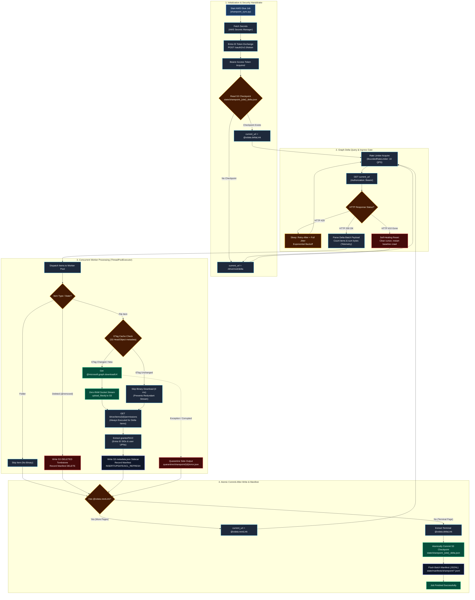
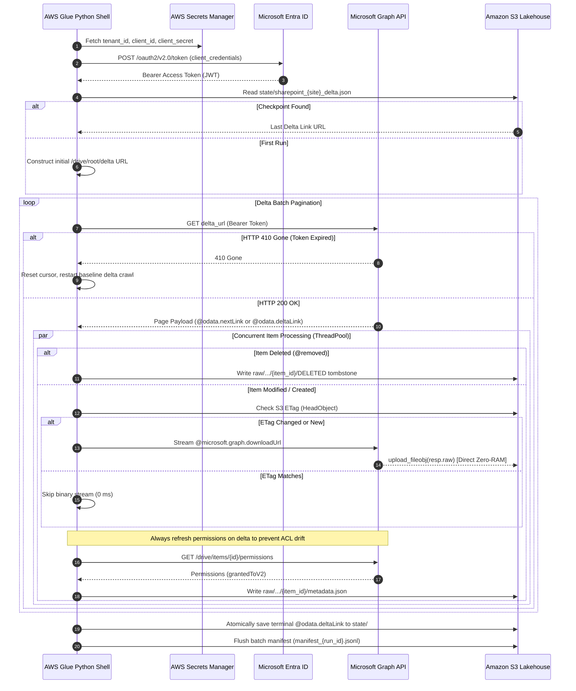
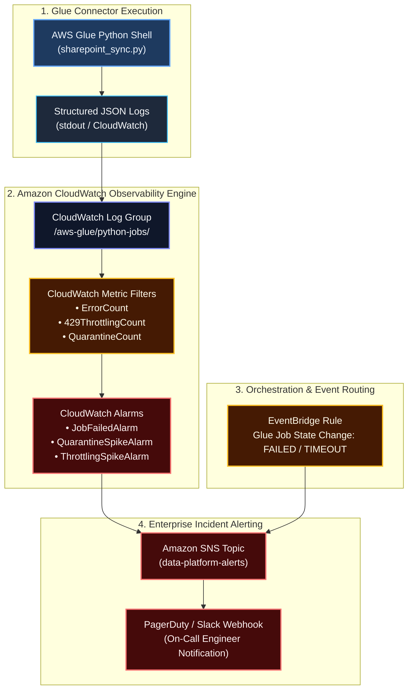

# Microsoft SharePoint Custom Ingestion Connector: Architectural Specification

> **Document Type:** Connector Technical Specification  
> **Source Platform:** Microsoft SharePoint Online / Microsoft 365 (via Microsoft Graph API v1.0) & SharePoint Server On-Premises  
> **Destination:** Amazon S3 Bronze Data Lakehouse (Parquet / Raw Binary & Metadata)  
> **Runtime:** AWS Glue Python Shell (0.0625 DPU)  
> **Reference Implementation:** [connector.py](file:///Users/toanbui/dev/data_ai_engineer/src/connectors/sharepoint/connector.py)

---

## 1. Protocol Architecture & Ingestion Lifecycle

The SharePoint Ingestion Connector utilizes the **Microsoft Graph API Delta Query Protocol** (`/root/delta`) to achieve incremental change detection across document libraries containing hundreds of thousands of files without recursive tree traversal.

### Architecture Logic Flowchart



### Protocol Sequence Diagram



---

## 2. Microsoft Graph Delta Query Protocol Mechanics

### 1. Delta URL Initialization
The sync starts at the document library root:
```http
GET https://graph.microsoft.com/v1.0/sites/{site_id}/drives/{drive_id}/root/delta
Authorization: Bearer {access_token}
Prefer: deltashowremoveddatamotion
```

### 2. Pagination & State Retention
* **In-Flight Batches:** Graph returns pages of changes with an `@odata.nextLink` property. The connector iterates through these links to drain the change backlog.
* **Terminal Checkpoint (`@odata.deltaLink`):** The final page of changes contains `@odata.deltaLink` instead of `@odata.nextLink`. This opaque URL contains the sync watermark:
  ```json
  {
    "@odata.deltaLink": "https://graph.microsoft.com/v1.0/sites/.../root/delta?token=aHR0cHM6Ly9n..."
  }
  ```
* **Atomic Persistence:** The connector commits `@odata.deltaLink` to `s3://{bucket}/state/sharepoint_{site}_delta.json` **only after** all documents in that run have been durably written.

### 3. Self-Healing on HTTP 410 Gone
* Microsoft Graph delta tokens expire if a pipeline is paused beyond the tenant's transaction retention window (typically 30 to 60 days).
* When a stale token is passed, Graph responds with `HTTP 410 Gone`.
* **Automated Self-Healing:** The connector catches `HTTP 410`, invalidates the cached cursor, and restarts a baseline delta crawl. Because the **ETag Cache Gate** is active, existing unchanged files in S3 are skipped in milliseconds, eliminating redundant binary re-downloads.

---

## 3. Zero-RAM Direct Binary Streaming

Managed lakehouse connectors (such as Databricks Lakeflow) load file contents into memory as single records, causing failures on files larger than 100 MB. 

The custom connector circumvents this through **two-stage direct-to-S3 streaming**:

```python
# 1. Graph returns a temporary, pre-authenticated CDN download URL
download_url = item.get("@microsoft.graph.downloadUrl")

# 2. Stream directly from CDN socket into S3 without memory buffer
with http_client.session.get(download_url, stream=True) as stream_resp:
    stream_resp.raise_for_status()
    s3_client.upload_fileobj(
        Fileobj=stream_resp.raw,
        Bucket=bucket_name,
        Key=f"raw/sharepoint/{site_id}/{item_id}/{file_name}",
        ExtraArgs={
            "ContentType": mime_type,
            "Metadata": {
                "upstream_etag": upstream_etag,
                "sharepoint_item_id": item_id
            }
        }
    )
```

* **Socket Plumbing:** `stream_resp.raw` is the underlying `urllib3` HTTPResponse socket. 
* **Buffer Isolation:** `upload_fileobj` streams the socket in 8 MB chunks directly to S3's multipart upload API. Process memory remains flat at ~16 MB even when streaming multi-gigabyte ISOs or CAD files.

---

## 4. Microsoft Entra ID Security Trimming (ACL Extraction)

To support enterprise Retrieval-Augmented Generation (RAG) where users must only query documents they have permission to view:

### 1. Permissions Query
For each ingested document, the connector queries:
```http
GET https://graph.microsoft.com/v1.0/sites/{site_id}/drive/items/{item_id}/permissions
```

### 2. Sidecar Metadata Generation
The connector extracts the `grantedToV2` structure, resolving:
* **Entra ID Security Groups:** Unique object GUIDs (e.g., `group:8e45f210-91a2-4a0b-bc11-123456789abc`)
* **User Principals:** User Principal Names (e.g., `user:cfo@company.com`)
* **Inheritance Flag:** Whether permissions are inherited from parent folders or broken explicitly.

The sidecar is written alongside the raw document:
```json
// s3://{bucket}/raw/sharepoint/{site_id}/{item_id}/metadata.json
{
  "doc_id": "01ABCD56789...",
  "file_name": "FY26_Executive_Compensation.xlsx",
  "site_id": "company.sharepoint.com,site-uuid,web-uuid",
  "upstream_etag": "\"{12345678-ABCD-EF01},2\"",
  "size_bytes": 482910,
  "mime_type": "application/vnd.openxmlformats-officedocument.spreadsheetml.sheet",
  "web_url": "https://company.sharepoint.com/sites/hr/Shared Documents/...",
  "created_at_utc": "2026-01-15T08:30:00Z",
  "modified_at_utc": "2026-02-28T14:12:00Z",
  "allowed_principals": [
    "group:8e45f210-91a2-4a0b-bc11-123456789abc",
    "user:cfo@company.com"
  ],
  "inherited_from_parent": true,
  "synced_at_utc": "2026-09-03T10:30:00Z"
}
```

---

## 5. Deletion, Move & Rename Semantics

| Upstream Event | Microsoft Graph Delta Payload | Connector Behavior |
| :--- | :--- | :--- |
| **File Deletion** | Emits item with `"@removed": {"reason": "deleted"}` | Writes `raw/.../{item_id}/DELETED` tombstone. Emits `DELETE` manifest entry. Downstream vector cleaner purges document. |
| **File Rename** | Same `item_id`, new `name` | Updates `metadata.json` with new file name. Preserves deterministic folder pointer. |
| **File Move** | Same `item_id`, new `parentReference.id` | Updates `parent_id` in `metadata.json`. No re-download of binary required. |
| **Permission Change** | File metadata unchanged, but `/permissions` updated | Connector refreshes `metadata.json` sidecar without re-streaming binary. |

---

## 6. Secrets Manager & Configuration Schema

Store credentials in **AWS Secrets Manager** under secret name `enterprise/rag/sharepoint_auth`:

```json
{
  "tenant_id": "00000000-1111-2222-3333-444444444444",
  "client_id": "55555555-6666-7777-8888-999999999999",
  "client_secret": "AQ...YOUR_AZURE_AD_APP_CLIENT_SECRET",
  "site_id": "company.sharepoint.com,11111111-2222-3333-4444-555555555555,66666666-7777-8888-9999-000000000000",
  "drive_id": ""
}
```
*Note: If `drive_id` is omitted, the connector defaults to the primary document library of the site (`/drive/root/delta`).*

---

## 7. Circuit Breaker & Failure Isolation Governance

To prevent cascading downstream outages, credential exhaust, and infinite error cascades:

### 1. Poison-Pill Quarantine Boundary
Individual document failures (corrupted PDFs, broken TCP streams, malformed filenames) are caught and directed to:
```
s3://{bucket}/quarantine/sharepoint/{item_id}/error.json
```
The batch continues processing the remaining 99.9% of healthy items without blocking the pipeline.

### 2. Batch-Level Cascading Circuit Breaker
If systemic failures occur (e.g., Entra ID token revoked mid-run, S3 bucket permissions altered, enterprise proxy drops connections):
* **Consecutive Failure Limit:** If **20 consecutive items** fail across worker threads, the circuit breaker immediately trips.
* **Batch Error Rate Threshold:** If the overall batch error rate exceeds **15%** of discovered items, the worker pool aborts execution.
* **State Safety:** When the circuit breaker trips, the `@odata.deltaLink` checkpoint is **not** committed. The next job execution restarts from the last durable checkpoint, safely retrying the batch after root-cause remediation.

---

## 8. Observability, Metric Filters & Enterprise Alerting Architecture

A production lakehouse ingestion connector must provide real-time observability, telemetry, and automated alerting for SLA breaches, rate limit spikes, and data quarantine anomalies.

### Observability & Alerting Architecture



### CloudWatch Metric Filters (Derived from `log_json`)

Every ingestion event emits structured JSON logs. CloudWatch Metric Filters automatically extract continuous metric data without external agents:

| Metric Name | CloudWatch Metric Filter Pattern | Metric Namespace | Unit |
| :--- | :--- | :--- | :--- |
| **`SharePointQuarantineCount`** | `{ $.level = "error" && $.action = "quarantine_item" }` | `DataLake/Ingestion/SharePoint` | Count |
| **`SharePointThrottlingCount`** | `{ $.level = "warning" && $.status_code = 429 }` | `DataLake/Ingestion/SharePoint` | Count |
| **`SharePointDeltaResetCount`** | `{ $.action = "delta_reset_410" }` | `DataLake/Ingestion/SharePoint` | Count |
| **`SharePointBytesIngested`** | `{ $.metrics.bytes_transferred = * }` | `DataLake/Ingestion/SharePoint` | Bytes |

### CloudWatch Alarms & Incident Escalation SLA

| Alarm Name | Evaluation Condition | Severity | Action & Target | Rationale |
| :--- | :--- | :--- | :--- | :--- |
| **`SharePointJobFailedAlarm`** | EventBridge state $\in$ `["FAILED", "TIMEOUT", "STOPPED"]` | **P1 - Critical** | SNS $\to$ PagerDuty | Immediate on-call engagement for broken ingestion pipeline. |
| **`SharePointQuarantineSpike`** | `SharePointQuarantineCount >= 5` in 15 mins | **P2 - High** | SNS $\to$ Slack (`#data-ops-alerts`) | Flags corrupted documents, upstream encoding breaks, or malformed PDFs. |
| **`SharePointExcessiveThrottling`** | `SharePointThrottlingCount >= 50` in 10 mins | **P3 - Medium** | SNS $\to$ Slack (`#data-ops-alerts`) | Tenant rate limits saturated; tune down `MAX_REQUESTS_PER_SEC`. |
| **`SharePointRunDurationSLA`** | Glue `ExecutionTime > 7200s` (2 hours) | **P2 - High** | SNS $\to$ Slack (`#data-ops-alerts`) | Catches socket hangs or unthrottled massive batch backlogs. |
| **`SharePointDeltaTokenExpired`** | `SharePointDeltaResetCount >= 1` | **P3 - Medium** | SNS $\to$ CloudWatch Dashboard | Informs platform team that tenant token was stale and full baseline sync completed. |

