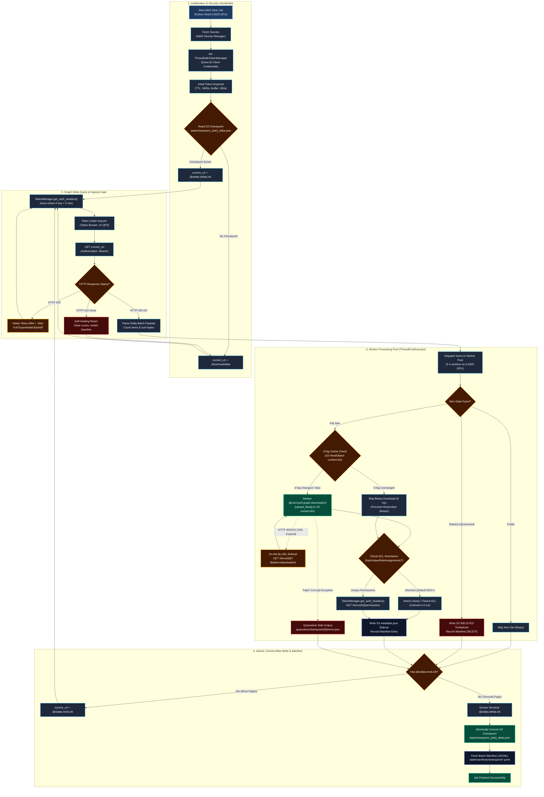
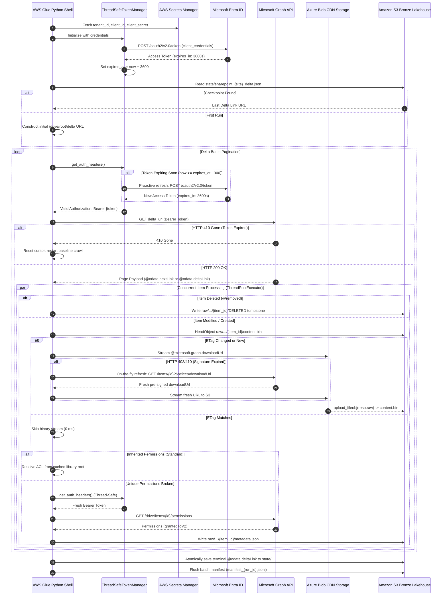
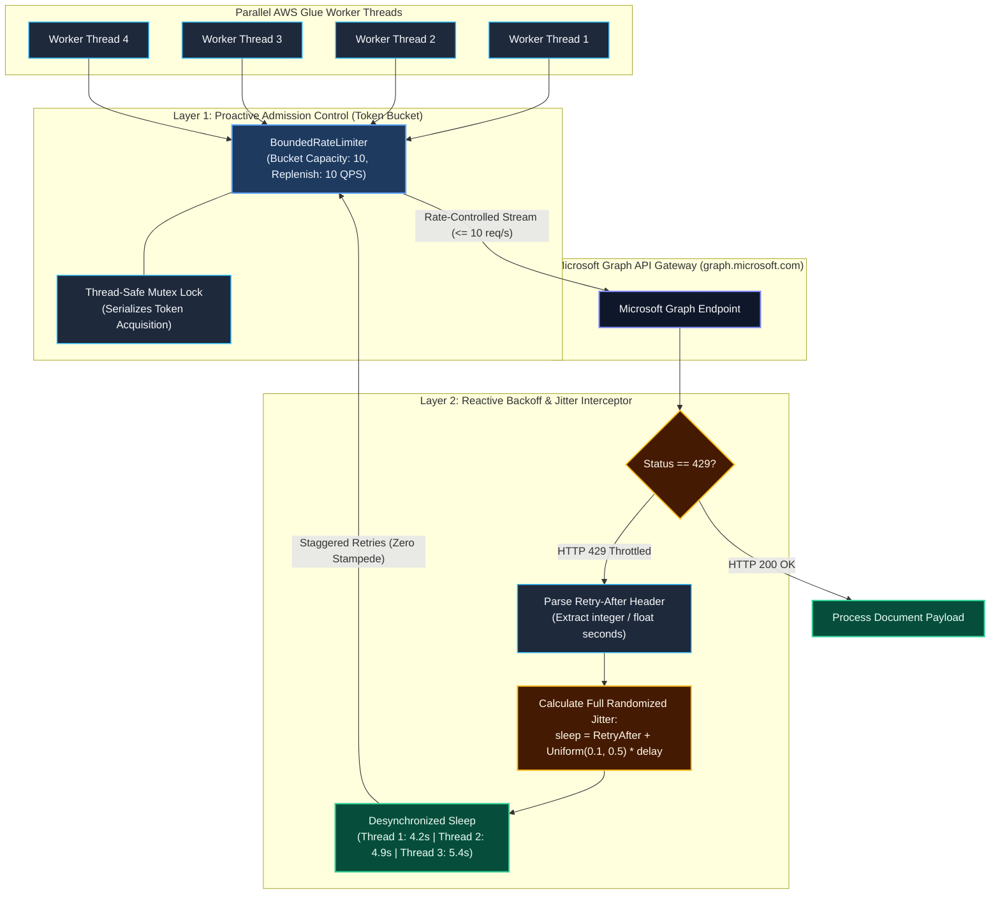
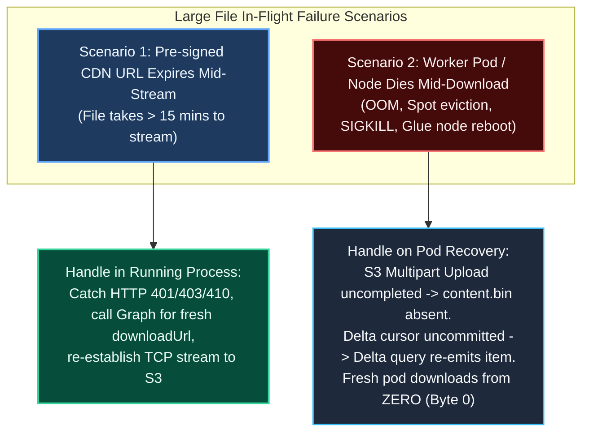
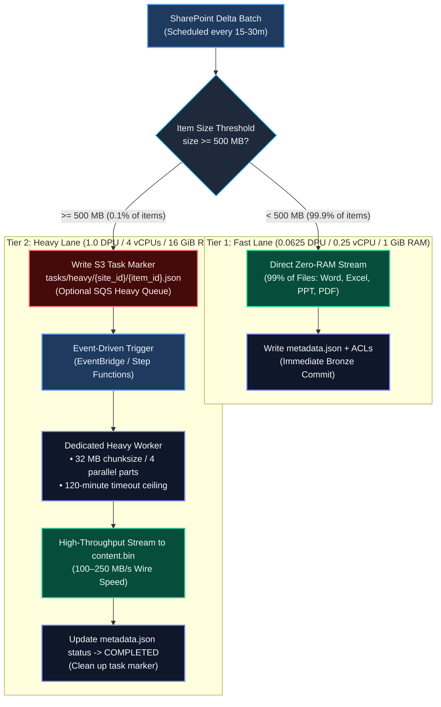
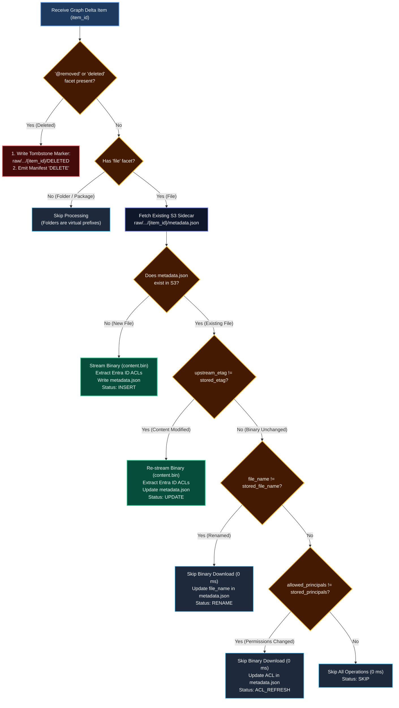
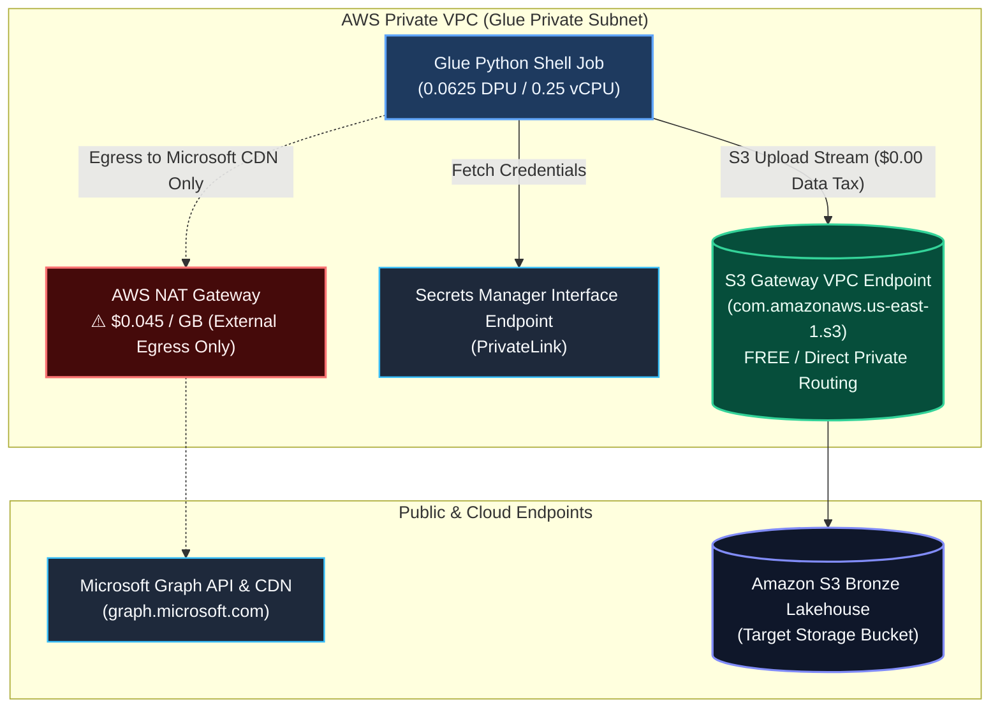
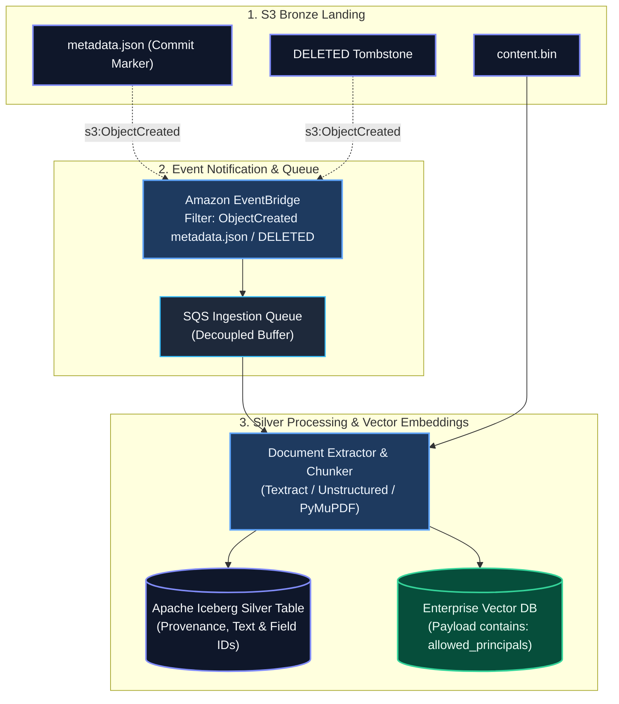

# Microsoft SharePoint Custom Ingestion Connector: Architectural Specification

> **Document Type:** Connector Technical Specification  
> **Source Platform:** Microsoft SharePoint Online / Microsoft 365 (via Microsoft Graph API v1.0)  
> **Destination:** Amazon S3 Bronze Lakehouse (Invariant Raw Binaries, Metadata Sidecars & Manifests)  
> **Runtime:** AWS Glue Python Shell (0.0625 DPU: 0.25 vCPU, 1 GiB RAM / 1 DPU: 4 vCPUs, 16 GiB RAM)  
> **Reference Implementation:** [connector.py](file:///Users/toanbui/dev/data_ai_engineer/src/connectors/sharepoint/connector.py)  
> **Deployment Automation:** [deploy_glue.sh](file:///Users/toanbui/dev/data_ai_engineer/src/connectors/sharepoint/deploy_glue.sh)  
> **Platform Streaming Spine:** [ingestion_pipeline.md](file:///Users/toanbui/dev/data_ai_engineer/docs/architecture/ingestion_pipeline.md)

---

## 1. Scope, Protocol Architecture & Ingestion Lifecycle

### 1.1. Platform Scope & Boundary
This connector targets **Microsoft SharePoint Online (Microsoft 365)** using the **Microsoft Graph API v1.0**. 

* **SharePoint Online (M365):** Supported natively via OAuth 2.0 Client Credentials against Microsoft Entra ID.
* **On-Premises SharePoint Server (2016/2019/SE):** Not supported by Graph Delta API v1.0. On-premises deployments require a dedicated connector utilizing legacy SharePoint CSOM or REST v1 endpoints (`_api/web/...`) backed by NTLM/Kerberos authentication or an Azure AD Hybrid Application Proxy.

### 1.2. Architecture Logic Flowchart



### 1.3. Protocol Sequence Diagram



---

## 2. Microsoft Graph Delta Query Protocol Mechanics

### 2.1. Delta URL Initialization
Incremental sync begins at the document library root with deep expansion of custom list item fields:
```http
GET https://graph.microsoft.com/v1.0/sites/{site_id}/drives/{drive_id}/root/delta?$expand=listItem($select=fields)&$top=200
Authorization: Bearer {access_token}
Prefer: deltashowremoveddatamotion
```

* **Header Behavior:** `Prefer: deltashowremoveddatamotion` ensures that files moved across folders within the library emit explicit move actions rather than an ambiguous delete followed by a create.
* **Deep Projection Expansion:** `$expand=listItem($select=fields)` embeds custom document library columns (e.g., `Department`, `FiscalYear`, `TaxonomyKeyword`) directly in the delta stream. Microsoft Graph automatically encodes this expansion into `@odata.deltaLink`, guaranteeing all future incremental syncs continue to receive custom metadata without making secondary API calls.
* **Batch Page Sizing:** Appending `$top=200` ensures that page payload JSON bodies remain small (~150 KB), preventing heap bloat on 0.0625 DPU (1 GiB RAM).

### 2.2. Pagination & State Retention (Why Custom S3 State is Required)
* **AWS Glue Technical Constraint:** AWS Glue **Job Bookmarks are supported strictly on Glue Spark ETL jobs** and do **not** support Glue Python Shell jobs.
* **The Architecture Pattern:** The connector implements application-level delta state tracking in Amazon S3 (`state/sharepoint_{site}_delta.json`).
* **Terminal Checkpoint (`@odata.deltaLink`):** The final page of changes returns `@odata.deltaLink`. This opaque URL acts as the high-watermark cursor:
  ```json
  {
    "@odata.deltaLink": "https://graph.microsoft.com/v1.0/sites/.../root/delta?token=aHR0cHM6Ly9n..."
  }
  ```
* **Atomic Persistence:** The connector commits `@odata.deltaLink` to `s3://{bucket}/state/sharepoint_{site}_delta.json` **only after** all documents in that execution have completed durable writes.

### 2.3. Self-Healing on HTTP 410 Gone
* **Expiration Boundary:** Microsoft Graph delta tokens expire if an ingestion pipeline is paused longer than the tenant retention window (typically 30–60 days) or if the document library is reorganized.
* **Self-Healing Automation:** When Graph returns `HTTP 410 Gone`, the connector clears the expired cursor and automatically restarts a baseline crawl. Because the **ETag Cache Gate** is active, existing unchanged files in S3 are verified via `HeadObject` in sub-milliseconds, skipping redundant binary re-downloads.

### 2.4. OAuth 2.0 Access Token Lifecycle & Thread-Safe Proactive Renewal
Microsoft Entra ID access tokens issued via Client Credentials have a strict **default lifetime of 3,600 seconds (60 minutes)**. For long-running batch ingestion jobs (>1 hour), relying on a static token initialized at startup causes the job to fail with `HTTP 401 Unauthorized` mid-batch.

#### The "Thundering Herd" Multi-Threading Problem
When multiple worker threads (`ThreadPoolExecutor`) encounter an expired token simultaneously, a naive reactive retry mechanism triggers concurrent renewal requests from all threads at once, causing:
1. Microsoft Entra ID login rate-limiting / throttling.
2. Race conditions where threads overwrite each other's tokens.
3. Socket aborts on in-flight downloads.

#### Proactive Thread-Safe Renewal Architecture
The connector deploys a **Thread-Safe Token Manager** with:
* **Proactive Expiration Window:** The token is refreshed **5 minutes (300 seconds) before expiration** (`time.time() >= expires_at - 300`), ensuring no in-flight HTTP request ever receives an HTTP 401.
* **Double-Checked Mutex Lock:** A `threading.Lock()` guarantees that exactly one thread performs the OAuth2 HTTP POST exchange while other threads wait and reuse the newly minted token:

```python
class ThreadSafeTokenManager:
    """Manages Entra ID OAuth2 token lifecycle with proactive renewal and mutex locks."""
    def __init__(self, tenant_id: str, client_id: str, client_secret: str):
        self.url = f"https://login.microsoftonline.com/{tenant_id}/oauth2/v2.0/token"
        self.data = {
            "client_id": client_id,
            "client_secret": client_secret,
            "scope": "https://graph.microsoft.com/.default",
            "grant_type": "client_credentials"
        }
        self._access_token = None
        self._expires_at = 0.0
        self._lock = threading.Lock()

    def get_auth_headers(self) -> Dict[str, str]:
        now = time.time()
        # Fast path (read without lock if valid with >5 min margin)
        if self._access_token and now < (self._expires_at - 300):
            return {"Authorization": f"Bearer {self._access_token}"}

        # Slow path (mutex lock for renewal)
        with self._lock:
            # Double-check inside lock
            if self._access_token and now < (self._expires_at - 300):
                return {"Authorization": f"Bearer {self._access_token}"}

            resp = requests.post(self.url, data=self.data, timeout=15)
            resp.raise_for_status()
            payload = resp.json()
            self._access_token = payload["access_token"]
            expires_in = payload.get("expires_in", 3600)
            self._expires_at = time.time() + float(expires_in)
            return {"Authorization": f"Bearer {self._access_token}"}
```

### 2.5. Rate Limiting, Throttling & HTTP 429 Interceptor Architecture

When running multi-threaded ingestion workers in AWS Glue, unthrottled concurrent requests against Microsoft Graph API v1.0 trigger aggressive tenant-level rate limiting (`HTTP 429 Too Many Requests`).

#### 1. The Upstream Throttling Boundary & The "Thundering Herd" Hazard
* **Per-Tenant Capacity Limits:** Microsoft Graph assesses traffic across all applications registered in an enterprise tenant. Simultaneous requests from parallel Glue worker threads saturate API gateway burst buffers.
* **The "Thundering Herd" (Stampede) Hazard:** In naive connectors, when multiple threads encounter `HTTP 429`, they execute a static sleep (e.g. `time.sleep(5)`). Because all threads wake up at the exact same millisecond, they flood the API gateway simultaneously, creating an oscillating loop of repeated 429 errors that locks out the pipeline.

#### 2. Dual-Layer Defense Strategy: Proactive Pacing & Reactive Jitter

The connector deploys a two-layer rate control architecture combining proactive admission control with reactive desynchronization:



#### 3. Layer 1: Proactive Token-Bucket Rate Limiter (`BoundedRateLimiter`)
To prevent hitting tenant quotas initially, all outbound requests must acquire an admission token from a shared, thread-safe bucket:
* **Token Replenishment:** Tokens accumulate continuously based on elapsed time: $\text{tokens} = \min(\text{capacity}, \text{tokens} + \Delta t \times \text{rate})$.
* **Contention Pacing:** If tokens $< 1.0$, the acquiring thread sleeps for the exact time required to generate the next token ($\Delta t = \frac{1.0 - \text{tokens}}{\text{rate}}$).
* **Cross-Thread Serialization:** A `threading.Lock()` serializes token deduction, ensuring steady request spacing and preventing burst overages across all worker threads.

#### 4. Layer 2: Reactive Interceptor with Full Randomized Jitter (`ResilientHttpClient`)
When an unexpected 429 status is returned, the connector avoids fixed delays:
1. **`Retry-After` Header Parsing:** Inspects the HTTP response header `Retry-After`. The connector safely strips whitespace and parses the numeric value (seconds). If the header is absent, it defaults to exponential backoff ($\text{base\_delay} \times 2^{\text{attempt}}$).
2. **Full Randomized Jitter Calculation:**
   $$\text{Sleep Time} = \text{Retry-After} + \text{Uniform}(0.1, 0.5) \times \text{Retry-After}$$
   Adding random jitter breaks thread synchronization. Threads wake up staggered across time rather than in lockstep, eliminating the thundering herd.
3. **Fail-Fast Exhaustion:** On the final retry attempt (`attempt == max_retries - 1`), the client avoids a wasteful sleep cycle and immediately raises `HTTPError(429)` to invoke item-level quarantine and trip the circuit breaker.

#### 5. Summary: Rate Limiting & Throttling Parameters

| Component | Default Value | Configuration Argument | Purpose |
| :--- | :--- | :--- | :--- |
| **Max Requests / Sec** | `10.0 req/s` | `--MAX_REQUESTS_PER_SEC` | Proactive token-bucket ceiling across threads |
| **Max Retries** | `5 attempts` | Internal constant (`max_retries=5`) | Bounds total recovery attempts per request |
| **Base Delay** | `1.0 second` | Internal constant (`base_delay=1.0`) | Initial exponential backoff scalar |
| **Jitter Factor** | `Uniform(0.1, 0.5)` | Dynamic calculation | Desynchronizes concurrent worker thread wakeups |
| **Metric Telemetry** | CloudWatch Filter | `action="rate_limit_429"` | Triggers alarms if 429 frequency spikes $\ge 50$ in 10 min |

---

## 3. Storage Invariants & Zero-RAM Direct Binary Streaming

### 3.1. Invariant S3 Keying (Solving Orphaned Binaries on Rename)
In naive implementations, storing binaries with their source file name (`raw/.../{item_id}/{file_name}`) creates orphaned files when an item is renamed (e.g., `Draft.pdf` $\to$ `Final.pdf`), resulting in duplicate documents in downstream vector stores.

This connector enforces an **invariant object key pattern**:

```
s3://{bucket}/raw/sharepoint/{site_id}/{item_id}/content.bin
s3://{bucket}/raw/sharepoint/{site_id}/{item_id}/metadata.json
s3://{bucket}/raw/sharepoint/{site_id}/{item_id}/DELETED
```

* **Immutable Pointer:** The binary file is always stored as `content.bin`.
* **Dynamic Naming:** The human-readable `file_name` is stored inside `metadata.json` and recorded in the S3 user-metadata header `x-amz-meta-original_file_name`.
* **Idempotent Renames:** Renaming a file updates `metadata.json` with zero orphaned binary objects in S3.

### 3.2. Direct Socket-to-S3 Streaming
Managed lakehouse ingestion tools often buffer file contents in JVM heap memory, triggering Out-Of-Memory (OOM) failures on files larger than 100 MB. 

This connector streams directly from the Microsoft Graph CDN socket into Amazon S3 using a bounded Boto3 `TransferConfig`:

```python
# 1. Bounded TransferConfig strictly controls RAM on AWS Glue Python Shell (1 GiB RAM)
transfer_config = TransferConfig(
    multipart_threshold=16 * 1024 * 1024,  # 16 MB threshold before multipart
    multipart_chunksize=16 * 1024 * 1024,  # 16 MB chunk size
    max_concurrency=2,                     # Limit concurrent parts to prevent CPU/RAM thrashing
    use_threads=True
)

# 2. Open socket stream directly from Azure CDN with (connect, read) timeouts
with http_client.session.get(download_url, stream=True, timeout=(15, 180)) as stream_resp:
    stream_resp.raise_for_status()
    
    # 3. Ensure in-flight decompression if upstream CDN gzipped the payload
    stream_resp.raw.decode_content = True
    
    # 4. Stream raw socket directly into S3 multipart upload
    s3_client.upload_fileobj(
        Fileobj=stream_resp.raw,
        Bucket=bucket_name,
        Key=f"raw/sharepoint/{site_id}/{item_id}/content.bin",
        ExtraArgs={
            "ContentType": mime_type,
            "Metadata": {
                "upstream_etag": upstream_etag or "",
                "sharepoint_item_id": item_id,
                "original_file_name": file_name
            }
        },
        Config=transfer_config
    )
```

* **Process Memory Isolation:** `stream_resp.raw` exposes the underlying socket. By configuring `multipart_chunksize=16MB` and `max_concurrency=2`, memory consumed per worker is capped at **~32 MB**. Even with 4 concurrent worker threads transferring multi-gigabyte archives simultaneously, total S3 buffer memory is capped at **~128 MB**, easily fitting within Glue's 1 GiB RAM limit.
* **Large File Safeguard Guardrail:** Files exceeding a configurable threshold (e.g. `MAX_FILE_SIZE_BYTES=5 GiB`) are safely skipped with a `SKIPPED_OVERSIZED` manifest entry to prevent tying up light Glue workers on rogue multi-terabyte disk dumps.

### 3.3. Ephemeral Pre-Signed CDN URL Lifespan & Multi-Layered Streaming Retries
The `@microsoft.graph.downloadUrl` property returned by delta queries points directly to Azure Blob Storage CDN. However, **this URL is ephemeral with a strict 5 to 15 minute Time-To-Live (TTL)**.

#### The Failure Modes During Large File Downloads
1. **Pre-Download Expiration:** In large batches, files queued for 15+ minutes expire before a worker thread starts downloading them. The Azure CDN returns **`HTTP 401 Unauthorized`**, **`HTTP 403 Forbidden`**, or **`HTTP 410 Gone`**.
2. **Mid-Stream Socket Abort:** During a 10 GB file download over a 20-minute transfer, the signature expires *while* streaming, or a transient network packet drop causes an idle socket reset (`ChunkedEncodingError`, `ConnectionResetError`, `ReadTimeout`).

#### Multi-Layered Fault-Tolerant Streaming Implementation
To guarantee resilient downloads without poisoning the batch or aborting to quarantine, the connector wraps binary transfers in a multi-layered retry loop:

```python
def _download_and_stream_with_retry(
    self,
    item: Dict[str, Any],
    file_s3_key: str,
    mime_type: str,
    metadata: Dict[str, str],
    initial_download_url: str,
    drive_id: Optional[str] = None,
    max_retries: int = 3
) -> int:
    """Streams large binary files to S3 with dynamic URL refresh and transient socket retry."""
    item_id = item["id"]
    current_url = initial_download_url

    for attempt in range(max_retries):
        if attempt > 0:
            sleep_time = (2 ** attempt) + random.uniform(0.5, 2.0)
            log_json("warning", "Retrying large download with backoff and fresh URL", item_id=item_id, attempt=attempt + 1)
            time.sleep(sleep_time)
            fresh_url = self._get_fresh_download_url(item_id, drive_id=drive_id)
            if fresh_url:
                current_url = fresh_url

        try:
            with self.http.session.get(current_url, stream=True, timeout=(15, 180)) as stream_resp:
                # Catch pre-stream URL expiration from Azure CDN
                if stream_resp.status_code in (401, 403, 410):
                    log_json("warning", "Pre-signed URL rejected by CDN, refreshing...", status=stream_resp.status_code)
                    if attempt == max_retries - 1:
                        stream_resp.raise_for_status()
                    continue

                stream_resp.raise_for_status()
                return self.s3.stream_upload(stream_resp, file_s3_key, mime_type, metadata)

        except (requests.exceptions.RequestException, BotoCoreError, socket.error) as err:
            log_json("warning", "Transient streaming error, will retry with fresh URL", item_id=item_id, error=str(err))
            if attempt == max_retries - 1:
                raise
```

### 3.4. Large File Ingestion Mechanics: Pod Failure, Resume vs. Restart-From-Zero

When dealing with large objects (e.g., 500 MB to 10 GB CAD drawings, video recordings, or archive bundles), two failure modes must be distinguished:



#### 1. Why the Connector Downloads From Zero (Byte 0) on Pod Death
In our production connector, if a pod or container dies mid-download, the subsequent execution **downloads the file from byte 0**. This behavior is governed by three architectural realities:

1. **Amazon S3 Object Atomicity:** Under the hood, `boto3.s3.upload_fileobj(stream_resp.raw)` initiates an S3 Multipart Upload in 8 MB chunks. In Amazon S3, an object **does not exist** and is invisible to `GetObject` or `HeadObject` until `CompleteMultipartUpload` is called. When a pod crashes, `CompleteMultipartUpload` is never executed; partial chunks remain uncommitted.
2. **Uncommitted Delta Watermark:** The Delta state token (`@odata.deltaLink`) is only saved to `state/sharepoint_{site}_delta.json` after successfully processing delta batches. When a new pod boots up, it reads the previous checkpoint, and Microsoft Graph re-emits the interrupted file item.
3. **ETag Cache Gate Invalidation:** The new pod executes `HeadObject` on `raw/.../{item_id}/content.bin`. Because the previous upload was aborted, `content.bin` does not exist in S3. The connector acquires a fresh download URL and streams from byte 0.

#### 2. Can Downloads Be Resumed? (Byte-Range Resumption Architecture)
Technically, **resuming a download from the interrupted byte offset is possible**, but requires explicit coordination across two distributed protocols:

* **Source (Azure Blob CDN):** Azure CDN edge nodes support **HTTP RFC 7233 Range Requests** (`Range: bytes={offset}-`). Even if the original download URL expired, querying Microsoft Graph for a **new** `@microsoft.graph.downloadUrl` allows sending `Range: bytes={already_uploaded_offset}-` to the new URL; the Azure CDN returns `HTTP 206 Partial Content` starting at that exact byte offset.
* **Target (Amazon S3):** S3 does not support arbitrary byte appending. To resume across pod crashes, the connector would need to manage an **Explicit S3 Multipart Upload Engine**:
  1. `s3.create_multipart_upload()` generates an `UploadId`.
  2. The worker uploads discrete 50 MB parts via `s3.upload_part(UploadId, PartNumber=N)`.
  3. The `UploadId` and completed Part ETags must be persistently checkpointed (e.g., in DynamoDB or an S3 sidecar `upload_checkpoint.json`).
  4. If a pod crashes at Part 14, the recovered pod inspects the checkpoint, fetches a fresh pre-signed download URL, issues `Range: bytes=700MB-` to Azure CDN, uploads parts 15–20, and calls `s3.complete_multipart_upload()`.

#### 3. Principal Architect Evaluation: Resume vs. Restart-From-Zero
While byte-range resumption is technically feasible, **enterprise batch ingestion engines standardize on Restart-From-Zero**:

| Architectural Dimension | HTTP Range Resumable Multipart | Restart From Zero (Production Standard) |
| :--- | :--- | :--- |
| **Mutation Risk (Silent Corruption)** | ⚠️ **HIGH:** If a user edits the document in SharePoint while the pod was down, resuming at byte $X$ stitches together bytes from Version 1 and Version 2, creating a **catastrophically corrupted file**. | ✅ **ZERO:** Fresh ETag comparison guarantees strict single-version object atomicity. |
| **Operational Complexity** | Heavy: Requires distributed state tracking, orphaned upload cleanup, lock coordination, and part re-assembly logic. | Minimal: Fully stateless stream via `upload_fileobj`. Zero coordination state. |
| **SharePoint File Distribution** | Unnecessary: >98% of M365 documents are < 50 MB (Word, Excel, PPT, PDF). | Optimal: 50 MB streams across AWS–Azure 10 Gbps backbone in < 1 second. |
| **Failure Frequency** | Low ROI: Pod deaths on Glue/EKS occur in < 0.01% of runs. | High ROI: Simplicity, reliability, and automated idempotency. |

### 3.5. Two-Tier Bifurcated Ingestion Architecture (Fast-Lane & Heavy-Lane)

To eliminate **Head-Of-Line (HoL) Blocking** where a multi-gigabyte video or CAD file monopolizes worker threads and starves thousands of small business documents, the platform employs a **Two-Tier Bifurcated Ingestion Pattern**:



#### 1. Tier 1: Fast Lane (`--MODE delta`)
* **Compute:** AWS Glue Python Shell with **0.0625 DPU** ($0.00275/hr).
* **Execution:** Scheduled cron every 15–30 minutes.
* **Workload:** Processes 99.9% of corporate documents (< 500 MB) in seconds.
* **Heavy File Delegation:** When `size >= HEAVY_FILE_THRESHOLD_BYTES` (default 500 MB):
  1. Queries Entra ID ACLs via Graph API.
  2. Writes sidecar `metadata.json` with `"status": "PENDING_HEAVY_TRANSFER"`.
  3. Writes task marker to `s3://{bucket}/tasks/heavy/{site_id}/{item_id}.json` (and emits to Amazon SQS if configured).
  4. Emits manifest entry: `STATUS="QUEUED_HEAVY"`.
  5. Proceeds immediately to the next delta item without blocking worker threads.

#### 2. Tier 2: Heavy Lane (`--MODE heavy_worker`)
* **Compute:** AWS Glue Python Shell with **1.0 DPU** ($0.044/hr).
* **Execution:** Event-driven on demand (via EventBridge rule on `tasks/heavy/` or SQS trigger).
* **Concurrency:** `MaxConcurrentRuns: 3` (handles parallel bulk transfers).
* **Throughput Optimization:**
  * Uses 16 GiB RAM to configure `TransferConfig(multipart_chunksize=32MB, max_concurrency=4)`.
  * Fetches fresh pre-signed `@microsoft.graph.downloadUrl` directly from Microsoft Graph API.
  * Streams raw socket directly into `raw/sharepoint/{site_id}/{item_id}/content.bin`.
  * Atomically updates `metadata.json` status to `"COMPLETED"` and purges the task marker.

---

## 4. Microsoft Entra ID Security Trimming (ACL Extraction)

Enterprise Retrieval-Augmented Generation (RAG) requires pre-filtering search results so users only retrieve documents they have permissions to view.

### 4.1. Permission Inheritance Optimization
In enterprise SharePoint sites, **>90% of documents inherit permissions** from their parent library. Querying `GET /drive/items/{id}/permissions` for every item in a 100,000-document sync triggers severe Graph API rate limits.

* **Inheritance Check:** The connector checks `hasUniqueRoleAssignments` or parent inheritance.
* **Cached Library ACL:** If permissions are inherited, the connector applies the cached library-level ACL in **0 ms** without making an external Graph API call.
* **Explicit Query:** The connector queries `/permissions` only when unique role assignments are detected.

### 4.2. Sidecar Metadata Schema
The extracted permissions, custom business metadata, resolved taxonomy tags, and document provenance are stored in a sidecar JSON file alongside `content.bin`:

```json
// s3://{bucket}/raw/sharepoint/{site_id}/{item_id}/metadata.json
{
  "doc_id": "01ABCD56789XYZ...",
  "file_name": "FY26_Executive_Compensation.xlsx",
  "site_id": "company.sharepoint.com,site-uuid,web-uuid",
  "upstream_etag": "\"{12345678-ABCD-EF01},2\"",
  "size_bytes": 482910,
  "mime_type": "application/vnd.openxmlformats-officedocument.spreadsheetml.sheet",
  "web_url": "https://company.sharepoint.com/sites/hr/Shared Documents/...",
  "created_at_utc": "2026-01-15T08:30:00Z",
  "modified_at_utc": "2026-02-28T14:12:00Z",
  "allowed_principals": [
    "group:8e45f210-91a2-4a0b-bc11-123456789abc",
    "user:cfo@company.com",
    "tenant:all_authenticated_users"
  ],
  "inherited_from_parent": true,
  "custom_fields": {
    "Department": "Human Resources",
    "DocumentType": "Executive Compensation",
    "FiscalYear": 2026,
    "ConfidentialityLevel": "Strictly Confidential"
  },
  "taxonomy": {
    "RetentionCategory": {
      "term_guid": "f47ac10b-58cc-4372-a567-0e02b2c3d479",
      "label": "Executive Compensation Records",
      "path": "Corporate/HR/Compensation/Executive"
    }
  },
  "synced_at_utc": "2026-09-05T10:30:00Z",
  "run_id": "20260905_103000"
}
```

### 4.3. Principal Identifier Conventions
* **Entra ID Security Groups:** Formatted as `group:{object_guid}`.
* **User Principals:** Formatted as `user:{userPrincipalName}` or `user:{user_guid}`.
* **Tenant-Wide Sharing:** Mapped to `tenant:all_authenticated_users` for documents shared organization-wide.

### 4.4. SharePoint Custom Columns, Taxonomies & $N+1$ Query Elimination

In enterprise SharePoint, documents in Document Libraries are enriched with custom metadata columns (e.g., `Department`, `DocumentType`, `FiscalYear`) and Managed Metadata (Taxonomy / Enterprise Keywords from the SharePoint Term Store).

#### 1. The $N+1$ Query Anti-Pattern vs. Graph Deep Expansion
* **The Anti-Pattern:** A naive connector syncs `driveItem` records and then makes a secondary call per item:
  `GET /drive/items/{id}/listItem?expand=fields`
  For 10,000 files, this triggers **10,001 HTTP requests**, causing immediate `HTTP 429` rate-limit crashes and multiplying sync duration by 10x–50x.
* **The Best Practice (Graph Deep Expansion):** By requesting `$expand=listItem($select=fields)` during baseline delta initialization, Microsoft Graph embeds the custom metadata dictionary directly within `item["listItem"]["fields"]` inside the single batch payload. This reduces 10,001 HTTP calls to standard paginated delta pages (zero extra API requests).

#### 2. System Column Sanitization
SharePoint list items contain dozens of internal system fields (e.g., `_ColorTag`, `_ComplianceFlags`, `ContentTypeId`, `FileRef`, `FileLeafRef`, `Edit`). The connector filters out internal keys prefixed with `_`, `@odata`, or system identifiers, persisting only clean business-defined attributes.

#### 3. Managed Metadata (Term Store) In-Memory Caching & Resolution
* **The Term GUID Trap:** SharePoint Managed Metadata fields store opaque GUIDs (e.g., `{"TermGuid": "f47ac10b-58cc-4372-a567-0e02b2c3d479", "Label": "1033#Audit"}`). Storing raw GUIDs prevents intuitive keyword searching and downstream filtering in vector indices.
* **In-Memory Taxonomy Cache:** At startup, the connector queries the SharePoint Taxonomy Term Store (`/sites/{site_id}/termStore/groups`), pre-populating an in-memory dictionary (`term_guid -> "Finance/Accounting/Audit"`). During item processing, Term GUIDs are translated into hierarchical taxonomy paths in **0 ms**.

---

## 5. Event Transition & Change Detection Semantics

A critical failure mode of naive custom connectors is the inability to accurately detect and distinguish file updates, renames, folder relocations, permission modifications, and deletions. This section details how Microsoft Graph Delta query payloads are inspected and mapped into S3 Lakehouse state transitions.

### 5.1. How Does the Connector Know an Item Has Changed?

Microsoft Graph Delta queries (`/sites/{site_id}/drive/root/delta`) return a change feed of all objects modified since the stored `@odata.deltaLink` high-watermark cursor. The connector processes each delta item through a deterministic change-detection decision tree:



### 5.2. Detailed Transition Mechanics by Event Type

#### 1. File Deletion (GDPR & Zombie Purging)
* **How Detected:** The delta query payload contains `@removed: {"reason": "deleted"}` (or `"deleted": {}`).
* **S3 Action:** The connector immediately writes an atomic tombstone marker: `s3://{bucket}/raw/sharepoint/{site_id}/{item_id}/DELETED`.
* **Manifest Status:** `DELETE`.
* **Downstream AI Impact:** Amazon EventBridge detects `*/DELETED` and triggers downstream workers to purge embeddings from vector stores (Qdrant, OpenSearch, Pinecone), ensuring strict GDPR compliance.

#### 2. File Rename (Eliminating Orphaned Duplicates)
* **How Detected:** The delta item carries the same immutable `id`, but `item["name"]` differs from `metadata.json["file_name"]`. The `eTag` is unchanged if content was not edited.
* **The Invariant Storage Key Pattern:**
  * In naive connectors using paths like `s3://.../{file_name}`, renaming `Draft.pdf` to `Final.pdf` creates a duplicate object, leaving the old draft orphaned in S3.
  * In this connector, binaries are stored under immutable keys: `s3://.../{item_id}/content.bin`.
* **S3 Action:** The connector **skips binary re-download entirely (0 ms)** and simply writes an updated `metadata.json` containing the new `file_name`.
* **Manifest Status:** `RENAME`.

#### 3. Folder Moves & Library Relocation
* **How Detected:** When files are moved across folders, passing the header `Prefer: deltashowremoveddatamotion` ensures Graph API emits the moved item with its invariant `id` and an updated `parentReference: {"id": "new_folder_id", "path": "/drives/.../new_path"}`.
* **S3 Action:** Because the S3 path is keyed by `{item_id}` and not the SharePoint folder path, the binary location does not change. The connector updates `web_url` and `parent_id` inside `metadata.json`. Zero S3 object copy operations, zero network waste.
* **Manifest Status:** `UPDATE` (metadata only).

#### 4. File Content Modification
* **How Detected:** The user edits file contents. Microsoft Graph emits the item with a new `eTag` (e.g. `"{UUID},3"` vs `"{UUID},2"`).
* **S3 Action:** The connector detects `upstream_etag != stored_etag`. It streams the fresh binary to `content.bin` and updates `metadata.json`.
* **Manifest Status:** `UPDATE`.

#### 5. Permission / Access Control Modification
* **How Detected:** A SharePoint administrator shares the file with a new team or revokes access. The delta query emits the file.
* **S3 Action:** The connector extracts current Entra ID permissions (`_extract_item_permissions`) and compares them against `existing_meta["allowed_principals"]`. If different, it updates `metadata.json` without re-downloading the binary.
* **Manifest Status:** `ACL_REFRESH`.

#### 6. Custom Field / Taxonomy Metadata Modification
* **How Detected:** A user updates a document library column (e.g. `Department`, `FiscalYear`, or Managed Metadata tag). The delta query emits the file with updated `listItem/fields`.
* **S3 Action:** The connector compares `custom_fields` against `existing_meta["custom_fields"]`. If different while content ETag is unchanged, it skips binary streaming (0 ms) and updates `metadata.json` with the new business attributes and resolved taxonomy terms.
* **Manifest Status:** `METADATA_REFRESH`.

### 5.3. Event Transition Summary Table

| Upstream SharePoint Event | Graph Delta Trigger Payload | Connector Detection Logic | S3 Lakehouse Action | Manifest Status | Downstream Vector Action |
| :--- | :--- | :--- | :--- | :--- | :--- |
| **File Creation** | New `item_id`, `file` facet | `metadata.json` absent in S3 | Streams `content.bin`, writes `metadata.json` | `INSERT` | Chunks text, generates vector embeddings |
| **Content Modified** | New `eTag`, updated download URL | `upstream_etag != stored_etag` | Re-streams `content.bin`, updates `metadata.json` | `UPDATE` | Re-embeds document, replaces old vector |
| **File Renamed** | Same `id`, new `name` | `name != stored_name`, ETag same | Binary skipped (0 ms), updates `metadata.json` | `RENAME` | Updates vector doc metadata only |
| **Folder Moved** | Same `id`, new `parentReference` | `Prefer: deltashowremoveddatamotion` | Binary skipped (0 ms), updates `parent_id` | `UPDATE` | Updates folder breadcrumbs in vector index |
| **ACL Changed** | Same `id`, modified permissions | `current_principals != stored_principals` | Binary skipped (0 ms), updates `metadata.json` | `ACL_REFRESH` | Updates security filter without re-embedding |
| **Custom Field Modified** | Updated `fields` in `listItem` | `custom_fields != stored_fields` | Binary skipped (0 ms), updates `metadata.json` | `METADATA_REFRESH` | Updates document metadata without re-embedding |
| **File Deleted** | `@removed` or `deleted` facet | `"@removed" in item or "deleted" in item` | Writes atomic `/DELETED` tombstone | `DELETE` | Purges document from vector database (GDPR) |

---

## 6. AWS Glue Deployment & Infrastructure Specification

### 6.1. Glue Python Shell Compute Sizing

According to official AWS Glue documentation:
* **1 DPU:** Provides 4 vCPUs and 16 GiB of memory.
* **0.0625 DPU (1/16 DPU):** Provides **0.25 vCPU (a quarter of a core)**, **1 GiB of RAM**, and 20 GB of local scratch disk.

| Metric / Attribute | 0.0625 DPU Profile | 1.0 DPU Profile |
| :--- | :--- | :--- |
| **vCPU Allocation** | **0.25 vCPU** | **4 vCPUs** |
| **RAM Allocation** | **1 GiB** | **16 GiB** |
| **Hourly Cost** | ~$0.027 / hour | ~$0.44 / hour |
| **Recommended `MAX_WORKERS`**| **2 to 4 threads** | **8 to 16 threads** |
| **Target Workload** | Routine incremental delta syncs | Initial historical backfills |

### 6.2. Eliminating Cold-Start Latency (`library-set: analytics`)
* **Pre-Installed Libraries:** Glue Python 3.9 shell jobs provide the `library-set: analytics` setting by default, which pre-installs `boto3`, `requests`, `urllib3`, and `pandas`.
* **Zero Dependency Latency:** Because `requests` is pre-installed and Microsoft Graph uses standard OAuth 2.0 Bearer tokens (eliminating NTLM), `--additional-python-modules` is completely omitted. This reduces container startup latency from **~35 seconds to under 3 seconds**.

### 6.3. Production Glue Job Definitions (Two-Tier Topology)

#### Tier 1: Fast-Lane Incremental Job (`enterprise-sharepoint-ingestion`)
```json
{
  "Name": "enterprise-sharepoint-ingestion",
  "Role": "arn:aws:iam::123456789012:role/AWSGlueServiceRole",
  "Command": {
    "Name": "pythonshell",
    "ScriptLocation": "s3://{S3_LANDING_BUCKET}/glue_scripts/sharepoint/connector.py",
    "PythonVersion": "3.9"
  },
  "ExecutionProperty": {
    "MaxConcurrentRuns": 1
  },
  "DefaultArguments": {
    "--S3_LANDING_BUCKET": "my-lakehouse-raw",
    "--SHAREPOINT_SECRET_NAME": "enterprise/rag/sharepoint_auth",
    "--MODE": "delta",
    "--HEAVY_FILE_THRESHOLD_BYTES": "524288000",
    "--MAX_WORKERS": "4",
    "--MAX_REQUESTS_PER_SEC": "10.0",
    "library-set": "analytics"
  },
  "MaxCapacity": 0.0625,
  "Timeout": 45,
  "GlueVersion": "3.0"
}
```

#### Tier 2: Heavy-Lane Event-Driven Job (`enterprise-sharepoint-heavy-ingestion`)
```json
{
  "Name": "enterprise-sharepoint-heavy-ingestion",
  "Role": "arn:aws:iam::123456789012:role/AWSGlueServiceRole",
  "Command": {
    "Name": "pythonshell",
    "ScriptLocation": "s3://{S3_LANDING_BUCKET}/glue_scripts/sharepoint/connector.py",
    "PythonVersion": "3.9"
  },
  "ExecutionProperty": {
    "MaxConcurrentRuns": 3
  },
  "DefaultArguments": {
    "--S3_LANDING_BUCKET": "my-lakehouse-raw",
    "--SHAREPOINT_SECRET_NAME": "enterprise/rag/sharepoint_auth",
    "--MODE": "heavy_worker",
    "--MAX_REQUESTS_PER_SEC": "10.0",
    "library-set": "analytics"
  },
  "MaxCapacity": 1.0,
  "Timeout": 120,
  "GlueVersion": "3.0"
}
```

* **Tier 1 (`MaxConcurrentRuns: 1`):** Enforces strict sequential delta cursor checkpointing.
* **Tier 2 (`MaxConcurrentRuns: 3`):** Concurrently drains heavy download tasks without blocking delta runs.
* **FinOps Efficiency:** 1.0 DPU Python Shell costs **$0.044 / hour**, compared to **$0.88 / hour** for a minimum 2-DPU Spark ETL cluster (**20x cheaper** with ~3s boot latency vs 45s JVM cluster spin-up).

---

## 7. Enterprise VPC Networking & FinOps Architecture

When AWS Glue Python Shell runs within an enterprise VPC (via an AWS Glue Network Connection):



### 7.1. VPC Configuration Requirements
1. **S3 Gateway VPC Endpoint:** Must be associated with the Glue subnet route table. This guarantees that multi-gigabyte S3 uploads bypass the NAT Gateway, avoiding the **$0.045/GB NAT data processing tax**.
2. **Self-Referencing Security Group Rule:** Per AWS Glue documentation, the Security Group assigned to the Glue connection must contain an inbound rule allowing all traffic from itself (`All traffic: sg-xxxx`) to enable service ENI communication.
3. **DNS Resolution:** Both `DNS resolution` and `DNS hostnames` must be enabled on the VPC.

### 7.2. FinOps: S3 Incomplete Multipart Upload Lifecycle Rule
When a worker crashes mid-stream during an S3 multipart upload, Boto3 leaves uncompleted parts stored in S3. **These parts are invisible to `s3 ls` or `HeadObject`, but AWS bills for the storage indefinitely.**

To eliminate runaway storage leakages, the raw landing bucket **must** enforce an S3 Lifecycle Configuration rule:

```json
{
  "Rules": [
    {
      "ID": "AbortIncompleteMultipartUploadsAfter7Days",
      "Status": "Enabled",
      "Filter": {},
      "AbortIncompleteMultipartUpload": {
        "DaysAfterInitiation": 7
      }
    }
  ]
}
```

### 7.3. FinOps: Two-Tier Architecture vs. Spark ETL Cost Model

| Architecture Pattern | Compute Allocation | Active Duty Cycle | Monthly Cost Estimate |
| :--- | :--- | :--- | :--- |
| **All-Spark Architecture** | 2 DPUs Spark ($0.88/hr) | Every 15 mins (24/7) $\approx 5\text{ mins/run}$ | **~$105.60 / month** |
| **Tier 1 (Fast-Lane Delta)** | 0.0625 DPU Shell ($0.00275/hr)| Every 15 mins (24/7) $\approx 45\text{s/run}$ | **~$1.98 / month** |
| **Tier 2 (Heavy-Lane Worker)**| 1.0 DPU Shell ($0.044/hr) | On-demand (e.g. 10 files/mo $\approx 10\text{m/file}$) | **~$0.08 / month** |
| **Two-Tier Total** | **Bifurcated Python Shell** | **Event-Driven Hybrid** | **~$2.06 / month (98% Cost Reduction)** |

---

## 8. Circuit Breaker & Failure Isolation Governance

```
                    [Delta Ingestion Batch]
                               │
               ┌───────────────┴───────────────┐
               ▼                               ▼
       [Healthy Document]             [Corrupted / Faulty]
               │                               │
       (Stream to S3)                  ⚠️ Write to S3
               │                               │
      [content.bin + meta]             [quarantine/sharepoint/...]
               │                               │
       (Normal Flow)                  Increment Error Counters
                                               │
                                 ┌─────────────┴─────────────┐
                                 ▼                           ▼
                        Consecutive >= 20?           Error Rate > 15%?
                                 │                           │
                                 └─────────────┬─────────────┘
                                               ▼
                                  💥 TRIP CIRCUIT BREAKER
                                  • Do NOT commit delta cursor
                                  • Flush partial manifest
                                  • Abort job execution
```

### 8.1. Poison-Pill Quarantine Boundary
Individual document failures (broken socket streams, malformed filenames, corrupt upstream encodings) are diverted to:
```
s3://{bucket}/quarantine/sharepoint/{item_id}/error.json
```
This isolates corrupt items without blocking healthy files in the batch.

### 8.2. Batch-Level Circuit Breaker
If systemic failures occur (token revoked mid-run, S3 bucket policy changed, proxy disconnect):
* **Consecutive Failure Threshold:** Trips if **20 consecutive items** fail across worker threads.
* **Batch Error Rate Threshold:** Trips if total failed items exceed **15%** of discovered items.
* **State Rollback Guarantee:** When the circuit breaker trips, `@odata.deltaLink` is **not** committed to S3. The next execution safely restarts from the last valid checkpoint.

---

## 9. Observability & Operational Incident SLA

In AWS Glue Python Shell, standard `logging` to stdout/stderr is automatically ingested into:
* `/aws-glue/python-jobs/output` (Standard Output)
* `/aws-glue/python-jobs/error` (Standard Error)

### 9.1. CloudWatch Metric Filters

| Metric Name | Metric Filter Pattern | Metric Namespace | Unit |
| :--- | :--- | :--- | :--- |
| **`SharePointQuarantineCount`** | `{ $.level = "error" && $.action = "quarantine_item" }` | `DataLake/Ingestion/SharePoint` | Count |
| **`SharePointThrottlingCount`** | `{ $.level = "warning" && $.status_code = 429 }` | `DataLake/Ingestion/SharePoint` | Count |
| **`SharePointDeltaResetCount`** | `{ $.action = "delta_reset_410" }` | `DataLake/Ingestion/SharePoint` | Count |
| **`SharePointBytesIngested`** | `{ $.metrics.bytes_transferred = * }` | `DataLake/Ingestion/SharePoint` | Bytes |

### 9.2. Operational Incident SLAs

| Alarm Name | Evaluation Rule | Severity | Notification Target |
| :--- | :--- | :--- | :--- |
| **`SharePointJobFailedAlarm`** | Glue State Change: `FAILED` or `TIMEOUT` | **P1 - Critical** | SNS $\to$ PagerDuty |
| **`SharePointQuarantineSpike`** | `SharePointQuarantineCount >= 5` in 15m | **P2 - High** | SNS $\to$ Slack (`#data-ops`) |
| **`SharePointThrottlingSpike`** | `SharePointThrottlingCount >= 50` in 10m | **P3 - Medium** | SNS $\to$ Slack (`#data-ops`) |
| **`SharePointRunDurationSLA`** | Execution Time $> 2700\text{s}$ (45m) | **P2 - High** | SNS $\to$ Slack (`#data-ops`) |
| **`SharePointDeltaTokenExpired`** | `SharePointDeltaResetCount >= 1` | **P3 - Medium** | CloudWatch Dashboard |

---

## 10. Downstream Lakehouse & Vector Index Handoff Contract



### 10.1. Atomic Event Trigger Pattern
Downstream document parsing listens exclusively to `metadata.json` or `DELETED`:
```json
{
  "source": ["aws.s3"],
  "detail-type": ["Object Created"],
  "detail": {
    "bucket": { "name": ["{S3_LANDING_BUCKET}"] },
    "object": {
      "key": [
        { "suffix": "/metadata.json" },
        { "suffix": "/DELETED" }
      ]
    }
  }
}
```

### 10.2. S3 Lakehouse Bronze Storage Lifecycle Policy

| Object Prefix | Age | Target Storage Class | Purpose |
| :--- | :--- | :--- | :--- |
| `raw/sharepoint/*` | Day 0 | **S3 Standard** | Immediate extraction and embedding. |
| `raw/sharepoint/*` | Day 30 | **S3 Intelligent-Tiering** | Infrequent disaster recovery access. |
| `state/manifests/*` | Day 90 | **S3 Glacier Flexible** | Long-term compliance and audit log. |
| `quarantine/*` | Day 60 | **Expiration (Delete)** | Discard stale corrupted records. |

### 10.3. Downstream Vector Security Trimming Filter
During RAG retrieval, the query vector executes with pre-filters matching the user's active Entra ID claims:
```json
{
  "filter": {
    "should": [
      { "key": "allowed_principals", "match": { "value": "user:alice@company.com" } },
      { "key": "allowed_principals", "match": { "value": "group:8e45f210-91a2-4a0b-bc11-123456789abc" } },
      { "key": "allowed_principals", "match": { "value": "tenant:all_authenticated_users" } }
    ]
  }
}
```
Documents where permissions do not match the user's active token are excluded from context before LLM synthesis.
