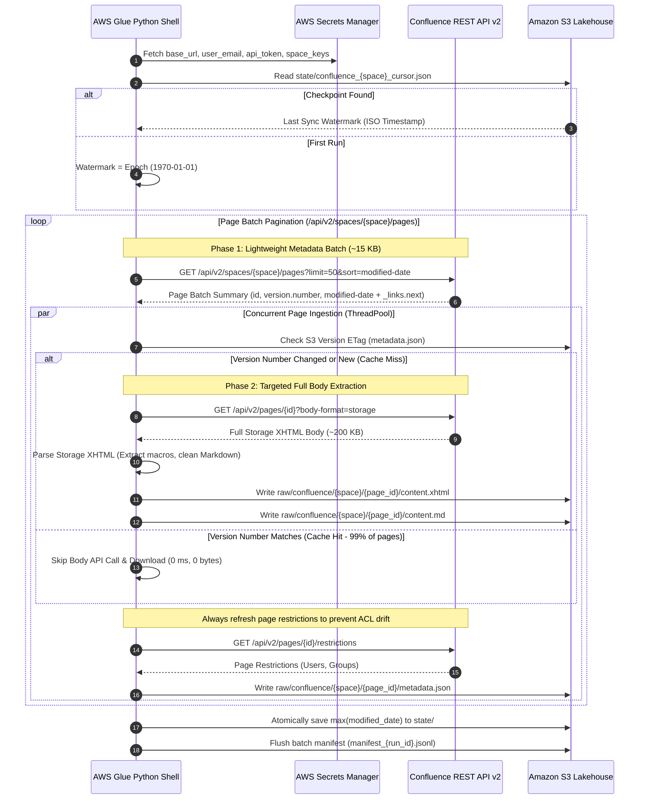
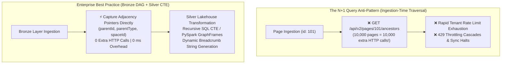
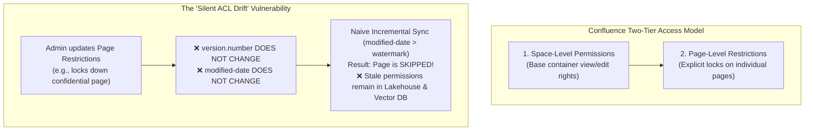
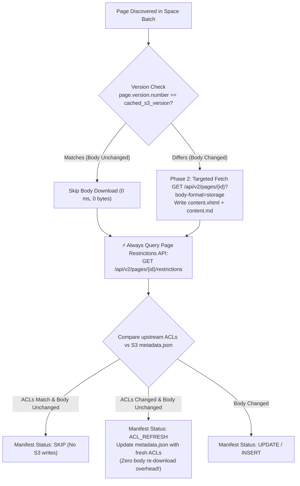
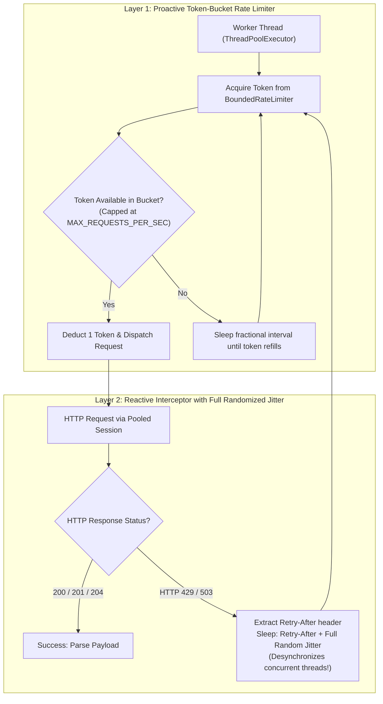
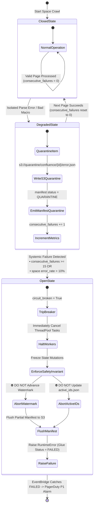
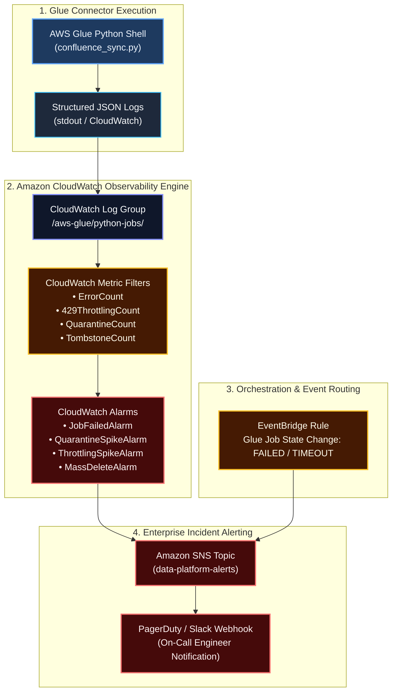

# Atlassian Confluence Custom Ingestion Connector: Architectural Specification

> **Document Type:** Connector Technical Specification  
> **Source Platform:** Atlassian Confluence Cloud (REST API v2) & Confluence Data Center On-Premises  
> **Destination:** Amazon S3 Bronze Data Lakehouse (Raw XHTML/ADF & Cleaned Markdown Sidecars)  
> **Runtime:** AWS Glue Python Shell (0.0625 DPU)  
> **Reference Implementation:** [connector.py](file:///Users/toanbui/dev/data_ai_engineer/src/connectors/confluence/connector.py)

---

## 1. Protocol Architecture & Ingestion Lifecycle

The Confluence Ingestion Connector synchronizes enterprise spaces, page hierarchies, and wiki content using the **Confluence Cloud REST API v2**. It handles both cloud instances (via API Tokens/OAuth) and on-premises Confluence Data Center instances behind corporate firewalls.

### Architecture Logic Flowchart

```mermaid
flowchart TD
    %% ── Universal Contrast Palette (Light & Dark Mode Safe) ──
    classDef default fill:#1e293b,stroke:#38bdf8,stroke-width:1.5px,color:#f8fafc;
    classDef brain fill:#1e3a5f,stroke:#60a5fa,stroke-width:2px,color:#eff6ff;
    classDef storage fill:#0f172a,stroke:#818cf8,stroke-width:2px,color:#f8fafc;
    classDef decision fill:#451a03,stroke:#fbbf24,stroke-width:2px,color:#fffbeb;
    classDef guard fill:#450a0a,stroke:#f87171,stroke-width:2px,color:#fef2f2;
    classDef success fill:#064e3b,stroke:#34d399,stroke-width:2px,color:#ecfdf5;

    subgraph Init ["1. Initialization & Credentials"]
        A["Start AWS Glue Job<br/>(confluence_sync.py)"]:::brain --> B["Fetch Secrets<br/>(AWS Secrets Manager)"]:::default
        B --> C["Construct Auth Headers<br/>Basic Auth (Cloud) or Bearer PAT (DC)"]:::default
        C --> D["Resolve Target Spaces<br/>(Configured space_keys or GET /api/v2/spaces)"]:::default
    end

    subgraph SpaceLoop ["2. Space Sync & Checkpoint Retrieval"]
        D --> E["Iterate Space [space_key]"]:::default
        E --> F{"Read S3 Checkpoint<br/>state/confluence_{space}_cursor.json"}:::decision
        F -->|"Checkpoint Found"| G["last_watermark = cursor_timestamp"]:::default
        F -->|"No Checkpoint"| H["last_watermark = 1970-01-01 (Epoch)"]:::default
        G & H --> I["Initial URL:<br/>/api/v2/spaces/{space}/pages?sort=modified-date"]:::default
    end

    subgraph BatchIngress ["3. Confluence REST API v2 Ingress Gate"]
        I --> J["Rate Limiter Acquire<br/>(BoundedRateLimiter: 10 QPS)"]:::default
        J --> K["GET current_page_url"]:::default
        K --> L{"HTTP Response Status?"}:::decision
        
        L -->|"HTTP 429"| M["Sleep: Retry-After + Full Jitter<br/>Exponential Backoff"]:::decision
        M --> J
        
        L -->|"HTTP 200 OK"| N["Parse Page Batch (results)<br/>Record Discovered Metrics"]:::default
    end

    subgraph ConcurrentPages ["4. Concurrent Page Worker Pool (ThreadPoolExecutor)"]
        N --> O["Dispatch Pages to Worker Threads"]:::default
        O --> P{"Version ETag Cache Check<br/>(version.number vs S3 metadata)"}:::decision
        
        P -->|"Version Changed / New (Cache Miss)"| R["Phase 2: Targeted Fetch<br/>GET /api/v2/pages/{id}?body-format=storage<br/>(Extract Storage XHTML Body)"]:::success
        R --> V["Sanitize Macros & Write<br/>• content.xhtml (Bronze Raw XML)<br/>• content.md (Cleaned Markdown)"]:::storage
        
        P -->|"Version Unchanged (Cache Hit)"| Q["Skip Body Download (0 ms, 0 API Calls)<br/>(Storage XHTML Unchanged)"]:::default
        
        V & Q --> S["GET /api/v2/pages/{id}/restrictions<br/>(Always Executed to Detect ACL Changes)"]:::default
        S --> T["Extract Read Restrictions<br/>(Restricted User IDs & Group Names)"]:::default
        T --> U["Capture Hierarchy Attributes<br/>(parentId, parentType, spaceId)"]:::default
        
        U --> W["Write S3 metadata.json Sidecar<br/>(with ACLs, version, breadcrumbs)"]:::storage
        W --> X["Track max(modified_date)<br/>Record Manifest INSERT/UPDATE/ACL_REFRESH"]:::success
        
        R -.->|"Exception / Corrupted"| Y["Quarantine Side-Output<br/>quarantine/confluence/{id}/error.json"]:::guard
    end

    subgraph Commit ["5. Atomic Checkpoint Commit & Manifest Flush"]
        X & Y --> Z{"Has _links.next?"}:::decision
        Z -->|"Yes (More Pages)"| AA["current_page_url = _links.next"]:::default
        AA --> J
        
        Z -->|"No (End of Space)"| AB{"New Watermark &gt; Last Watermark?"}:::decision
        AB -->|"Yes"| AC["Atomically Commit S3 Checkpoint<br/>state/confluence_{space}_cursor.json"]:::success
        AB -->|"No"| AD["Retain Existing Checkpoint"]:::default
        
        AC & AD --> AE{"More Spaces in Queue?"}:::decision
        AE -->|"Yes"| E
        AE -->|"No"| AF["Flush Batch Manifest (JSONL)<br/>state/manifests/confluence/*.jsonl"]:::storage
        AF --> AG["Job Finished Successfully"]:::success
    end
```



### Protocol Sequence Diagram



---

## 2. Content Storage Formats & Macro Processing

Confluence represents rich pages in proprietary formats that require systematic normalization for Lakehouse and downstream RAG chunking:

### 1. Format Selection (`?body-format=storage`)
* **`storage` (Authoritative XHTML):** The connector requests `?body-format=storage`. This returns the native Confluence XHTML-based XML format representing the true state of tables, macros, and embedded media.
* **`atlas_doc_format` (ADF JSON):** The Cloud editor's internal JSON AST. Used optionally when downstream processing relies on JSON AST walkers.

### 2. Macro Sanitization & Transformation
Raw Confluence storage XHTML contains non-standard XML elements:
```xml
<!-- Raw Confluence Storage Format -->
<ac:structured-macro ac:name="code">
  <ac:parameter ac:name="language">python</ac:parameter>
  <ac:plain-text-body><![CDATA[def calculate_tax(): pass]]></ac:plain-text-body>
</ac:structured-macro>
<ac:structured-macro ac:name="info">
  <ac:rich-text-body><p>Confidential corporate guidance.</p></ac:rich-text-body>
</ac:structured-macro>
```

The connector parses the XHTML tree (using BeautifulSoup / lxml or standard library parser) to:
1. **Preserve High-Value Content:** Converts `<ac:structured-macro ac:name="code">` into clean fenced Markdown code blocks (````python ... ````).
2. **Convert Formatting Elements:** Translates `<ac:structured-macro ac:name="info|warning|note">` into standard GitHub/Obsidian callout syntax (`> [!NOTE]`).
3. **Strip Clutter Macros:** Removes table of contents (`<ac:name="toc">`), status badges, user profile cards, and layout containers.
4. **Preserve Tables:** Retains HTML `<table>` elements with column headers intact for tabular RAG parsing.

### 3. Dual S3 Ingestion Artifacts (Bronze & Silver)
For each new or updated page, the connector writes two complementary content representations alongside its security sidecar:
* `raw/confluence/{space}/{page_id}/content.xhtml`: The raw, immutable authoritative XML storage format (Bronze Lakehouse tier).
* `raw/confluence/{space}/{page_id}/content.md`: The macro-sanitized clean Markdown representation (Silver tier), ready for direct RAG text chunking and embedding generation without runtime parsing overhead.
* `raw/confluence/{space}/{page_id}/metadata.json`: The metadata sidecar containing permissions, page hierarchy, and version numbers.

---

## 3. Page Tree Hierarchy Preservation & Dynamic Breadcrumb Resolution

Confluence pages are organized hierarchically within Spaces as a directed acyclic graph (DAG). Preserving parent-child lineage is critical for downstream enterprise search relevancy, semantic filtering, and breadcrumb navigation.



---

### 3.1. The $N+1$ Ancestor Query Anti-Pattern vs. Adjacency DAG Storage

* **The Vulnerability:** Naive connectors attempt to construct full breadcrumb paths (e.g., `/Engineering/Architecture/Data_Lakehouse/Zero_RAM_Streaming`) at ingestion time by querying `/ancestors` or iteratively following `parentId` upwards for every single page.
* **The Cost:** Confluence API v2 `/api/v2/pages` summary payloads do **not** embed the full ancestor path. Querying ancestors individually introduces an $N+1$ query explosion: an enterprise space with 25,000 pages generates 25,000 additional synchronous HTTP requests, immediately tripping Atlassian Cloud rate limits (HTTP 429) and stretching crawl runtimes from minutes to hours.
* **The Solution (Adjacency DAG in Bronze):** The connector captures only the immediate structural pointers directly available in the `/api/v2/spaces/{id}/pages` batch response:
  * `page_id`: Unique identifier (`str`).
  * `parent_id`: Immediate parent page ID (`Optional[str]`, `null` for root space home pages).
  * `parent_type`: Type of parent container (`"page"` or `"whiteboard"`).
  * `space_key`: Space partition key (`str`).
  * **Zero Extra API Overhead:** Requires **0 additional HTTP calls**, 0 ms network overhead, and perfectly preserves the DAG.

---

### 3.2. Dynamic Hierarchy & Breadcrumb Resolution (Silver Layer)

Downstream Silver transformation jobs reconstruct complete hierarchical paths dynamically using recursive SQL CTEs or PySpark GraphFrames over Bronze `metadata.json` sidecars:

```sql
-- Silver Transformation: Recursive Breadcrumb & Depth Construction
WITH RECURSIVE page_hierarchy AS (
    -- Anchor Member: Root Space Home Pages (parent_id IS NULL)
    SELECT 
        page_id,
        title,
        parent_id,
        space_key,
        CAST(CONCAT('/', space_key, '/', title) AS VARCHAR(1000)) AS breadcrumb_path,
        ARRAY[page_id] AS ancestor_path_ids,
        1 AS depth
    FROM bronze_confluence_metadata
    WHERE parent_id IS NULL AND is_deleted = false

    UNION ALL

    -- Recursive Member: Child Pages Joined Against Parent Hierarchy
    SELECT 
        c.page_id,
        c.title,
        c.parent_id,
        c.space_key,
        CAST(CONCAT(p.breadcrumb_path, '/', c.title) AS VARCHAR(1000)) AS breadcrumb_path,
        p.ancestor_path_ids || c.page_id AS ancestor_path_ids,
        p.depth + 1 AS depth
    FROM bronze_confluence_metadata c
    INNER JOIN page_hierarchy p 
        ON c.parent_id = p.page_id
    WHERE c.is_deleted = false
)
SELECT 
    page_id,
    title,
    space_key,
    breadcrumb_path,
    ancestor_path_ids,
    depth
FROM page_hierarchy;
```

---

### 3.3. Folder Moves, Renames & Structural Relocations

In active enterprise Confluence wikis, reorganization occurs frequently (e.g., an entire department documentation branch containing 2,000 sub-pages is moved under a new parent section):
* **Confluence Upstream Behavior:** Atlassian updates **only the moved root page's `parentId`**. The 2,000 descendant child pages are completely untouched—their `version.number` and `modified-date` timestamps do not change!
* **Bronze Ingestion Efficiency:** Because the connector stores raw adjacency DAG pointers (`parent_id`), **not a single descendant child page needs to be re-downloaded or rewritten in S3 Bronze**.
* **Automatic Downstream Propagation:** The next scheduled Silver recursive resolution detects the single updated parent pointer and instantly recomputes the new breadcrumb strings and ancestor arrays for all 2,000 child pages in Lakehouse storage with zero S3 I/O duplication.

---

## 4. Confluence Hard Deletes & The "Zombie Document" Reconciliation Architecture

One of the most dangerous edge cases in enterprise search and GenAI RAG architectures is the **Zombie Document**: pages deleted or purged in Confluence that persist indefinitely in downstream Lakehouse storage and Vector DB search indices.

```mermaid
flowchart TD
    %% ── Universal Contrast Palette (Light & Dark Mode Safe) ──
    classDef default fill:#1e293b,stroke:#38bdf8,stroke-width:1.5px,color:#f8fafc;
    classDef brain fill:#1e3a5f,stroke:#60a5fa,stroke-width:2px,color:#eff6ff;
    classDef storage fill:#0f172a,stroke:#818cf8,stroke-width:2px,color:#f8fafc;
    classDef decision fill:#451a03,stroke:#fbbf24,stroke-width:2px,color:#fffbeb;
    classDef guard fill:#450a0a,stroke:#f87171,stroke-width:2px,color:#fef2f2;
    classDef success fill:#064e3b,stroke:#34d399,stroke-width:2px,color:#ecfdf5;

    subgraph Trap ["The Zombie Document Failure Mode"]
        UserDel["User deletes or trashes page in Confluence"]:::guard
        ApiSilent["❌ Confluence API v2 provides NO CDC / changefeed<br/>❌ Deleted page simply vanishes from GET /pages response!"]:::guard
        NaiveSync["Naive Watermark Sync (modified-date &gt; watermark)<br/>Never encounters deleted page!"]:::decision
        ZombieS3["❌ Bronze S3 files (content.xhtml, content.md) stay forever<br/>❌ Vector DB keeps embeddings active<br/>⚠️ GenAI RAG serves outdated / confidential deleted data!"]:::guard
        UserDel --> ApiSilent --> NaiveSync --> ZombieS3
    end

    subgraph Solution ["Two-Phase Manifest Reconciliation (Anti-Join Pattern)"]
        SpaceCrawl["Complete Space Crawl<br/>Collect current_active_ids"]:::brain
        PrevState["Load Previous State<br/>s3://state/confluence_{space}_active_ids.json"]:::storage
        AntiJoin{"Anti-Join Difference<br/>deleted_ids = prev_ids - current_ids"}:::decision
        
        TombstoneS3["⚡ Write S3 Soft-Tombstone Marker:<br/>raw/confluence/{space}/{page_id}/DELETED"]:::storage
        UpdateMeta["Update metadata.json:<br/>is_deleted = true, status = DELETE"]:::storage
        EmitManifest["Emit Manifest Entry:<br/>status = DELETE in manifest_{run_id}.jsonl"]:::brain
        DownstreamPurge["Downstream Vector DB &amp; Delta Lake:<br/>Purge chunk embeddings &amp; set is_deleted = true"]:::success
        CommitState["Atomically Save New Active IDs:<br/>s3://state/confluence_{space}_active_ids.json"]:::storage

        SpaceCrawl & PrevState --> AntiJoin
        AntiJoin -->|"deleted_ids &gt; 0"| TombstoneS3 & UpdateMeta & EmitManifest
        EmitManifest --> DownstreamPurge
        AntiJoin -->|"Space Complete"| CommitState
    end
```



---

### 4.1. The Upstream Confluence Cloud API Dilemma

Unlike Microsoft Graph / SharePoint Delta API (which provides `@removed: {"reason": "deleted"}` tombstone feeds), **Atlassian Confluence Cloud REST API v2 does not provide a deletion changefeed or CDC stream**:
1. Endpoints such as `GET /api/v2/spaces/{space_id}/pages?sort=modified-date` **only return active, non-deleted pages**.
2. When a page is moved to the trash or permanently purged, it silently vanishes from API responses.
3. No modified timestamp or version bump is emitted.
4. An incremental pipeline relying purely on `modified_date > watermark` will **never** detect that a page was deleted.

---

### 4.2. Why Physical S3 Deletions (`s3.delete_object`) Fail

Executing physical S3 object deletions upon detecting a missing page is an enterprise anti-pattern:
* **Compliance & Legal Auditing Loss:** Enterprise regulatory standards (SOC 2, ISO 27001, FINRA, HIPAA) mandate tamper-proof audit trails proving when a document was created, modified, by whom, and when it was decommissioned.
* **Delta Lake / Apache Iceberg Snapshot Breakage:** Physical S3 deletions out-of-band break transaction log pointers, corrupting historical time-travel queries (`SELECT * FROM silver VERSION AS OF ...`).
* **High Latency & Throttling:** Deleting dozens or hundreds of nested S3 objects synchronously slows the crawl and adds unnecessary S3 write costs.

---

### 4.3. The Two-Phase Manifest Anti-Join Architecture

To resolve hard deletes with zero API overhead and full auditability, the connector applies **State-Driven Manifest Reconciliation**:

1. **Active Inventory Tracking:** During the space traversal, the connector aggregates all discovered active page IDs into an in-memory set:
   $$\mathcal{S}_{\text{current\_active}} = \{ p_{\text{id}} \mid p \in \text{Discovered Pages in Space} \}$$
2. **State Anti-Join Calculation:**
   The connector fetches the previously persisted set of active page IDs from `s3://{bucket}/state/confluence_{space_key}_active_ids.json`:
   $$\mathcal{S}_{\text{deleted}} = \mathcal{S}_{\text{previous\_active}} \setminus \mathcal{S}_{\text{current\_active}}$$
3. **Soft-Delete Tombstone Generation:**
   For every $p_{\text{id}} \in \mathcal{S}_{\text{deleted}}$:
   * **Write Soft Tombstone Marker:** Upload an explicit marker file `raw/confluence/{space_key}/{page_id}/DELETED`.
   * **Update Metadata Sidecar:** Update `metadata.json` with `"is_deleted": true`, `"status": "DELETE"`, and `"deleted_at_utc": timestamp`.
   * **Emit Manifest Tombstone Entry:** Append a record with `status: "DELETE"` to `manifest_{run_id}.jsonl`.
   * **Metric Recording:** Increment `PipelineMetrics.deleted_docs` and emit structured audit JSON logs (`action="page_tombstone_emitted"`).
4. **Atomic State Commit:**
   Only after all pages are traversed, tombstones are emitted, and the circuit breaker reports 0 fatal errors, the connector atomically overwrites `state/confluence_{space_key}_active_ids.json` with $\mathcal{S}_{\text{current\_active}}$.

---

### 4.4. S3 Tombstone Marker & Metadata Sidecar Contract

#### 1. S3 Tombstone Marker Object (`DELETED`):
* **S3 Key:** `s3://{bucket}/raw/confluence/{space_key}/{page_id}/DELETED`
* **Content:**
  ```json
  {
    "page_id": "184729103",
    "space_key": "PLATFORM",
    "status": "DELETE",
    "deleted_at_utc": "2026-09-06T20:00:00.000Z",
    "run_id": "20260906_200000",
    "reason": "missing_from_upstream_space_crawl"
  }
  ```

#### 2. Updated Sidecar Schema (`metadata.json`):
```json
{
  "page_id": "184729103",
  "space_key": "PLATFORM",
  "title": "Architecture: Real-Time Ingestion Engine",
  "version_number": 4,
  "parent_id": "184728001",
  "parent_type": "page",
  "is_deleted": true,
  "status": "DELETE",
  "deleted_at_utc": "2026-09-06T20:00:00.000Z",
  "synced_at_utc": "2026-09-06T20:00:00.000Z",
  "run_id": "20260906_200000"
}
```

#### 3. Batch Inventory Manifest Tombstone Record (`manifest_{run_id}.jsonl`):
```json
{
  "run_id": "20260906_200000",
  "source": "confluence",
  "item_id": "184729103",
  "file_name": "184729103.xhtml",
  "status": "DELETE",
  "size_bytes": 0,
  "s3_path": "raw/confluence/PLATFORM/184729103/DELETED",
  "timestamp_utc": "2026-09-06T20:00:00.000Z",
  "error": null
}
```

---

### 4.5. Downstream Lakehouse MERGE & Vector DB Purge Protocol

Downstream Silver/Gold and vector indexing pipelines consume the run manifest:

#### 1. Delta Lake / Apache Iceberg Silver Table MERGE:
```sql
MERGE INTO silver_confluence_pages AS target
USING bronze_inventory_manifest AS source
ON target.page_id = source.item_id
WHEN MATCHED AND source.status = 'DELETE' THEN
  UPDATE SET 
    target.is_deleted = true,
    target.deleted_at = source.timestamp_utc,
    target.sync_status = 'PURGED'
WHEN MATCHED AND source.status IN ('INSERT', 'UPDATE', 'ACL_REFRESH') THEN
  UPDATE SET 
    target.content_md = source.content_md,
    target.allowed_users = source.allowed_users,
    target.allowed_groups = source.allowed_groups,
    target.version_number = source.version_number,
    target.is_deleted = false
WHEN NOT MATCHED AND source.status != 'DELETE' THEN
  INSERT *;
```

#### 2. Vector DB (Pinecone / Qdrant / OpenSearch / pgvector) Purge:
Vector embedding consumers filter the batch manifest for `status == 'DELETE'` and immediately remove chunk embeddings matching the document filter:
```python
# Purge all vector chunks associated with deleted Confluence page
vector_index.delete(
    filter={
        "space_key": {"$eq": entry["space_key"]},
        "page_id": {"$eq": entry["item_id"]}
    }
)
```

---

### 4.6. Circuit Breaker Safety & Checkpoint Isolation Invariant

> [!CAUTION]
> **Tombstone Safety Invariant:**  
> If an ingestion run terminates prematurely (e.g., due to an unhandled HTTP 500 error, AWS Glue network timeout, or the circuit breaker halting execution after 15 consecutive errors), **`state/confluence_{space_key}_active_ids.json` MUST NOT BE MUTATED**.  
> If an interrupted crawl were to reconcile active IDs, all pages in batches that were not yet reached would be falsely flagged as deleted, triggering catastrophic false tombstones across downstream Lakehouse tables and Vector DB indices!

---

## 5. Confluence Security Trimming & The "Silent ACL Drift" Defense

Confluence enforces a two-tier permission model that introduces one of the most critical security vulnerabilities in enterprise data pipelines:



> [!WARNING]
> **The #1 Enterprise Security Trap: Silent ACL Drift**  
> In Atlassian Confluence, modifying page restrictions (`/api/v2/pages/{id}/restrictions`) **does not increment the page's `version.number`** and **does not update its `modified-date` / `version.createdAt` timestamp**.  
> If an ingestion pipeline relies solely on `modified_date > watermark` or `version.number != cached_version`, **security permissions will silently drift**. Documents locked down to executives in Confluence will remain accessible to unauthorized employees in downstream search engines and GenAI RAG pipelines.

---

### 1. Decoupled Security Refreshing Architecture

To guarantee zero permission leakage without incurring massive re-download overhead, the connector decouples **content body extraction** from **security restriction extraction**:



1. **Continuous Restriction Probing:** For every discovered page in a space traversal, the connector **always** queries the restrictions endpoint:
   ```http
   GET https://your-company.atlassian.net/wiki/api/v2/pages/{page_id}/restrictions
   ```
2. **In-Memory ACL Diffing:** The connector diffs `allowed_users` and `allowed_groups` against the existing S3 `metadata.json` sidecar.
3. **`ACL_REFRESH` Manifest Emission:** When restrictions change but the page body is unchanged, the connector updates `metadata.json` with the new permissions and emits an `ACL_REFRESH` status in the batch manifest, preventing permission drift without downloading a single byte of storage XHTML.

---

### 2. Hierarchical Restriction Inheritance

Confluence permissions are hierarchical and cascade down the page tree:
* **The Inheritance Rule:** If Parent Page $A$ is restricted to group `executives`, all child pages ($B$, $C$) and descendant sub-pages are **implicitly restricted to `executives`**, even if Child $B$'s own `/restrictions` endpoint returns an empty array (`"restrictions": []`).
* **Effective Permission Formula:**
  $$\text{Effective Access}(P) = \text{Space Access} \cap \left( \bigcap_{a \in \text{Ancestors}(P)} \text{Restrictions}(a) \right) \cap \text{Restrictions}(P)$$

#### Capturing the Adjacency Graph:
The connector captures three structural attributes on every page payload to enable downstream ancestor graph resolution:
* `page_id`: Unique identifier for the page.
* `parent_id`: Immediate parent page ID (`null` for space home pages).
* `parent_type`: Type of parent container (`page` or `whiteboard`).
* `space_key`: Top-level space partition.

---

### 3. Access Control Sidecar Schema (`metadata.json`)

For every page, the connector compiles explicit restrictions, structural hierarchy, and version metadata into `s3://{bucket}/raw/confluence/{space_key}/{page_id}/metadata.json`:

```json
{
  "page_id": "184729103",
  "space_key": "PLATFORM",
  "title": "Architecture: Real-Time Ingestion Engine",
  "version_number": 4,
  "parent_id": "184728001",
  "parent_type": "page",
  "author_id": "712020:a1b2c3d4-e5f6-7890-abcd-1234567890ab",
  "created_at_utc": "2025-11-10T12:00:00.000Z",
  "modified_at_utc": "2026-03-01T09:45:00.000Z",
  "web_url": "https://your-company.atlassian.net/wiki/spaces/PLATFORM/pages/184729103",
  "size_bytes": 15420,
  "has_restrictions": true,
  "allowed_users": [
    "712020:a1b2c3d4-e5f6-7890-abcd-1234567890ab"
  ],
  "allowed_groups": [
    "platform-engineers-staff",
    "enterprise-architects"
  ],
  "edit_users": [
    "712020:a1b2c3d4-e5f6-7890-abcd-1234567890ab"
  ],
  "edit_groups": [
    "enterprise-architects"
  ],
  "is_update": true,
  "acl_synced_at_utc": "2026-09-06T17:30:00.000Z",
  "synced_at_utc": "2026-09-06T17:30:00.000Z",
  "run_id": "20260906_173000"
}
```

---

### 4. Downstream Zero-Leakage RAG Security Trimming

During Silver-to-Gold indexing and vector embedding ingestion:
1. **Pre-Query Filtering:** When a user executes a search or asks a GenAI assistant, the vector search engine applies mandatory metadata filters:
   ```sql
   WHERE (has_restrictions = false AND user.spaces CONTAINS space_key)
      OR (has_restrictions = true AND (
            allowed_groups OVERLAPS user.groups OR 
            allowed_users CONTAINS user.account_id
         ))
   ```
2. **Inherited Ancestor Expansion:** For child pages without explicit restrictions, the Silver transformation traverses the `parent_id` chain to inherit the parent's `allowed_groups` and `allowed_users`, ensuring complete security isolation across deep page trees.

---

## 6. Incremental Watermarking & Version Caching

To avoid repeatedly fetching thousands of unchanged pages across large spaces, the connector implements a **True Two-Phase Ingestion Pattern**:

1. **Phase 1: Lightweight Metadata Enumeration (~15 KB per batch):**
   The space traversal calls `/api/v2/spaces/{space_id}/pages?limit=50&sort=modified-date` **without** `body-format`. This retrieves only metadata headers (`id`, `version.number`, `version.createdAt`, `parentId`, `title`).
2. **Sub-Millisecond ETag Gate:**
   For each discovered page, worker threads compare `page.version.number` against the S3 companion sidecar (`s3://.../{page_id}/metadata.json`).
   * **Cache Hit (Version Matches):** 99% of pages in corporate wikis are unchanged day-to-day. The worker records `SKIP`, making **zero full-body HTTP requests and zero S3 body writes** (0 ms latency, 0 bytes bandwidth).
   * **Cache Miss (New or Modified Page):** The worker triggers **Phase 2: Targeted Fetch** (`GET /api/v2/pages/{id}?body-format=storage`), extracting only the specific changed body, parsing macros to Markdown, and updating S3.
3. **Persistent Timestamp Watermark:**
   The sync tracks the highest `version.createdAt` timestamp observed across the space and atomically commits it to `s3://{bucket}/state/confluence_{space}_cursor.json` upon successful space completion.

---

## 7. Compute Engine Sizing, Rate Limiting & HTTP 429 Interceptor Architecture

A critical architectural pitfall in cloud data engineering is misaligning the compute engine with the physical characteristics of the upstream data source.

### 7.1. Compute Right-Sizing: AWS Glue Python Shell vs. PySpark

Atlassian Cloud enforces strict per-tenant API rate limits (typically 10–50 requests/second). Ingestion is strictly **I/O-bound and network rate-limited**, not CPU- or memory-bound:

| Dimension | AWS Glue PySpark (Anti-Pattern for API Crawling) | AWS Glue Python Shell (Production Best Practice) |
| :--- | :--- | :--- |
| **Minimum Compute Allocation** | 2 DPUs (8 vCPUs, 32 GiB RAM) | **0.0625 DPU (1 vCPU, 1 GiB RAM)** |
| **Hourly Compute Cost** | **$0.88 / hour** | **$0.0027 / hour (>320x Cost Reduction)** |
| **Cold Start Startup Latency** | 60 – 120 seconds (JVM cluster provisioning) | **~10 seconds (Single container boot)** |
| **Executor Utilization** | 98% Idle (Workers wait on network sockets & sleep) | **100% Efficient (Multi-threaded I/O)** |
| **Rate Limit Coordination** | Distributed lock required across Spark executors | **In-memory thread-safe token bucket (`threading.Lock`)** |
| **Concurrency Model** | Distributed partitions (Hammering API causes 429s) | **`ThreadPoolExecutor(max_workers=8)` within tenant limit** |

> [!TIP]
> **Total Cost of Ownership (TCO) Impact:**  
> Running daily 30-minute ingestion across enterprise spaces on PySpark costs **~$160/year per space**. On AWS Glue Python Shell (0.0625 DPU), the exact same ingestion finishes in the same elapsed time and costs **~$0.50/year per space**.

---

### 7.2. Upstream Throttling Boundary & The "Thundering Herd" Hazard

Atlassian Cloud dynamically monitors tenant request density. When tenant quotas are exceeded, the API responds with:
```http
HTTP/1.1 429 Too Many Requests
Retry-After: 5
Content-Type: application/json
```

#### The "Thundering Herd" Failure Mode:
In naive implementations, concurrent threads hit with a 429 execute a static sleep: `time.sleep(2)`.
* If 8 concurrent worker threads are throttled together, all 8 threads sleep for exactly 2.0 seconds.
* At $t = 2.000$s, all 8 threads wake up simultaneously and fire requests at the exact same millisecond.
* Atlassian detects another sudden spike, re-throttles the tenant, and can trigger a 15-minute hard ban.

---

### 7.3. Dual-Layer Defense Architecture

To maximize sync throughput while guaranteeing zero tenant lockouts, the connector implements a **Dual-Layer Defense**:



#### 1. Layer 1: Proactive Token-Bucket Pacing (`BoundedRateLimiter`)
Before any request hits the network, the thread acquires a token from an in-memory token bucket:
* **Token Refill Formula:** $\text{Tokens}_{\text{now}} = \min(\text{Capacity}, \text{Tokens}_{\text{last}} + \Delta t \times \text{Rate})$.
* **Smoothing Effect:** Paces requests evenly (default: 10 requests/sec), preventing bursts from ever reaching Atlassian's rate limit boundary.

#### 2. Layer 2: Reactive Full Randomized Jitter (`ResilientHttpClient`)
When an `HTTP 429` (or `HTTP 503`) occurs, the client desynchronizes threads using **Full Jitter**:
$$T_{\text{sleep}} = T_{\text{base}} + \text{UniformRandom}(0.1, 0.5) \times T_{\text{base}}$$
Where $T_{\text{base}}$ is the parsed `Retry-After` header value (or $2^{\text{attempt}}$ exponential backoff). Because each thread sleeps for a unique fractional duration (e.g., 5.14s, 5.72s, 6.28s), the retry wave is smoothed into a harmless trickle.

---

### 7.4. Connection Pooling & Socket Hygiene (`HTTPAdapter`)

To prevent socket exhaustion and TLS handshake overhead, the connector mounts a persistent `requests.adapters.HTTPAdapter`:
```python
adapter = requests.adapters.HTTPAdapter(
    pool_connections=25,  # Cached connection pools
    pool_maxsize=25,      # Max simultaneous sockets across threads
    max_retries=1         # Immediate handoff to custom jitter loop
)
```
* **Performance Gain:** Reuses established TLS connections across batches, reducing round-trip latency from ~250 ms to ~20 ms per request.
* **Socket Safety:** Enforces explicit socket timeouts `timeout=(15, 60)` (15s connect, 60s read) to prevent permanently hung threads on silent proxy drops.

---

## 8. Secrets Manager Configuration Schema

Store credentials in **AWS Secrets Manager** under secret name `enterprise/rag/confluence_auth`:

```json
{
  "base_url": "https://your-company.atlassian.net/wiki",
  "user_email": "svc-rag-bot@your-company.com",
  "api_token": "YOUR_ATLASSIAN_API_TOKEN",
  "space_keys": "PLATFORM,ENG,SECURITY,FINANCE"
}
```
*Note: For **Confluence Data Center** on-premises, `user_email` can be omitted, and `api_token` represents a Personal Access Token (PAT).*

---

## 9. Circuit Breaker, Poison-Pill Quarantine & Failure Isolation Governance

In enterprise wikis containing hundreds of thousands of pages accumulated over years, real-world data pipelines inevitably encounter malformed storage XHTML, unclosed tags from legacy plugins, deprecated third-party macros (e.g., Gliffy, Draw.io, custom Jira filters), and 404 attachment pointers. 

A resilient ingestion engine must satisfy two opposing operational requirements:
1. **It must never crash on an isolated bad document** (avoiding infinite AWS Glue retry loops).
2. **It must immediately halt on systemic infrastructure failures** (avoiding burning compute, spamming error files, or corrupting state checkpoints during Atlassian API outages or credential revocations).



---

### 9.1. The Poison-Pill Hazard & S3 Dead-Letter Quarantine

#### The Failure Modes:
* **The Infinite Retry Crash Loop:** If a single corrupted XML macro raises an unhandled exception, the entire Glue job aborts. AWS Glue's automatic retry policy restarts the job from the beginning, runs for hours, encounters the exact same page, and crashes again. This burns hundreds of dollars in Glue DPU hours with zero data ingested.
* **The `except: pass` Blind Spot:** Silently swallowing errors with `except: pass` drops documents without logging or telemetry. If an Atlassian API schema changes, tens of thousands of pages vanish into a black hole while the pipeline reports a false "SUCCESS".

#### The Quarantine Solution:
Isolated item exceptions are captured at the individual page boundary (`_process_page`):
1. **Forensic S3 Artifact (`quarantine/confluence/{page_id}/error.json`):**
   The connector uploads a complete diagnostic packet to S3:
   ```json
   {
     "timestamp_utc": "2026-09-06T20:15:00.000Z",
     "source": "confluence",
     "item_id": "184729103",
     "error": "XMLSyntaxError: Opening and ending tag mismatch: p line 4 and ac:structured-macro",
     "error_type": "XMLSyntaxError",
     "stack_trace": "Traceback (most recent call last):\n  File 'connector.py', line 705...",
     "raw_payload": {
       "id": "184729103",
       "title": "Legacy Q3 Marketing Plan",
       "spaceId": "PLATFORM",
       "version": { "number": 3 }
     }
   }
   ```
2. **Audit Manifest Contract:**
   The page is recorded in `manifest_{run_id}.jsonl` with `status: "QUARANTINE"`, preserving end-to-end lineage for enterprise compliance auditing.
3. **Smooth Continuation:**
   The worker increments `PipelineMetrics.quarantined_docs`, emits a structured JSON log (`action: "quarantine_item"`), and proceeds with the next page in the thread pool.

---

### 9.2. Two-Tier Cascading Circuit Breaker

To detect systemic platform failures (e.g., revoked API tokens, network gateway drops, or Atlassian Cloud 500/503 outages) without generating hundreds of thousands of useless quarantine records, the connector enforces a **Two-Tier Tripwire**:

#### Tier 1: Consecutive Failure Threshold ($N = 15$)
* Every successfully processed page resets `consecutive_failures = 0`.
* Every quarantined page increments `consecutive_failures += 1`.
* **Statistical Rationale:** In a wiki with 100,000 pages, the probability of encountering 15 independently corrupted documents in exact succession is infinitesimal ($p < 10^{-12}$). A streak of 15 consecutive failures proves an external infrastructure breakdown (expired auth credentials, severed proxy connection, or Atlassian Cloud incident).
* **Action:** `circuit_broken` is set to `True`. All worker threads immediately halt.

#### Tier 2: Space Error Rate Ceiling ($10\%$)
* Calculated as $\text{Error Rate} = \frac{\text{total\_failed}}{\text{total\_processed}}$.
* **Evaluation Condition:** Evaluated once at least 10 pages have been processed in the space ($\text{total\_processed} \ge 10$).
* **Action:** If the error rate exceeds **10%**, the circuit breaker trips immediately. This protects against scenarios where an entire department's document template contains an unhandled macro syntax error.

---

### 9.3. Atomic Commit-After-Write & Checkpoint Safety Invariants

> [!CAUTION]
> **The Checkpoint Isolation Invariant:**  
> When a circuit breaker trips or an ingestion run is interrupted, **state watermarks (`confluence_{space}_cursor.json`) and active page inventories (`confluence_{space}_active_ids.json`) MUST NEVER BE MUTATED**.

#### Why Mid-Crawl Checkpointing Causes Catastrophic Data Loss:
1. **Permanent Page Skipping:** If a crawl of 10,000 pages aborts at page #2,000 and commits the watermark seen so far, pages 2,001 through 10,000 that were created prior to that timestamp will **never be queried again by future incremental runs**, creating permanent blind spots in the Lakehouse.
2. **Mass False Tombstone Purge:** If the active page inventory was committed partially ($\mathcal{S}_{\text{current}} = \{p_1 \dots p_{2000}\}$), the subsequent run's delete reconciliation would conclude that all 8,000 unvisited pages were deleted in Confluence, emitting false `DELETE` tombstones that wipe out 80% of the Vector DB!

#### Self-Healing Recovery Protocol:
Because the checkpoint watermark is safely frozen at the last known good run:
1. The next scheduled Glue run resumes from the previous durable watermark.
2. Pages 1 through 1,999 that succeeded in the failed run hit the connector's **Sub-Millisecond ETag Gate**:
   * ETag/version check takes 0 ms and transfers 0 bytes of storage body.
   * Marked as `SKIP` in the manifest.
3. The crawler rapidly advances to page #2,000 and resumes extracting the remaining backlog, achieving complete self-healing with zero data loss and zero manual database cleanup.

---

### 9.4. AWS Glue Job Orchestration Contract

When the circuit breaker trips:
1. **Durable Forensic Audit:** The connector calls `s3.flush_batch_manifest()` before exiting, ensuring all valid and quarantined records processed prior to the trip are durably written to `state/manifests/confluence/`.
2. **Failure Signaling:** The connector raises a `RuntimeError("Confluence Ingestion aborted: Circuit breaker tripped...")`, forcing the AWS Glue job to exit with a non-zero exit status (`FAILED`).
3. **Enterprise Escalation:** AWS EventBridge catches the `Glue Job State Change: FAILED` event and immediately publishes to Amazon SNS, paging the on-call data platform engineer via PagerDuty within seconds.

---

## 10. Observability, Metric Filters & Enterprise Alerting Architecture

A resilient enterprise RAG pipeline requires comprehensive observability into crawl rates, restriction refresh latency, throttling events, hard-delete tombstones, and schema parsing errors.

### Observability & Alerting Architecture



### CloudWatch Metric Filters (Derived from `log_json`)

Structured JSON log lines emitted to stdout are automatically parsed by CloudWatch Metric Filters:

| Metric Name | CloudWatch Metric Filter Pattern | Metric Namespace | Unit |
| :--- | :--- | :--- | :--- |
| **`ConfluenceQuarantineCount`** | `{ $.level = "error" && $.action = "quarantine_item" }` | `DataLake/Ingestion/Confluence` | Count |
| **`ConfluenceThrottlingCount`** | `{ $.level = "warning" && $.status_code = 429 }` | `DataLake/Ingestion/Confluence` | Count |
| **`ConfluencePagesIngested`** | `{ $.action = "write_content" }` | `DataLake/Ingestion/Confluence` | Count |
| **`ConfluenceRestrictionsRefreshed`** | `{ $.action = "refresh_restrictions" }` | `DataLake/Ingestion/Confluence` | Count |
| **`ConfluenceTombstonesEmitted`** | `{ $.action = "page_tombstone_emitted" }` | `DataLake/Ingestion/Confluence` | Count |

### CloudWatch Alarms & Incident Escalation SLA

| Alarm Name | Evaluation Condition | Severity | Action & Target | Rationale |
| :--- | :--- | :--- | :--- | :--- |
| **`ConfluenceJobFailedAlarm`** | EventBridge state $\in$ `["FAILED", "TIMEOUT", "STOPPED"]` | **P1 - Critical** | SNS $\to$ PagerDuty | Immediate on-call engagement for failed ingestion job. |
| **`ConfluenceQuarantineSpike`** | `ConfluenceQuarantineCount >= 5` in 15 mins | **P2 - High** | SNS $\to$ Slack (`#data-ops-alerts`) | Flags unhandled Atlassian storage macros or parsing regressions. |
| **`ConfluenceExcessiveThrottling`** | `ConfluenceThrottlingCount >= 50` in 10 mins | **P3 - Medium** | SNS $\to$ Slack (`#data-ops-alerts`) | Atlassian API rate limit nearing threshold; tune `MAX_REQUESTS_PER_SEC`. |
| **`ConfluenceMassDeleteAlarm`** | `ConfluenceTombstonesEmitted >= 100` in 15 mins | **P1 - Critical** | SNS $\to$ PagerDuty & Slack | Flags potential accidental space wipe or mass purge event in Confluence. |
| **`ConfluenceRunDurationSLA`** | Glue `ExecutionTime > 7200s` (2 hours) | **P2 - High** | SNS $\to$ Slack (`#data-ops-alerts`) | Flags massive space backlog or stuck network connection. |

---

## 11. Modular Software Architecture & Package Design

To meet enterprise Python software engineering standards, maintainability, and testability, the Confluence Ingestion Connector is decomposed into a modular package under `src/connectors/confluence/`:

```
src/connectors/confluence/
├── __init__.py           # Package entry point & unified public exports
├── models.py             # Strongly typed domain models (PageSummary, PageMetadata, ManifestRecord)
├── exceptions.py         # Custom domain exception hierarchy
├── config.py             # Configuration dataclass, Secrets Manager integration, CLI parsing
├── telemetry.py          # Structured JSON logging & thread-safe metrics collector
├── rate_limiter.py       # Token-bucket rate limiter & resilient HTTP client with jitter backoff
├── sanitizer.py          # XHTML storage format parser & Markdown transformation engine
├── s3_sink.py            # Amazon S3 Lakehouse storage sink (checkpoints, tombstones, manifests)
├── engine.py             # Multithreaded space sync engine & circuit breaker controller
└── connector.py          # Backward-compatible public façade & Glue entrypoint
```

### 11.1. Module Responsibilities & Design Patterns

| Module | Core Responsibility | Key Classes & Functions | Design Pattern |
| :--- | :--- | :--- | :--- |
| **`models.py`** | Domain state definitions and type safety | `PageSummary`, `PageRestrictions`, `PageMetadata`, `ManifestRecord`, `TombstoneMarker`, `SyncAction` | Strongly Typed Dataclasses & Enums |
| **`exceptions.py`** | Explicit domain error classifications | `ConfluenceConnectorError`, `AuthenticationError`, `RateLimitExceededError`, `CircuitBreakerTrippedError`, `QuarantineError`, `StorageSinkError` | Domain-Specific Exception Hierarchy |
| **`config.py`** | Environment resolution & credential hydration | `ConfluenceConfig`, `parse_job_arguments()`, `fetch_secret()`, `load_config()` | Factory & Dependency Injection |
| **`telemetry.py`** | Thread-safe observability & structured audit | `log_json()`, `PipelineMetrics` | Thread-Safe Accumulator & JSON Logger |
| **`rate_limiter.py`** | Ingress flow control & socket pool management | `BoundedRateLimiter`, `ResilientHttpClient` | Token Bucket & Adapter Pattern |
| **`sanitizer.py`** | Confluence macro parsing & Markdown conversion | `ConfluenceMacroSanitizer` | HTML Parser & Strategy Pattern |
| **`s3_sink.py`** | Lakehouse persistence, checkpoints, manifests | `S3Sink` | Repository / Storage Sink Pattern |
| **`engine.py`** | Batch pagination, worker pool, circuit breaker | `CircuitBreaker`, `ConfluenceSyncEngine` | Circuit Breaker & Worker Pool Orchestrator |
| **`connector.py`** | Backward-compatible user & CLI interface | `ConfluenceConnector`, `main()` | Façade Pattern |

### 11.2. Façade Pattern & Backward Compatibility

Existing production scripts and Glue job definitions referencing `from src.connectors.confluence.connector import ConfluenceConnector` or accessing attributes like `connector.max_consecutive_failures` and `connector._process_page` continue to function seamlessly without any modifications:
1. **Property Delegation:** `ConfluenceConnector` delegates circuit breaker parameters (`max_consecutive_failures`, `max_error_rate`, `consecutive_failures`, `circuit_broken`) directly to its encapsulated `CircuitBreaker` instance.
2. **Engine Delegation:** Methods like `sync()`, `_sync_space()`, and `_process_page()` delegate to `ConfluenceSyncEngine` while preserving the exact original method signatures and behaviors.
3. **Pluggable Page Processing:** `ConfluenceSyncEngine` executes through `self.page_processor`, allowing test suites and monitoring hooks to intercept or mock page processing seamlessly.


