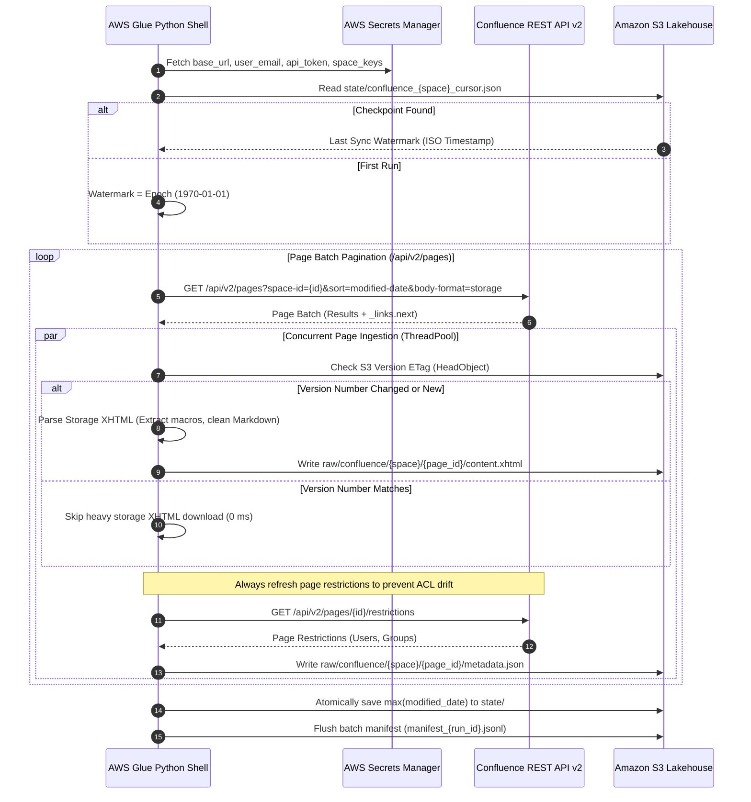
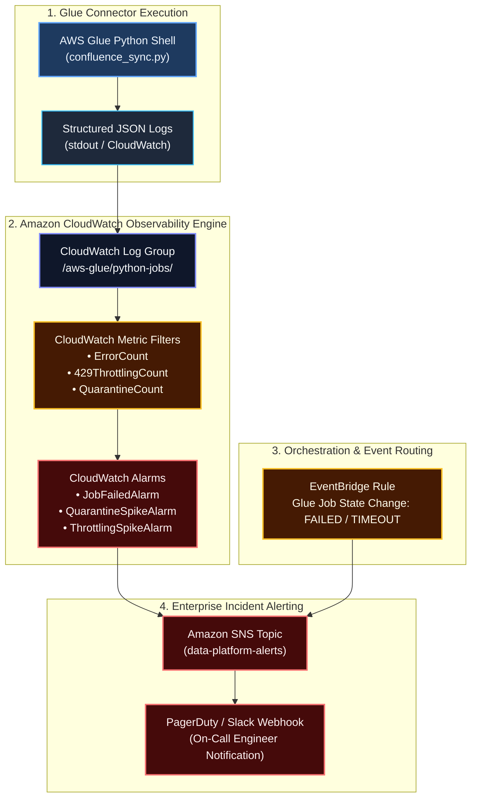

# Atlassian Confluence Custom Ingestion Connector: Architectural Specification

> **Document Type:** Connector Technical Specification  
> **Source Platform:** Atlassian Confluence Cloud (REST API v2) & Confluence Data Center On-Premises  
> **Destination:** Amazon S3 Bronze Data Lakehouse (Raw XHTML/ADF & Cleaned Markdown Sidecars)  
> **Runtime:** AWS Glue Python Shell (0.0625 DPU)  
> **Reference Implementation:** [connector.py](file:///Users/toanbui/dev/data_ai_engineer/src/connectors/confluence/connector.py)

---

## 1. Protocol Architecture & Ingestion Lifecycle

The Confluence Ingestion Connector synchronizes enterprise spaces, page hierarchies, and wiki content using the **Confluence Cloud REST API v2**. It handles both cloud instances (via API Tokens/OAuth) and on-premises Confluence Data Center instances behind corporate firewalls.

### Architecture Logic Flowchart

```mermaid
flowchart TD
    %% ── Universal Contrast Palette (Light & Dark Mode Safe) ──
    classDef default fill:#1e293b,stroke:#38bdf8,stroke-width:1.5px,color:#f8fafc;
    classDef brain fill:#1e3a5f,stroke:#60a5fa,stroke-width:2px,color:#eff6ff;
    classDef storage fill:#0f172a,stroke:#818cf8,stroke-width:2px,color:#f8fafc;
    classDef decision fill:#451a03,stroke:#fbbf24,stroke-width:2px,color:#fffbeb;
    classDef guard fill:#450a0a,stroke:#f87171,stroke-width:2px,color:#fef2f2;
    classDef success fill:#064e3b,stroke:#34d399,stroke-width:2px,color:#ecfdf5;

    subgraph Init ["1. Initialization & Credentials"]
        A["Start AWS Glue Job<br/>(confluence_sync.py)"]:::brain --> B["Fetch Secrets<br/>(AWS Secrets Manager)"]:::default
        B --> C["Construct Auth Headers<br/>Basic Auth (Cloud) or Bearer PAT (DC)"]:::default
        C --> D["Resolve Target Spaces<br/>(Configured space_keys or GET /api/v2/spaces)"]:::default
    end

    subgraph SpaceLoop ["2. Space Sync & Checkpoint Retrieval"]
        D --> E["Iterate Space [space_key]"]:::default
        E --> F{"Read S3 Checkpoint<br/>state/confluence_{space}_cursor.json"}:::decision
        F -->|"Checkpoint Found"| G["last_watermark = cursor_timestamp"]:::default
        F -->|"No Checkpoint"| H["last_watermark = 1970-01-01 (Epoch)"]:::default
        G & H --> I["Initial URL:<br/>/api/v2/spaces/{space}/pages?sort=modified-date"]:::default
    end

    subgraph BatchIngress ["3. Confluence REST API v2 Ingress Gate"]
        I --> J["Rate Limiter Acquire<br/>(BoundedRateLimiter: 10 QPS)"]:::default
        J --> K["GET current_page_url"]:::default
        K --> L{"HTTP Response Status?"}:::decision
        
        L -->|"HTTP 429"| M["Sleep: Retry-After + Full Jitter<br/>Exponential Backoff"]:::decision
        M --> J
        
        L -->|"HTTP 200 OK"| N["Parse Page Batch (results)<br/>Record Discovered Metrics"]:::default
    end

    subgraph ConcurrentPages ["4. Concurrent Page Worker Pool (ThreadPoolExecutor)"]
        N --> O["Dispatch Pages to Worker Threads"]:::default
        O --> P{"Version ETag Cache Check<br/>(version.number vs S3 metadata)"}:::decision
        
        P -->|"Version Changed / New"| R["Extract Storage XHTML Body<br/>(?body-format=storage)"]:::success
        R --> V["Write S3 content.xhtml<br/>(raw/confluence/{space}/{id}/)"]:::storage
        
        P -->|"Version Unchanged"| Q["Skip Body Download (0 ms)<br/>(Storage XHTML Unchanged)"]:::default
        
        V & Q --> S["GET /api/v2/pages/{id}/restrictions<br/>(Always Executed to Detect ACL Changes)"]:::default
        S --> T["Extract Read Restrictions<br/>(Restricted User IDs & Group Names)"]:::default
        T --> U["Capture Hierarchy Attributes<br/>(parentId, parentType, spaceId)"]:::default
        
        U --> W["Write S3 metadata.json Sidecar<br/>(with ACLs, version, breadcrumbs)"]:::storage
        W --> X["Track max(modified_date)<br/>Record Manifest INSERT/UPDATE/ACL_REFRESH"]:::success
        
        R -.->|"Exception / Corrupted"| Y["Quarantine Side-Output<br/>quarantine/confluence/{id}/error.json"]:::guard
    end

    subgraph Commit ["5. Atomic Checkpoint Commit & Manifest Flush"]
        X & Y --> Z{"Has _links.next?"}:::decision
        Z -->|"Yes (More Pages)"| AA["current_page_url = _links.next"]:::default
        AA --> J
        
        Z -->|"No (End of Space)"| AB{"New Watermark &gt; Last Watermark?"}:::decision
        AB -->|"Yes"| AC["Atomically Commit S3 Checkpoint<br/>state/confluence_{space}_cursor.json"]:::success
        AB -->|"No"| AD["Retain Existing Checkpoint"]:::default
        
        AC & AD --> AE{"More Spaces in Queue?"}:::decision
        AE -->|"Yes"| E
        AE -->|"No"| AF["Flush Batch Manifest (JSONL)<br/>state/manifests/confluence/*.jsonl"]:::storage
        AF --> AG["Job Finished Successfully"]:::success
    end
```



### Protocol Sequence Diagram



---

## 2. Content Storage Formats & Macro Processing

Confluence represents rich pages in proprietary formats that require systematic normalization for Lakehouse and downstream RAG chunking:

### 1. Format Selection (`?body-format=storage`)
* **`storage` (Authoritative XHTML):** The connector requests `?body-format=storage`. This returns the native Confluence XHTML-based XML format representing the true state of tables, macros, and embedded media.
* **`atlas_doc_format` (ADF JSON):** The Cloud editor's internal JSON AST. Used optionally when downstream processing relies on JSON AST walkers.

### 2. Macro Sanitization & Transformation
Raw Confluence storage XHTML contains non-standard XML elements:
```xml
<!-- Raw Confluence Storage Format -->
<ac:structured-macro ac:name="code">
  <ac:parameter ac:name="language">python</ac:parameter>
  <ac:plain-text-body><![CDATA[def calculate_tax(): pass]]></ac:plain-text-body>
</ac:structured-macro>
<ac:structured-macro ac:name="info">
  <ac:rich-text-body><p>Confidential corporate guidance.</p></ac:rich-text-body>
</ac:structured-macro>
```

The connector parses the XHTML tree (using BeautifulSoup / lxml) to:
1. **Preserve High-Value Content:** Converts `<ac:structured-macro ac:name="code">` into clean fenced Markdown code blocks (````python ... ````).
2. **Convert Formatting Elements:** Translates `<ac:structured-macro ac:name="info|warning|note">` into standard GitHub/Obsidian callout syntax (`> [!NOTE]`).
3. **Strip Clutter Macros:** Removes table of contents (`<ac:name="toc">`), status badges, user profile cards, and layout containers.
4. **Preserve Tables:** Retains HTML `<table>` elements with column headers intact for tabular RAG parsing.

---

## 3. Page Tree Hierarchy Preservation

Confluence pages are organized hierarchically within Spaces. Losing the parent-child relationship degrades search relevancy and breadcrumb navigation.

### Adjacency Hierarchy Extraction:
The connector captures three positional attributes on every page payload:
* `id`: The unique page identifier.
* `parentId`: The ID of the immediate parent page (or `null` for root home pages).
* `parentType`: Whether the parent is a `page` or a `whiteboard`.
* `spaceId`: The container space ID.

### Downstream Breadcrumb Reconstruction:
During Bronze-to-Silver transformation, an adjacency graph builds complete breadcrumb strings (e.g., `/Engineering/Architecture/Data_Lakehouse/Zero_RAM_Streaming`), appending this path directly to vector metadata.

---

## 4. Confluence Security Trimming (Restrictions Extraction)

Confluence enforces a two-tier permission model:
1. **Space-Level Permissions:** Who can view the space.
2. **Page-Level Restrictions:** Explicit overrides locking down individual pages.

### Restrictions Query
For each page, the connector queries:
```http
GET https://your-company.atlassian.net/wiki/api/v2/pages/{page_id}/restrictions
```

### Access Control Payload
The connector compiles the permitted users and groups into the `metadata.json` sidecar:
```json
// s3://{bucket}/raw/confluence/{space_key}/{page_id}/metadata.json
{
  "page_id": "184729103",
  "space_key": "PLATFORM",
  "title": "Architecture: Real-Time Ingestion Engine",
  "version_number": 4,
  "created_at_utc": "2025-11-10T12:00:00Z",
  "modified_at_utc": "2026-03-01T09:45:00Z",
  "parent_id": "184728001",
  "author_id": "712020:a1b2c3d4-...",
  "web_url": "https://your-company.atlassian.net/wiki/spaces/PLATFORM/pages/184729103",
  "has_restrictions": true,
  "allowed_users": [
    "712020:a1b2c3d4-..."
  ],
  "allowed_groups": [
    "platform-engineers-staff",
    "enterprise-architects"
  ],
  "synced_at_utc": "2026-09-03T10:30:00Z"
}
```
*Downstream GenAI Search:* When user queries the RAG engine, the vector search filters by `allowed_groups CONTAINS user.groups` or `allowed_users CONTAINS user.id`, guaranteeing zero permission leakage.

---

## 5. Incremental Watermarking & Version Caching

To avoid repeatedly fetching thousands of unchanged pages:

1. **Persistent Timestamp Watermark:**
   The sync tracks the highest `version.createdAt` timestamp observed across the space and commits it to `s3://{bucket}/state/confluence_{space}_cursor.json`.
2. **Sub-Millisecond ETag Gate:**
   Confluence page payloads include an integer `version.number` (e.g., `version: {"number": 14}`). The connector compares this number with the existing S3 metadata before downloading the heavy storage format body. If matched, the page is marked `SKIPPED` in sub-milliseconds.

---

## 6. Secrets Manager Configuration Schema

Store credentials in **AWS Secrets Manager** under secret name `enterprise/rag/confluence_auth`:

```json
{
  "base_url": "https://your-company.atlassian.net/wiki",
  "user_email": "svc-rag-bot@your-company.com",
  "api_token": "YOUR_ATLASSIAN_API_TOKEN",
  "space_keys": "PLATFORM,ENG,SECURITY,FINANCE"
}
```
*Note: For **Confluence Data Center** on-premises, `user_email` can be omitted, and `api_token` represents a Personal Access Token (PAT).*

---

## 7. Circuit Breaker & Failure Isolation Governance

To safeguard against Atlassian Cloud rate limits, proxy timeouts, and cascading failure loops:

### 1. Poison-Pill Quarantine Boundary
Individual page parsing errors (corrupted XHTML storage formatting, unsupported custom vendor macros, broken attachment links) are isolated and written to:
```
s3://{bucket}/quarantine/confluence/{page_id}/error.json
```
The ingestion process proceeds uninterrupted with the remaining valid pages in the space.

### 2. Batch-Level Cascading Circuit Breaker
* **Consecutive Error Breaker:** If **15 consecutive pages** fail within a single space traversal, the worker pool halts execution.
* **Space Error Rate Threshold:** If the failure rate exceeds **10%** of discovered pages in a space, the sync stops for that space, flagging it in the audit manifest.
* **Atomic Checkpoint Isolation:** When a circuit breaker trips, the cursor watermark (`max(modified_date)`) is **not** advanced. The next scheduled Glue run safely resumes from the previous durable watermark.

---

## 8. Observability, Metric Filters & Enterprise Alerting Architecture

A resilient enterprise RAG pipeline requires comprehensive observability into crawl rates, restriction refresh latency, throttling events, and schema parsing errors.

### Observability & Alerting Architecture



### CloudWatch Metric Filters (Derived from `log_json`)

Structured JSON log lines emitted to stdout are automatically parsed by CloudWatch Metric Filters:

| Metric Name | CloudWatch Metric Filter Pattern | Metric Namespace | Unit |
| :--- | :--- | :--- | :--- |
| **`ConfluenceQuarantineCount`** | `{ $.level = "error" && $.action = "quarantine_item" }` | `DataLake/Ingestion/Confluence` | Count |
| **`ConfluenceThrottlingCount`** | `{ $.level = "warning" && $.status_code = 429 }` | `DataLake/Ingestion/Confluence` | Count |
| **`ConfluencePagesIngested`** | `{ $.action = "write_content" }` | `DataLake/Ingestion/Confluence` | Count |
| **`ConfluenceRestrictionsRefreshed`** | `{ $.action = "refresh_restrictions" }` | `DataLake/Ingestion/Confluence` | Count |

### CloudWatch Alarms & Incident Escalation SLA

| Alarm Name | Evaluation Condition | Severity | Action & Target | Rationale |
| :--- | :--- | :--- | :--- | :--- |
| **`ConfluenceJobFailedAlarm`** | EventBridge state $\in$ `["FAILED", "TIMEOUT", "STOPPED"]` | **P1 - Critical** | SNS $\to$ PagerDuty | Immediate on-call engagement for failed ingestion job. |
| **`ConfluenceQuarantineSpike`** | `ConfluenceQuarantineCount >= 5` in 15 mins | **P2 - High** | SNS $\to$ Slack (`#data-ops-alerts`) | Flags unhandled Atlassian storage macros or parsing regressions. |
| **`ConfluenceExcessiveThrottling`** | `ConfluenceThrottlingCount >= 50` in 10 mins | **P3 - Medium** | SNS $\to$ Slack (`#data-ops-alerts`) | Atlassian API rate limit nearing threshold; tune `MAX_REQUESTS_PER_SEC`. |
| **`ConfluenceRunDurationSLA`** | Glue `ExecutionTime > 7200s` (2 hours) | **P2 - High** | SNS $\to$ Slack (`#data-ops-alerts`) | Flags massive space backlog or stuck network connection. |

