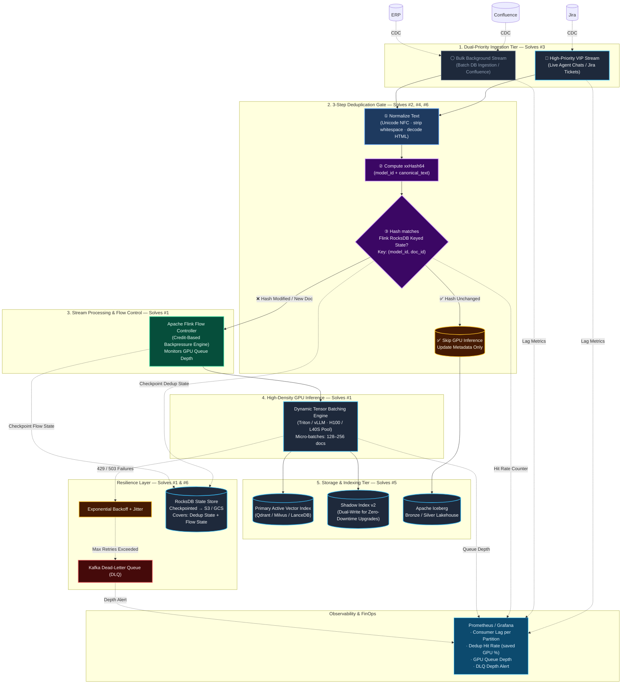

# Real-Time Ingestion Pipeline Architecture

> **Document Type:** System Architecture & Production Failure-Mode Analysis  
> **Scenario:** Scenario 1 — Real-Time Vector Sync & Zero-Downtime Migration  
> **Level:** L6 Staff Engineer Reference Architecture  
> **Throughput Target:** 15,000 CDC document-change events/sec  
> **Objective:** Sub-second vector index freshness with minimal GPU compute cost

---

## 1. Production Failure Modes & Ingestion Bottlenecks

Operating a real-time vector embedding and indexing pipeline at **15,000 events/second** introduces severe distributed systems bottlenecks. The 6 most fatal production failure modes are:

```
┌─────────────────────────────────────────────────────────────────────────────────────────────┐
│                          6 FATAL PRODUCTION ISSUES IN STREAMING INGESTION                   │
├────────────────────────────────┬────────────────────────────────────────────────────────────┤
│ 1. GPU Inference Meltdown      │ Sending 15,000 unbatched HTTP requests/sec triggers 429    │
│    (429/503 Rate-Limit Crash)  │ rate-limits, cascading consumer lag, and worker OOMs.      │
├────────────────────────────────┼────────────────────────────────────────────────────────────┤
│ 2. Redundant Embedding Waste   │ ~80% of enterprise CDC events modify metadata only         │
│    (The $400k/yr Waste)        │ (e.g. view_count, status_id), burning ~$34k/mo on GPU APIs.│
├────────────────────────────────┼────────────────────────────────────────────────────────────┤
│ 3. Head-of-Line Blocking       │ Bulk background DB syncs clog the single Kafka topic,      │
│    (Agent Traffic Starvation)  │ delaying urgent customer-facing ticket embeddings by hours.│
├────────────────────────────────┼────────────────────────────────────────────────────────────┤
│ 4. Formatting Cache Misses     │ Trivial whitespace (\r\n vs \n) or Unicode variations      │
│    (False Invalidation)        │ break naive string hashes, triggering unnecessary GPU runs.│
├────────────────────────────────┼────────────────────────────────────────────────────────────┤
│ 5. Model Migration Downtime    │ Upgrading embedding models (1536d → 1024d) forces full DB  │
│    (Search Outages & Degrade)  │ rebuilds, causing hours of search downtime for live agents.│
├────────────────────────────────┼────────────────────────────────────────────────────────────┤
│ 6. Worker Crash Invalidation   │ Pod crash loses in-memory dedup state, causing double-     │
│    (State Desynchronization)   │ writes and re-embedding storms upon consumer restart.      │
└────────────────────────────────┴────────────────────────────────────────────────────────────┘
```

---

## 2. Architecture Blueprint

To eliminate all 6 failure modes, the system coordinates a **Dual-Priority Ingestion Tier**, a **3-Step Zero-Waste Deduplication Gate**, an **Apache Flink Flow Controller**, and a **Shadow Dual-Writing Storage Tier**:



---

## 3. How the Architecture Handles Each Production Problem

| # | Production Problem | Architecture Component | How the Architecture Neutralizes the Issue |
|---|---|---|---|
| **1** | **GPU Inference Meltdown** | **Flink Async I/O + Triton Batching + Backpressure** | Accumulates 128–256 docs per batch before calling Triton. If Triton's queue fills, Flink's credit-based network stack automatically slows Kafka consumption upstream without dropping records or crashing workers. |
| **2** | **Redundant Embedding Waste** | **xxHash64 Deduplication Gate + RocksDB** | Compares `xxHash64(text)` against local RocksDB state. If unchanged (~80% of CDC events), bypasses the GPU and routes directly to Iceberg/Vector DB payload update, slashing GPU cost by **~$34,000/month**. |
| **3** | **Head-of-Line Blocking** | **Dual-Priority Kafka Topics (VIP vs. Bulk)** | Isolates live agent/user queries into a dedicated VIP topic with dedicated consumer threads, ensuring sub-second ingestion latency even when a 50M Confluence historical sync is saturating the Bulk queue. |
| **4** | **Formatting Cache Misses** | **Text Normalization Engine (Pre-Hash)** | Normalizes Unicode (NFC), strips `\r\n` carriage returns, trims whitespace, and unescapes HTML before hashing. Prevents trivial serialization noise from falsely triggering GPU re-embedding. |
| **5** | **Model Migration Downtime** | **Dual-Writing & Shadow Convergence** | Writes real-time CDC updates to both `v1` (Active) and `v2` (Shadow) while backfilling historical records in the background. Once shadow index lag reaches zero, atomically swaps alias pointers with **zero search downtime**. |
| **6** | **Worker Crash Invalidation** | **RocksDB Checkpointing to S3** | Persists keyed state (`doc_id → hash`) to RocksDB and checkpoints incrementally to S3. If a worker pod crashes, the new pod recovers exact state without causing re-embedding storms or Vector DB double-writes. |

---

## 4. Deep-Dive Technical Mechanics

### 4.1. The Deduplication Gate (Solving Issues #2, #4, #6)

```
Incoming Record ──► [1. Normalize Text] ──► [2. xxHash64] ──► Query RocksDB [(model_id, doc_id)]
                                                                      │
                                                ┌─────────────────────┴─────────────────────┐
                                                ▼                                           ▼
                                         [Hash Matches]                             [Hash Modified]
                                                │                                           │
                                     Bypass GPU Inference!                      Update State & Send to GPU
                                     (Update metadata in Iceberg)               (Triton Dynamic Batcher)
```

1. **Text Normalization Pipeline**:
   ```python
   def canonical_hash(doc_text: str, model_id: str) -> str:
       # Unicode NFC normalization
       text = unicodedata.normalize("NFC", doc_text)
       # Strip carriage returns and trailing whitespace
       text = re.sub(r"\r\n", "\n", text).strip()
       # Strip HTML entities from Confluence CDC
       text = html.unescape(text)
       # 25x faster than SHA-256
       return xxhash.xxh64(f"{model_id}:{text}".encode("utf-8")).hexdigest()
   ```
2. **RocksDB Keyed State**:
   * Uses a composite key: `(model_id, doc_id) → latest_hash`.
   * Stored in local NVMe RocksDB for **microsecond lookups** with zero external network overhead (unlike Redis).
   * Upgrading `model_id` automatically invalidates previous hashes, cleanly triggering re-embedding.

---

### 4.2. Credit-Based Backpressure & Async I/O (Solving Issue #1)

* **Asynchronous I/O**: Instead of a worker thread blocking on an HTTP call to Triton, Flink's `AsyncDataStream` fires up to 500 concurrent gRPC requests per worker pod.
* **Credit-Based Backpressure**: When Triton's queue depth crosses the high-water mark, Flink withholds network buffer credits from upstream operators, causing Kafka consumers to naturally pause reading partitions without memory leaks or crash loops.

---

### 4.3. Zero-Downtime Shadow Migration (Solving Issue #5)

```
                  ┌───────── CDC Live Stream (15,000/sec) ─────────┐
                  │                                                │
                  ▼                                                ▼
     [Active Index (v1: 1536-dim)]                   [Shadow Index (v2: 1024-dim)]
     ▲ - Serves 100% Agent Queries                   ▲ - Receives real-time dual-writes
     │                                               │ - Receives historical backfill from Iceberg
     └────────────────────── ATOMIC POINTER SWAP ────┘ (When shadow lag reaches 0)
```

1. Create `Shadow Index v2` with 1024-dim schema.
2. Direct real-time Flink pipeline to **dual-write** to both `v1` and `v2`.
3. Launch an asynchronous Spark backfill job reading historical Iceberg records into `v2`.
4. Validate semantic recall parity and ensure shadow lag is 0.
5. Atomically update the client-facing vector search alias pointer (`agent_search_alias → v2`).
6. Decommission `v1` with **zero downtime and zero query degradation**.

---

## 5. The Enterprise Standard: Apache Flink

While Python-native tools (like Bytewax or Quix Streams) are increasingly popular for AI teams, **Apache Flink (via Java or PyFlink) remains the undisputed enterprise standard** for high-throughput, mission-critical streaming at 15,000+ events/sec.

| Framework | Target Team | Key Strengths | Limitations |
| :--- | :--- | :--- | :--- |
| **Apache Flink** | Enterprise Data & Platform Teams | Battle-tested at petabyte scale; rock-solid credit-based backpressure; native RocksDB checkpointing to S3. | JVM tuning and infrastructure overhead. |
| **Bytewax** | Python-First AI Teams | Rust-powered performance with pure Python API; native RocksDB support; async I/O. | Smaller ecosystem compared to Flink. |
| **Quix Streams** | Kafka-Centric Python Teams | Pandas-like Python syntax; built on `librdkafka`; native RocksDB integration. | Tied strictly to Kafka sources. |

---

## 6. FinOps Cost & Capacity Model

At enterprise scale (**15,000 events/sec**, where 80% are metadata-only changes):

```
+-----------------------------------------------------------------------------------------------+
|                                FINOPS COST & CAPACITY COMPARISON                              |
+------------------+----------------------------------+--------------------+--------------------+
| Level            | GPU Requests / Sec              | Required Hardware  | Estimated Cost/Mo  |
+------------------+----------------------------------+--------------------+--------------------+
| L4 (Mid-Level)   | 15,000 calls/sec (Unbatched)     | System crashes     | N/A (Outage)       |
| L5 (Senior)      | 15,000 docs/sec (Batched)        | ~16x H100 GPUs     | ~$45,000 / month   |
| L6 (Staff - Us)  | 3,000 docs/sec (Deduplicated)    | ~4x H100 GPUs      | ~$11,000 / month   |
+------------------+----------------------------------+--------------------+--------------------+
| FINANCIAL SAVINGS: Staff L6 Architecture saves ~$34,000/month ($408,000/year) in GPU compute! |
+-----------------------------------------------------------------------------------------------+
```

---

## 7. Interview Follow-Up Stress Tests

### Probe 1: "What if the downstream GPU cluster drops 50% capacity during peak traffic?"
* **Staff Answer**: Flink's credit-based backpressure automatically slows consumption at the Kafka consumer layer without dropping data. The Dual-Priority queue ensures the VIP topic continues receiving GPU credits while the Bulk topic is throttled.

### Probe 2: "How do you handle GDPR 'Right to be Forgotten' deletions within 60 seconds?"
* **Staff Answer**: Emit a tombstone event to the VIP Kafka topic. Flink bypasses deduplication, directly invokes `client.delete(doc_id)` on both Active and Shadow vector indexes, purges the key from RocksDB state, and appends a delete record to the Iceberg metadata table.
