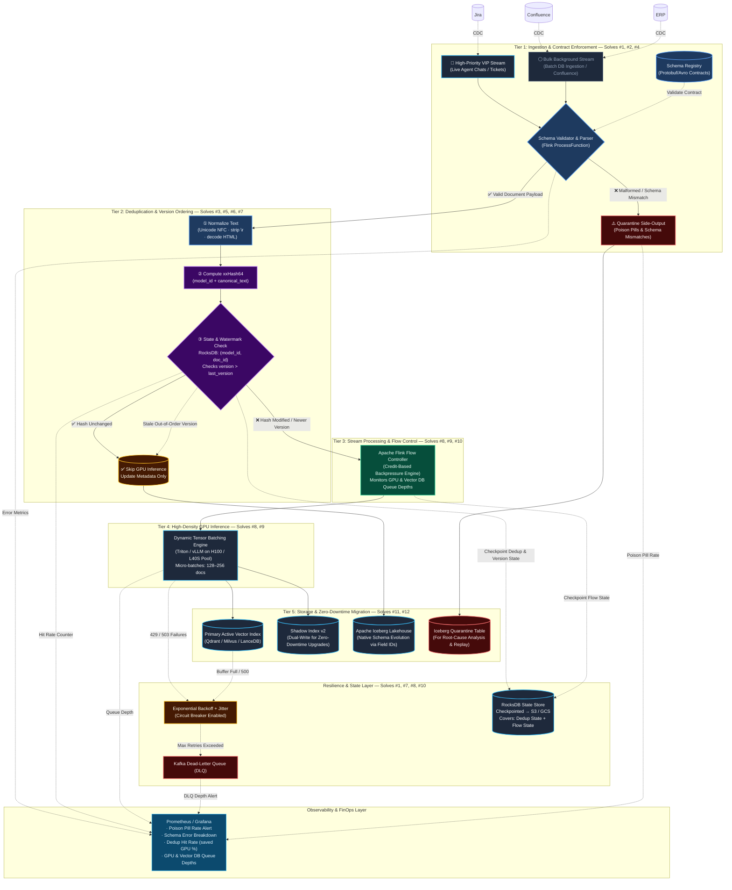

# Real-Time Ingestion Pipeline Architecture

> **Document Type:** System Architecture & Production Failure-Mode Analysis  
> **Scenario:** Scenario 1 — Real-Time Vector Sync, Zero-Downtime Schema Evolution & Bad Data Quarantine  
> **Level:** L6 Staff Engineer Reference Architecture  
> **Throughput Target:** 15,000 CDC document-change events/sec  
> **Objective:** Sub-second vector index freshness, zero pipeline downtime during schema drift, and automated bad-data quarantine

---

## 1. Production Failure Modes & Ingestion Bottlenecks

Operating a real-time vector embedding and indexing pipeline at **15,000 events/second** introduces severe distributed systems bottlenecks. The 12 most fatal production failure modes are:

```
┌────────────────────────────────────────────────────────────────────────────────────────────────────────┐
│                                 12 MAJOR PRODUCTION FAILURE MODES IN VECTOR INGESTION                  │
├──────┬───────────────────────────────┬─────────────────────────────────────────────────────────────────┤
│ CAT  │ FAILURE MODE                  │ ROOT CAUSE & CATASTROPHIC IMPACT                                │
├──────┼───────────────────────────────┼─────────────────────────────────────────────────────────────────┤
│      │ 1. Poison Pill Records        │ Malformed JSON, corrupted bytes, or null required keys trigger  │
│      │                               │ unhandled exceptions, causing infinite TaskManager crash loops. │
│ DATA ├───────────────────────────────┼─────────────────────────────────────────────────────────────────┤
│ INGEST│ 2. Upstream Schema Drift      │ Unannounced column renames or type modifications break schema   │
│      │                               │ parsers, halting the entire streaming DAG.                      │
│      ├───────────────────────────────┼─────────────────────────────────────────────────────────────────┤
│      │ 3. Out-of-Order CDC Events    │ Network latency causes an older `UPDATE` to arrive after a       │
│      │    & Race Conditions          │ `DELETE` or newer `UPDATE`, causing stale data overwrite.       │
│      ├───────────────────────────────┼─────────────────────────────────────────────────────────────────┤
│      │ 4. Head-of-Line Blocking      │ Bulk DB sync floods a single topic, starving urgent live agent  │
│      │    (Priority Inversion)       │ ticket embeddings by hours.                                     │
├──────┼───────────────────────────────┼─────────────────────────────────────────────────────────────────┤
│      │ 5. False Cache Misses         │ Trivial formatting jitter (\r\n vs \n, Unicode NFD, HTML tags)  │
│ DEDUP│    (Formatting Jitter)        │ breaks naive hashes, causing ~$34k/mo in redundant GPU compute. │
│  &   ├───────────────────────────────┼─────────────────────────────────────────────────────────────────┤
│ STATE│ 6. False Positives / Desync   │ Naive Bloom Filters incorrectly flag changed docs as unchanged, │
│      │    (Bloom Filter Fallacy)     │ permanently corrupting and desynchronizing the Vector DB.       │
│      ├───────────────────────────────┼─────────────────────────────────────────────────────────────────┤
│      │ 7. Worker Crash Desync        │ Pod crash loses uncheckpointed in-memory hash state, causing     │
│      │                               │ massive duplicate re-embedding storms upon recovery.            │
├──────┼───────────────────────────────┼─────────────────────────────────────────────────────────────────┤
│      │ 8. GPU Inference Meltdown     │ Unbatched HTTP requests trigger 429/503 rate-limits, consumer   │
│ GPU  │    (429/503 Cascades)         │ lag explosion, and TaskManager Out-Of-Memory (OOM) crashes.     │
│ INFER├───────────────────────────────┼─────────────────────────────────────────────────────────────────┤
│      │ 9. Straggler GPU Workers      │ Hardware degradation on a subset of GPU pods causes queue       │
│      │                               │ imbalances without upstream credit-based backpressure.          │
├──────┼───────────────────────────────┼─────────────────────────────────────────────────────────────────┤
│      │ 10. Vector DB Write Buffer    │ High ingestion QPS saturates Vector DB write WAL, exhausting    │
│STORE │     Exhaustion                │ client connection pools and failing upserts.                    │
│  &   ├───────────────────────────────┼─────────────────────────────────────────────────────────────────┤
│ MIG  │ 11. Model Migration Downtime  │ Upgrading embedding models (1536d → 1024d) forces full DB drops, │
│      │                               │ causing search outages or degraded recall for active agents.    │
│      ├───────────────────────────────┼─────────────────────────────────────────────────────────────────┤
│      │ 12. GDPR Deletion SLA Breach  │ Failure to propagate tombstones across Vector DB, Shadow Index, │
│      │                               │ and Iceberg tables within 60 seconds violates compliance.       │
└──────┴───────────────────────────────┴─────────────────────────────────────────────────────────────────┘
```

---

## 2. Architecture Blueprint

To eliminate all 12 failure modes, the system integrates a **Contract Enforcement Gate**, a **Non-Blocking Quarantine Side-Output**, a **3-Step Zero-Waste Deduplication Gate**, an **Apache Flink Flow Controller**, and an **Apache Iceberg Schema-Evolved Lakehouse**:



---

## 3. How the Architecture Handles Each Production Problem

| # | Production Problem | Architecture Component | How the Architecture Neutralizes the Issue |
|---|---|---|---|
| **1** | **Poison Pill Records** | **Flink Non-Blocking Side-Output (`OutputTag`)** | Malformed JSON or null fields are caught in `ProcessFunction`, tagged with error metadata, and routed to an Iceberg Quarantine table. **Zero task crashes; zero downtime for valid records.** |
| **2** | **Upstream Schema Drift** | **Schema Registry + Iceberg Field-ID Tracking** | Enforces `BACKWARD_TRANSITIVE` producer contracts. Iceberg maps columns by immutable numeric Field IDs, allowing renames, additions, and type promotions without table rewrites or streaming restarts. |
| **3** | **Out-of-Order CDC Events** | **RocksDB Version Watermarking** | RocksDB stores `(doc_id) → {hash, event_timestamp, lsn}`. If an event arrives with `event_timestamp < last_stored_timestamp`, it is identified as a stale out-of-order replay and discarded. |
| **4** | **Head-of-Line Blocking** | **Dual-Priority Kafka Topics (VIP vs Bulk)** | Live agent queries and high-priority tickets are isolated in a dedicated VIP topic with dedicated consumer threads, ensuring sub-second ingestion even during a 50M-doc Confluence backfill. |
| **5** | **Formatting Cache Misses** | **Pre-Hash Canonical Normalization Pipeline** | Standardizes text before hashing: Unicode NFC normalization, `\r\n` stripping, whitespace trimming, and HTML entity decoding. Eliminates false cache misses, saving ~$34k/mo. |
| **6** | **Bloom Filter Desynchronization** | **Exact KV State in RocksDB (No Bloom Filters)** | Replaces probabilistic Bloom filters with exact Key-Value storage (`doc_id → hash`). Guarantees zero false positives (no missed document updates) and supports seamless key updates/deletions. |
| **7** | **Worker Crash Desync** | **RocksDB Incremental Checkpointing to S3** | State is flushed asynchronously to S3/GCS every 1–3 minutes. If a worker pod crashes, the replacement recovers the exact hash state, preventing re-embedding storms or Vector DB double-writes. |
| **8** | **GPU Inference Meltdown** | **Credit-Based Backpressure + Dynamic Batching** | Flink's flow controller monitors Triton queue depth. When full, Flink withholds network credits from upstream Kafka consumers, naturally pausing ingestion without memory leaks or 429 crashes. |
| **9** | **Straggler GPU Workers** | **Asynchronous I/O with Circuit Breakers** | Flink `AsyncDataStream` distributes requests across GPU workers with exponential backoff + jitter. If a GPU pod fails consistently, a circuit breaker trips and redirects traffic to healthy pods. |
| **10** | **Vector DB Buffer Full** | **Downstream Flow Throttling & WAL Spillover** | Flink treats Vector DB response latencies as backpressure signals. If vector index write buffers fill, ingestion slows down gracefully rather than dropping unindexed records. |
| **11** | **Model Migration Downtime** | **Dual-Writing & Shadow Index Convergence** | Writes real-time CDC updates to both `v1` (1536d) and `v2` (1024d) while backfilling historical records from Iceberg. Once shadow index lag reaches 0, atomically swaps the search alias pointer with **zero downtime**. |
| **12** | **GDPR Deletion SLA Breach** | **VIP Tombstone Fast-Path** | CDC delete events bypass the deduplication gate, issuing immediate `delete(doc_id)` commands to both Active/Shadow vector indexes, purging RocksDB state, and logging tombstones in Iceberg within < 60s. |

---

## 4. Deep-Dive Technical Mechanics

### 4.1. Zero-Downtime Schema Evolution & Poison-Pill Quarantine (Solving Issues #1 & #2)

```
Incoming Message ──► [Schema Validator & Parser]
                              │
             ┌────────────────┴────────────────┐
             ▼                                 ▼
      [Valid Document]               [Malformed / Schema Drift]
             │                                 │
     (Normal Processing)             ⚠️ Flink Side-Output Tag
             │                                 │
             ▼                                 ▼
    [Deduplication Gate]              [Iceberg Quarantine Table]
                                               │
                                               ▼
                                      [Alert & Non-Blocking Replay]
```

#### A. The Non-Blocking Poison Pill Quarantine Pattern
In production, throwing an uncaught deserialization exception causes Flink to restart the TaskManager, replay the same poison-pill record, and enter a **fatal infinite crash loop**.

To achieve **zero downtime**, we wrap ingestion in a resilient parsing `ProcessFunction`:

```java
public class ResilientParsingFunction extends ProcessFunction<byte[], ValidDocument> {
    public static final OutputTag<CorruptedRecord> QUARANTINE_TAG = 
        new OutputTag<CorruptedRecord>("quarantine-tag"){};

    @Override
    public void processElement(byte[] value, Context ctx, Collector<ValidDocument> out) {
        try {
            // 1. Attempt Avro / JSON deserialization against Schema Registry
            ValidDocument doc = SchemaDeserializer.parse(value);
            
            // 2. Validate semantic constraints (non-empty body, valid tenant ID)
            if (doc.getContent() == null || doc.getContent().trim().isEmpty()) {
                throw new ValidationException("Empty document content payload");
            }
            
            // 3. Emit valid record to the main stream
            out.collect(doc);
            
        } catch (Exception e) {
            // 4. NEVER crash: Capture raw payload + error metadata to side-output
            CorruptedRecord badRecord = new CorruptedRecord(
                value, 
                e.getMessage(), 
                ctx.timestamp(), 
                ExceptionUtils.getStackTrace(e)
            );
            ctx.output(QUARANTINE_TAG, badRecord);
        }
    }
}
```

* **Outcome**: Valid records process at sub-second latency; bad data is isolated into the **Iceberg Quarantine Table** with full stack traces for root-cause analysis.

---

#### B. Zero-Downtime Schema Evolution in Apache Iceberg
Traditional data lakes (Hive, Delta 1.x) break when upstream databases rename columns because they map fields by column name or positional index.

**How Iceberg solves this**:
* Iceberg assigns an immutable, unique integer **Field ID** to every column (e.g., `1: doc_id`, `2: content`, `3: status_cd`).
* **Column Renames**: If upstream changes `status_cd` $\to$ `status_code`, Iceberg simply updates the schema metadata pointing Field ID `3` to the new name without rewriting Parquet files.
* **Column Additions**: New columns are added with default null values without backfilling.
* **Type Promotions**: `int` $\to$ `long`, `float` $\to$ `double` happen metadata-only in sub-milliseconds with **zero table lock or streaming pipeline downtime**.

---

#### C. Automated Remediation & Replay Loop
1. Quarantined records in Iceberg trigger a Prometheus alert (`poison_pill_rate > 0.01%`).
2. Engineers or an automated schema patcher apply the correct contract to the Schema Registry.
3. A lightweight Spark/Flink replay job reads the quarantine table, applies the transform, and re-injects the remediated records into the Kafka topic:
   ```sql
   -- Replay remediated quarantine records
   INSERT INTO kafka_vip_stream
   SELECT remediate_json(raw_payload, 'v2_patch') 
   FROM iceberg_quarantine_table
   WHERE error_type = 'SCHEMA_MISMATCH' AND resolved = false;
   ```

---

### 4.2. The Deduplication Gate & Version Ordering (Solving Issues #3, #5, #6, #7)

```
Incoming Record ──► [1. Normalize Text] ──► [2. xxHash64] ──► Query RocksDB [(model_id, doc_id)]
                                                                      │
                                                ┌─────────────────────┴─────────────────────┐
                                                ▼                                           ▼
                                         [Hash Matches]                             [Hash Modified]
                                                │                                           │
                                     Bypass GPU Inference!                      Update State & Send to GPU
                                     (Update metadata in Iceberg)               (Triton Dynamic Batcher)
```

1. **Text Normalization Pipeline**:
   ```python
   def canonical_hash(doc_text: str, model_id: str) -> str:
       # Unicode NFC normalization
       text = unicodedata.normalize("NFC", doc_text)
       # Strip carriage returns and trailing whitespace
       text = re.sub(r"\r\n", "\n", text).strip()
       # Strip HTML entities from Confluence CDC
       text = html.unescape(text)
       # 25x faster than SHA-256
       return xxhash.xxh64(f"{model_id}:{text}".encode("utf-8")).hexdigest()
   ```
2. **RocksDB Keyed State with Version Watermarking**:
   * Uses composite state: `(model_id, doc_id) → {latest_hash, event_timestamp, lsn}`.
   * If an incoming CDC message has an earlier `event_timestamp` or `lsn` than what is already committed in RocksDB, it is dropped as a stale out-of-order update.
   * Stored in local NVMe RocksDB for **microsecond lookups** with zero external network overhead.

---

### 4.3. Credit-Based Backpressure & Async I/O (Solving Issues #8, #9, #10)

* **Asynchronous I/O**: Instead of a worker thread blocking on an HTTP call to Triton, Flink's `AsyncDataStream` fires up to 500 concurrent gRPC requests per worker pod.
* **Credit-Based Backpressure**: When Triton's queue depth crosses the high-water mark, Flink withholds network buffer credits from upstream operators, causing Kafka consumers to naturally pause reading partitions without memory leaks or crash loops.

---

### 4.4. Zero-Downtime Shadow Migration (Solving Issue #11)

```
                  ┌───────── CDC Live Stream (15,000/sec) ─────────┐
                  │                                                │
                  ▼                                                ▼
     [Active Index (v1: 1536-dim)]                   [Shadow Index (v2: 1024-dim)]
     ▲ - Serves 100% Agent Queries                   ▲ - Receives real-time dual-writes
     │                                               │ - Receives historical backfill from Iceberg
     └────────────────────── ATOMIC POINTER SWAP ────┘ (When shadow lag reaches 0)
```

1. Create `Shadow Index v2` with 1024-dim schema.
2. Direct real-time Flink pipeline to **dual-write** to both `v1` and `v2`.
3. Launch an asynchronous Spark backfill job reading historical Iceberg records into `v2`.
4. Validate semantic recall parity and ensure shadow lag is 0.
5. Atomically update the client-facing vector search alias pointer (`agent_search_alias → v2`).
6. Decommission `v1` with **zero downtime and zero query degradation**.

---

## 5. The Enterprise Standard: Apache Flink

While Python-native tools (like Bytewax or Quix Streams) are increasingly popular for AI teams, **Apache Flink (via Java or PyFlink) remains the undisputed enterprise standard** for high-throughput, mission-critical streaming at 15,000+ events/sec.

| Framework | Target Team | Key Strengths | Limitations |
| :--- | :--- | :--- | :--- |
| **Apache Flink** | Enterprise Data & Platform Teams | Battle-tested at petabyte scale; rock-solid credit-based backpressure; native RocksDB checkpointing to S3; robust Side-Outputs. | JVM tuning and infrastructure overhead. |
| **Bytewax** | Python-First AI Teams | Rust-powered performance with pure Python API; native RocksDB support; async I/O. | Smaller ecosystem compared to Flink. |
| **Quix Streams** | Kafka-Centric Python Teams | Pandas-like Python syntax; built on `librdkafka`; native RocksDB integration. | Tied strictly to Kafka sources. |

---

## 6. FinOps Cost & Capacity Model

At enterprise scale (**15,000 events/sec**, where 80% are metadata-only changes):

```
+-----------------------------------------------------------------------------------------------+
|                                FINOPS COST & CAPACITY COMPARISON                              |
+------------------+----------------------------------+--------------------+--------------------+
| Level            | GPU Requests / Sec              | Required Hardware  | Estimated Cost/Mo  |
+------------------+----------------------------------+--------------------+--------------------+
| L4 (Mid-Level)   | 15,000 calls/sec (Unbatched)     | System crashes     | N/A (Outage)       |
| L5 (Senior)      | 15,000 docs/sec (Batched)        | ~16x H100 GPUs     | ~$45,000 / month   |
| L6 (Staff - Us)  | 3,000 docs/sec (Deduplicated)    | ~4x H100 GPUs      | ~$11,000 / month   |
+------------------+----------------------------------+--------------------+--------------------+
| FINANCIAL SAVINGS: Staff L6 Architecture saves ~$34,000/month ($408,000/year) in GPU compute! |
+-----------------------------------------------------------------------------------------------+
```

---

## 7. Interview Follow-Up Stress Tests

### Probe 1: "What if an upstream database migration alters 100,000 records with a breaking schema change?"
* **Staff Answer**: The Schema Validator in Flink catches the schema incompatibility without throwing uncaught exceptions. The 100,000 records are diverted in real time to the Quarantine side-output and written to the Iceberg Quarantine table, while all valid records continue processing with zero latency impact. Once the upstream team publishes the new schema version, the quarantined records are re-injected via the automated replay loop.

### Probe 2: "What if the downstream GPU cluster drops 50% capacity during peak traffic?"
* **Staff Answer**: Flink's credit-based backpressure automatically slows consumption at the Kafka consumer layer without dropping data. The Dual-Priority queue ensures the VIP topic continues receiving GPU credits while the Bulk topic is throttled.

### Probe 3: "How do you handle GDPR 'Right to be Forgotten' deletions within 60 seconds?"
* **Staff Answer**: Emit a tombstone event to the VIP Kafka topic. Flink bypasses deduplication, directly invokes `client.delete(doc_id)` on both Active and Shadow vector indexes, purges the key from RocksDB state, and appends a delete record to the Iceberg metadata table.
