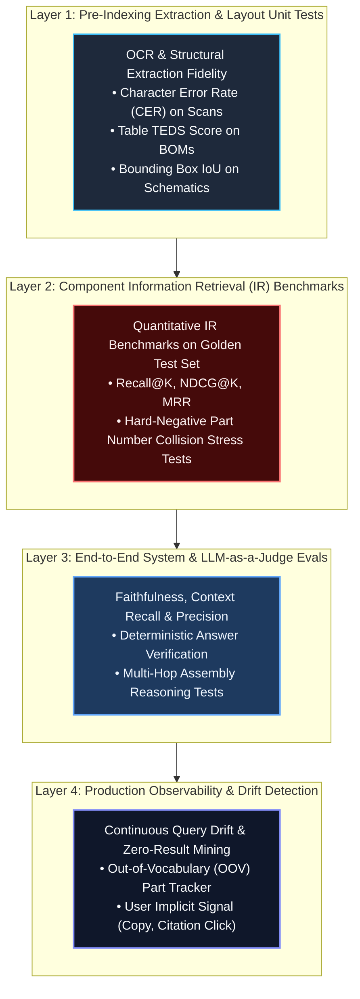
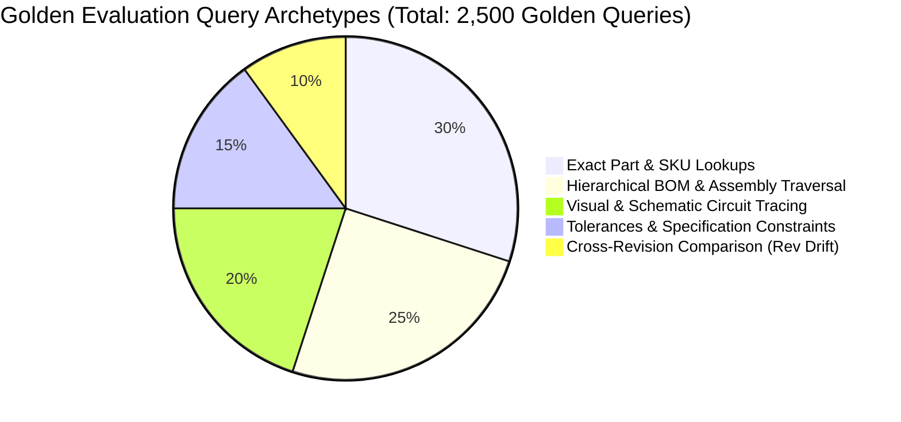
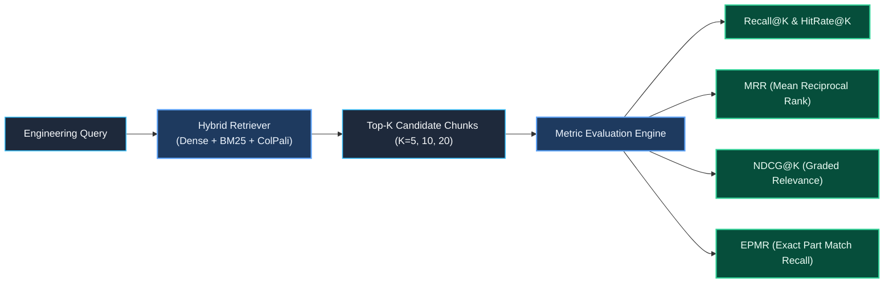
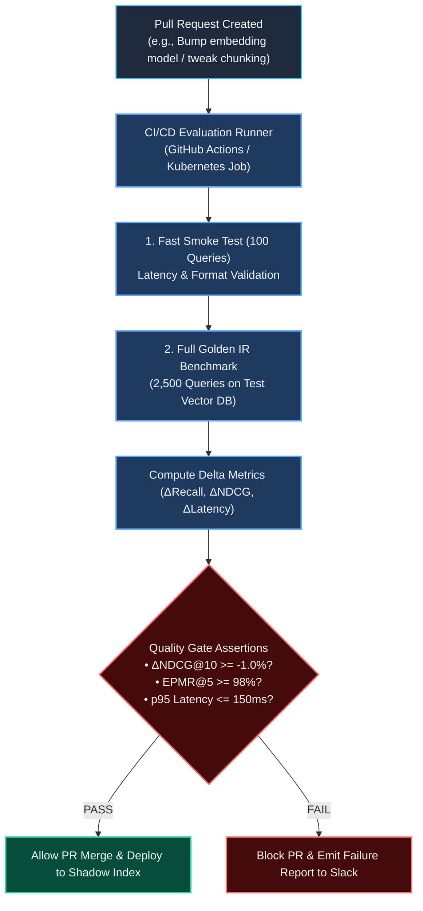
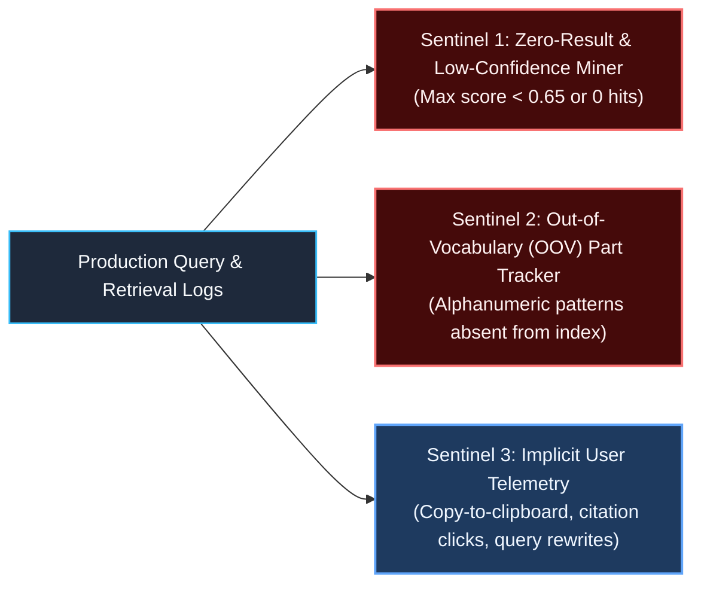

# Testing & Evaluation Strategy: Indexing & Retrieval for Complex Engineering Data

> **Document Type:** System Architecture & Technical Design Specification (TDS)  
> **Level:** Principal Data & AI Architect / Lead Evaluation Specialist  
> **Domain:** Heavy Industrial, Aerospace, Manufacturing & Mechanical/Electrical Engineering  
> **Evaluation Scope:** Unstructured PDFs, Scanned Blueprints, P&IDs, CAD Models, and Bill of Materials (BOM)  
> **Applicable Rules:** Strictly conforms to [.agents/rules/data_ai_architect_persona.md](file:///.agents/rules/data_ai_architect_persona.md) and [.agents/rules/ai_data_architect_evaluator.md](file:///.agents/rules/ai_data_architect_evaluator.md)  
> **Companion Documents:** [indexing_strategy.md](file:///Users/toanbui/dev/data_ai_engineer/docs/indexing/indexing_strategy.md) | [golden_benchmark_strategy.md](file:///Users/toanbui/dev/data_ai_engineer/docs/indexing/golden_benchmark_strategy.md)

---

## 1. Executive Summary & Evaluation Philosophy

In mission-critical engineering systems, **retrieval errors have physical consequences**. Returning the torque specification for a grade 5 bolt instead of a grade 8 bolt, or hallucinating a mating O-ring part number, can cause catastrophic mechanical failure.

Standard academic Information Retrieval (IR) benchmarks (e.g., MS MARCO, BEIR) and generic RAG metrics (e.g., ROUGE, BLEU) fail completely in this domain because:
1. **They treat all tokens equally**: In engineering, missing a single alphanumeric character (e.g., `MS21042-4` vs. `MS21042-5`) is a total failure, even if the rest of the text has a 99% lexical overlap.
2. **They ignore layout fidelity**: If a table extraction tool misaligns a column header, the retrieved chunk looks grammatically coherent to an LLM judge but contains inverted engineering specifications.
3. **They are blind to multi-modal schematics**: Text-only evaluation cannot determine if an electrical trace or piping circuit was correctly localized on a scanned drawing.

### The Engineering Retrieval Testing Pyramid



---

## 2. Layer 1: Pre-Indexing Extraction & Layout Fidelity Testing

Before evaluating vector similarity or search rankings, you must verify that the **raw extraction from complex PDFs and scans is physically accurate**. Garbage into the index guarantees hallucinations out of the retriever.

### 2.1. OCR Fidelity on Engineering Scans (CER / WER)

Scanned engineering drawings contain noise, dirt, stamps, and small text callouts. We compute **Character Error Rate (CER)** and **Word Error Rate (WER)** against a human-verified ground-truth transcription:

$$\text{CER} = \frac{S + D + I}{N} = \frac{\text{Substitutions} + \text{Deletions} + \text{Insertions}}{\text{Total Ground Truth Characters}}$$

#### Specific Engineering Assertion:
* **Alphanumeric Callout CER**: $\text{CER}_{\text{part\_numbers}} \le 0.5\%$. A standard text CER of $3\%$ might be acceptable for prose, but $3\%$ error on part numbers invalidates the search index.

### 2.2. Table Extraction Testing: TEDS (Tree Edit Distance for Tables)

Evaluating extracted BOM tables requires measuring both **cell text accuracy** and **structural tree hierarchy** (handling colspans, rowspans, and multiline headers). We mandate **Tree Edit Distance-based Similarity (TEDS)**:

$$\text{TEDS}(T_a, T_b) = 1 - \frac{\text{EditDistance}(T_a, T_b)}{\max(|T_a|, |T_b|)}$$

Where $T_a$ and $T_b$ are the HTML/AST tree representations of the ground-truth table and candidate table.

| Metric | Target SLA | Critical Failure Mode |
| :--- | :--- | :--- |
| **TEDS (Structural Only)** | $\ge 0.95$ | Split columns; missing row borders causing adjacent rows to merge. |
| **TEDS (Text + Structure)** | $\ge 0.90$ | Units of measure dropped (e.g., converting `0.05 mm` to `0.05`). |
| **Header Association Accuracy** | $100\%$ | Numerical values bound to the wrong column header. |

### 2.3. Schematic Segmentation: Bounding Box IoU

For engineering drawings, diagrams must be segmented without clipping callouts or notes:

$$\text{IoU} = \frac{\text{Area of Overlap}}{\text{Area of Union}} = \frac{|B_{\text{pred}} \cap B_{\text{gt}}|}{|B_{\text{pred}} \cup B_{\text{gt}}|}$$

* **Target SLA**: $\text{IoU} \ge 0.85$ for Title Blocks, BOM regions, and Drawing Schematic views.

---

## 3. Golden Benchmark Dataset Construction

A credible engineering evaluation framework requires a curated **Golden Test Set** consisting of $(Query, Context_{GT}, Answer_{GT}, Negatives_{Hard})$ tuples.

> [!NOTE]
> For the comprehensive architectural specification on constructing, formatting, and anchoring golden datasets (including persistent semantic span resolvers and JSON schemas), refer to the dedicated guide: [golden_benchmark_strategy.md](file:///Users/toanbui/dev/data_ai_engineer/docs/indexing/golden_benchmark_strategy.md).

### 3.1. Query Taxonomy Distribution

The benchmark must represent five distinct engineering query archetypes:



1. **Exact Part & SKU Lookups (30%)**:
   * *Query*: `"What is the replacement interval for filter element 883441-A?"`
   * *Challenge*: Sparse exact match against near-identical variants (`883441-B`).
2. **Hierarchical BOM Traversal (25%)**:
   * *Query*: `"List all fasteners and O-rings required to mount the Main Fuel Metering Valve (Assy 4401-01)."`
   * *Challenge*: Multi-row table extraction and parent-child graph link traversal.
3. **Visual & Schematic Circuit Tracing (20%)**:
   * *Query*: `"Identify the circuit breaker upstream of hydraulic shutoff valve HV-202 on schematic E-4412."`
   * *Challenge*: Multi-vector visual alignment (ColPali) over topological drawings.
4. **Tolerances & Specification Constraints (15%)**:
   * *Query*: `"What is the maximum permissible bore runout for the sleeve bearing under operating spec AS-9100?"`
   * *Challenge*: Exact numerical value extraction without context starvation.
5. **Cross-Revision Comparison (10%)**:
   * *Query*: `"What material spec changed for the mounting bracket between Rev C and Rev D of drawing D-99120?"`
   * *Challenge*: Version-aware metadata filtering preventing temporal contamination.

### 3.2. Mining Engineering Hard Negatives

Naive vector evaluation uses random chunks as negative examples. In engineering, random chunks are too easy to differentiate. You must explicitly construct **Hard Negatives**:

* **Typographic Twins**: If the query targets `MS21042-4`, inject `MS21042-3` and `MS21042-5` into the candidate corpus.
* **Semantic Twins**: Same part description, different parent assembly (e.g., `"High Pressure Hydraulic Relief Valve"` for Landing Gear vs. Flight Controls).
* **Obsolete Revisions**: Same part number from an superseded drawing revision (`Rev B` when `Rev D` is active).

---

## 4. Quantitative Information Retrieval (IR) Metrics

The retrieval pipeline (Hybrid Dense + Sparse + Graph) is evaluated against the golden dataset using standard and domain-specific IR metrics:



### 4.1. Core Mathematical Formulations

#### 1. Mean Reciprocal Rank (MRR)
Measures where the first relevant document appears in the ranked list:

$$\text{MRR} = \frac{1}{|Q|} \sum_{i=1}^{|Q|} \frac{1}{\text{rank}_i}$$

Where $\text{rank}_i$ is the position of the first ground-truth document for query $i$.

#### 2. Normalized Discounted Cumulative Gain (NDCG@K)
Evaluates graded relevance (e.g., 2 = exact matching part spec, 1 = parent assembly manual, 0 = unrelated text):

$$\text{DCG}@K = \sum_{i=1}^K \frac{2^{rel_i} - 1}{\log_2(i + 1)}, \quad \text{NDCG}@K = \frac{\text{DCG}@K}{\text{IDCG}@K}$$

Where $\text{IDCG}@K$ is the ideal DCG obtained by sorting all candidate items by their true relevance score.

#### 3. Exact Part Match Recall (EPMR@K) — Custom Engineering Metric
Measures whether the *exact* target alphanumeric part code is present in the top-$K$ retrieved chunks:

$$\text{EPMR}@K = \frac{1}{|Q_{\text{part}}|} \sum_{q \in Q_{\text{part}}} \mathbb{I}(\text{TargetPart} \in \bigcup_{j=1}^K \text{Tokens}(\text{Chunk}_j))$$

### 4.2. Target Production SLAs

| Metric | Target SLA | Benchmark Failure Threshold | Action on Violation |
| :--- | :--- | :--- | :--- |
| **Recall@5** | $\ge 0.88$ | $< 0.80$ | Expand dense chunk overlap; inspect BM25 tokenization. |
| **Recall@20** | $\ge 0.96$ | $< 0.90$ | Re-ranker candidate pool starved; increase initial retrieval depth. |
| **NDCG@10** | $\ge 0.85$ | $< 0.78$ | Cross-encoder reranker weights miscalibrated. |
| **MRR** | $\ge 0.80$ | $< 0.72$ | Top result ranks poorly; tune sparse-dense RRF weights. |
| **EPMR@5** | $\ge 0.98$ | $< 0.94$ | **P0 Blocker**: Alphanumeric tokenizer splitting hyphens/slashes. |
| **p95 Latency** | $< 120\text{ ms}$ | $> 250\text{ ms}$ | Quantize dense vectors (SQ8) or optimize HNSW `efSearch`. |

---

## 5. Automated CI/CD Regression Harness

Retrieval evaluation must not be a one-time manual spreadsheet exercise. It must run automatically in the CI/CD pipeline whenever:
1. The embedding model is retrained or swapped.
2. The chunking boundary logic or table parser is updated.
3. The vector database index configuration (e.g., HNSW $M$, $efConstruction$) is modified.



### 5.1. Production Pytest Implementation of the IR Harness

```python
import pytest
import numpy as np
from typing import List, Dict

@pytest.fixture(scope="session")
def golden_test_suite() -> List[Dict]:
    """Loads human-verified engineering queries with ground-truth chunk IDs."""
    import json
    with open("tests/benchmarks/golden_engineering_queries.json", "r") as f:
        return json.load(f)

def test_retrieval_regression_gates(golden_test_suite, production_hybrid_retriever):
    """Asserts that PR changes do not degrade retrieval accuracy or part recall."""
    recalls_at_5 = []
    ndcgs_at_10 = []
    exact_part_hits = []
    
    for item in golden_test_suite:
        query = item["query"]
        expected_chunk_ids = set(item["ground_truth_chunk_ids"])
        target_part_number = item.get("target_part_number")
        
        # Execute hybrid retrieval
        search_results = production_hybrid_retriever.search(query, top_k=10)
        retrieved_ids = [res.chunk_id for res in search_results]
        
        # 1. Compute Recall@5
        top_5_ids = set(retrieved_ids[:5])
        hits = len(top_5_ids.intersection(expected_chunk_ids))
        recalls_at_5.append(hits / max(1, len(expected_chunk_ids)))
        
        # 2. Compute Graded NDCG@10
        dcg = 0.0
        for rank, res in enumerate(search_results[:10], start=1):
            rel = 2 if res.chunk_id in expected_chunk_ids else (1 if res.is_same_document else 0)
            dcg += (2**rel - 1) / np.log2(rank + 1)
            
        # Ideal DCG calculation
        ideal_rels = sorted([2] * len(expected_chunk_ids) + [0] * 10, reverse=True)[:10]
        idcg = sum((2**r - 1) / np.log2(rk + 1) for rk, r in enumerate(ideal_rels, start=1))
        ndcgs_at_10.append(dcg / max(1e-6, idcg))
        
        # 3. Compute Exact Part Match Recall
        if target_part_number:
            combined_text = " ".join([r.payload.get("text", "") for r in search_results[:5]])
            exact_part_hits.append(1 if target_part_number in combined_text else 0)
            
    mean_recall_5 = np.mean(recalls_at_5)
    mean_ndcg_10 = np.mean(ndcgs_at_10)
    mean_epmr = np.mean(exact_part_hits) if exact_part_hits else 1.0
    
    # Strict Production Gates
    assert mean_recall_5 >= 0.85, f"Recall@5 dropped below SLA: {mean_recall_5:.4f}"
    assert mean_ndcg_10 >= 0.82, f"NDCG@10 dropped below SLA: {mean_ndcg_10:.4f}"
    assert mean_epmr >= 0.98, f"Critical Part Number Match dropped: {mean_epmr:.4f}"
```

---

## 6. Continuous Production Observability & Drift Detection

Offline evaluation on static datasets decays over time as new engineering manuals, revisions, and CAD models are ingested. Production observability requires continuous monitoring:

### 6.1. The Three Critical Production Sentinels



1. **Zero-Result & Low-Confidence Mining**:
   * Any query returning zero results or where the top dense similarity score is $< 0.60$ is automatically flagged into a DLQ.
   * A weekly automated job clusters low-confidence queries to identify missing catalog segments or unindexed drawing revisions.
2. **Out-of-Vocabulary (OOV) Part Number Tracker**:
   * Uses regex to scan queries for part-number patterns (e.g., `^[A-Z0-9]{3,}-[A-Z0-9]+`).
   * Cross-references detected tokens against the indexed catalog vocabulary. Unmatched part codes immediately alert the ingestion team that a vendor catalog or new revision is missing from the lakehouse.
3. **Implicit User Signal Mining**:
   * **Positive Signal**: User copies text from a retrieved citation or expands the cited diagram view.
   * **Negative Signal (The Frustration Loop)**: User executes 3 queries within 60 seconds with minor lexical variations (e.g., `AN919-6`, then `AN919 fitting`, then `hydraulic reducer 3/8`). Indicates the retriever is failing to locate the required document.

---

## 7. Senior vs. Staff Leveling Matrix: Indexing & Retrieval Testing

To calibrate engineering teams and evaluate candidates on production readiness:

| Dimension | Senior Engineer (L4 / L5) | Staff Engineer (L6+) |
| :--- | :--- | :--- |
| **Evaluation Scope** | Runs Ragas or TruLens on a sample of 100 queries; reports average cosine similarity and LLM answer correctness. | Designs the 4-layer testing pyramid (Fidelity $\to$ IR $\to$ E2E $\to$ Production Drift); architects automated regression gates in CI/CD. |
| **Metrics Mastery** | Measures basic Precision and Recall; treats all query types identically. | Calibrates Graded NDCG, MRR, and domain-specific metrics (EPMR, TEDS table distance); constructs hard-negative collision suites. |
| **Visual & Layout Testing** | Converts PDFs to plain text and evaluates text similarity. | Implements multi-modal evaluation; measures layout IoU on engineering title blocks and evaluates ColPali visual patch MaxSim alignment. |
| **Failure Analysis** | Fixes failing queries by adding manual few-shot examples or hardcoding synonyms. | Diagnoses root-cause failure mechanisms: identifies tokenizer hyphen splitting, HNSW graph disconnections, or table spanning collapse. |
| **FinOps & Scale** | Runs evaluations directly against live production LLM endpoints without caching. | Implements synthetic test-set generators with semantic caching, mock vector fixtures, and evaluates GPU latency budgets alongside retrieval accuracy. |
