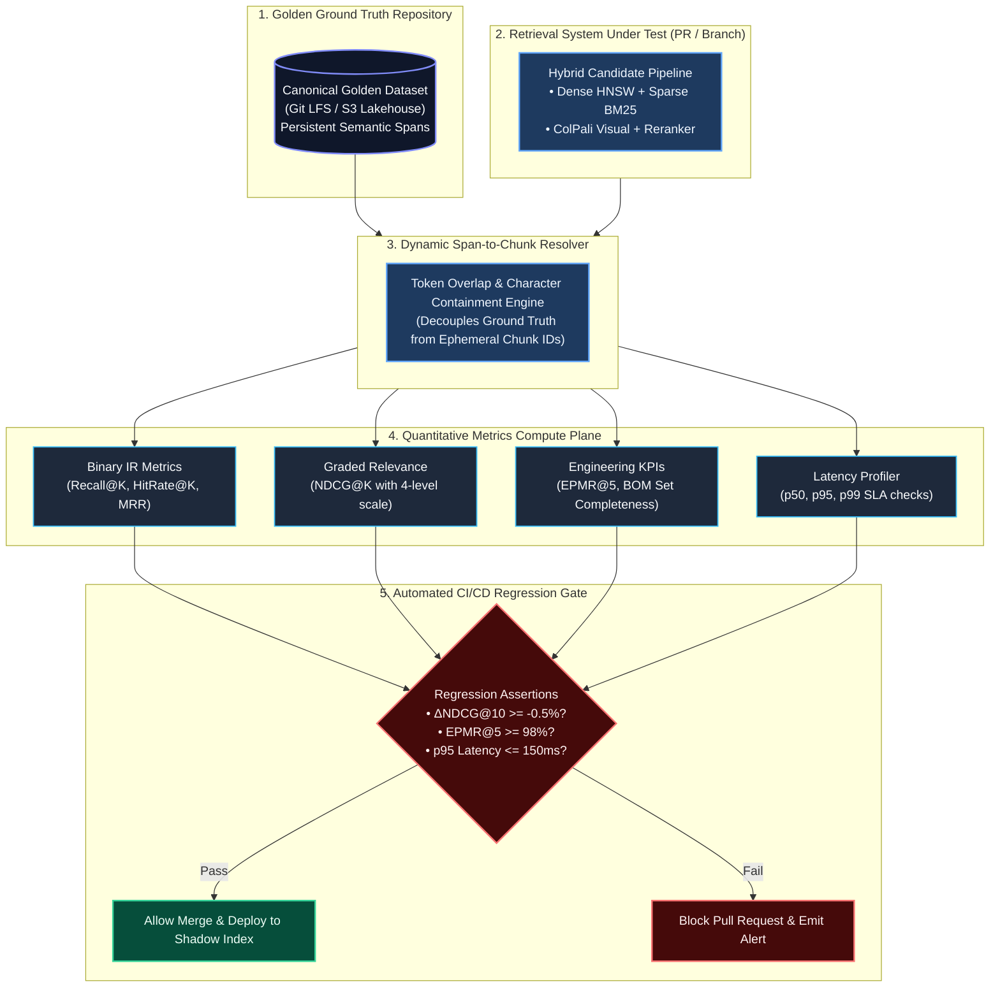
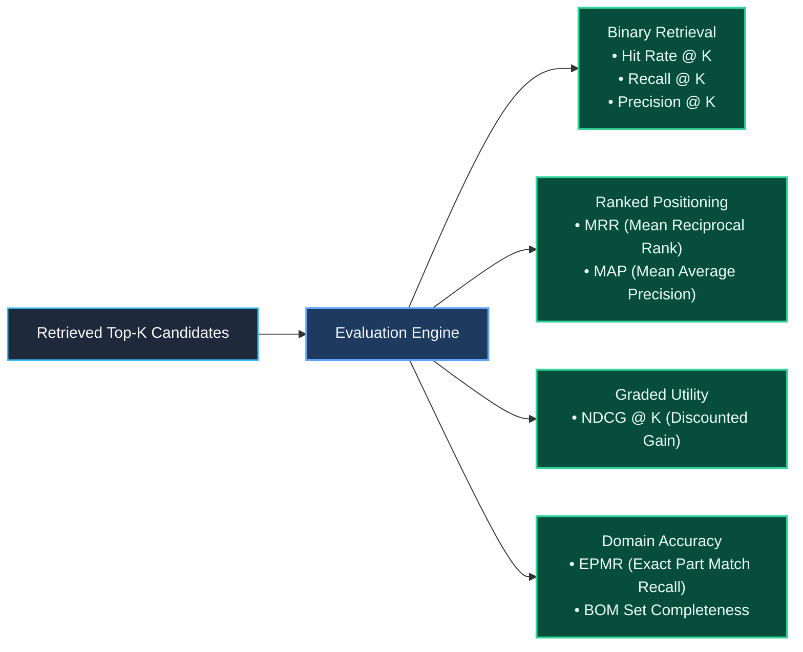
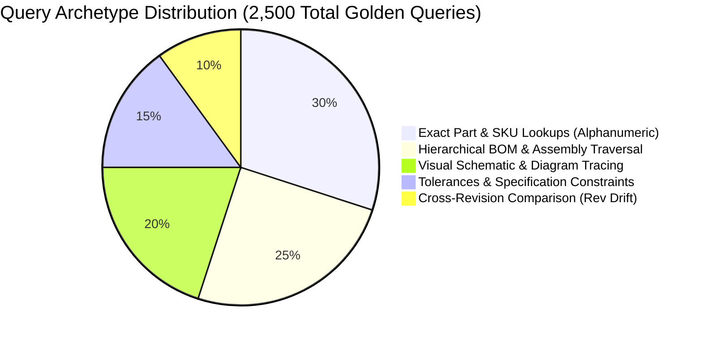
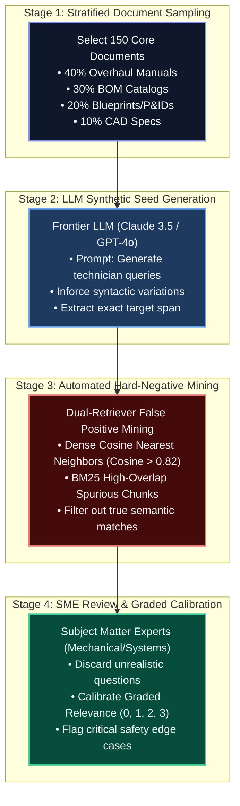
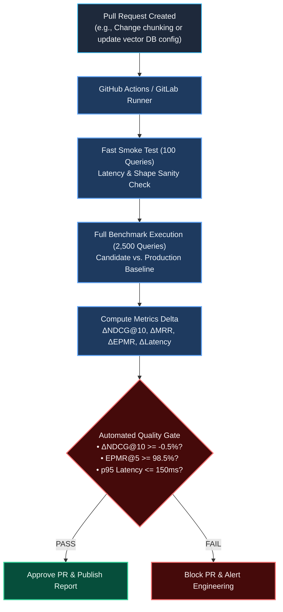
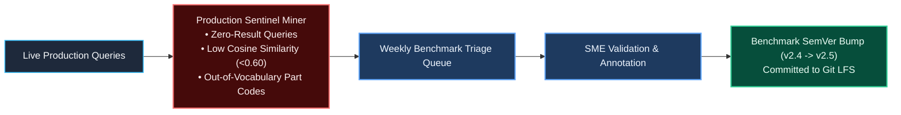

# Golden Benchmark Dataset Strategy: Design, Evaluation Metrics & Production Harness

> **Document Type:** System Architecture & Technical Design Specification (TDS)  
> **Level:** Principal Data & AI Architect / Lead Evaluation Specialist  
> **Domain:** Heavy Industrial, Aerospace, Manufacturing & Mechanical/Electrical Engineering  
> **Scope:** Ground-Truth Benchmark Construction, Quantitative IR Metrics, Semantic Span Anchoring, and Automated CI/CD Regression Gating  
> **Companion Documents:** [indexing_strategy.md](file:///Users/toanbui/dev/data_ai_engineer/docs/indexing/indexing_strategy.md) | [evaluate_strategy.md](file:///Users/toanbui/dev/data_ai_engineer/docs/indexing/evaluate_strategy.md)

---

## 1. Executive Summary & Problem Framing

In production enterprise Retrieval-Augmented Generation (RAG) and AI agent systems, search quality is frequently managed via **"vibe-driven engineering"**: an engineer adjusts a chunking window from 256 to 512 tokens, swaps an embedding model, or modifies HNSW index parameters, spot-checks three favorite queries in a chat UI, and declares victory. 

In complex engineering domains (aerospace, manufacturing, CAD, GD&T specs), vibe-driven iteration causes catastrophic, silent regressions. A change that improves high-level narrative summaries can silently destroy alphanumeric part lookups (e.g., retrieving `MS21042-4` instead of `MS21042-5`), leading to physical assembly failures or regulatory non-compliance.

A **Golden Benchmark Dataset** is an immutable, human-verified, and statistically representative test suite that acts as the absolute ground truth for Information Retrieval (IR) performance. This specification details:
1. **Why it is indispensable**: Decoupling the retrieval tier from LLM synthesis, evaluating the Pareto frontier of cost vs. quality, and stress-testing against adversarial hard negatives.
2. **What metrics to evaluate**: Mathematical formulations for binary IR metrics, Graded NDCG, and domain-specific engineering KPIs (Exact Part Match Recall, BOM Completeness).
3. **How to build and maintain it**: Solving the **"Fragile Chunk ID"** trap via persistent semantic span anchoring, executing a hybrid HITL curation workflow, and enforcing automated CI/CD quality gates.



---

## 2. Why a Golden Benchmark Is Indispensable

### 2.1. Isolating Retrieval Quality from LLM Generation Nondeterminism
In end-to-end RAG evaluations (e.g., scoring final answers via GPT-4 or Ragas), failures are confounded. If an AI agent gives an incorrect answer, there are three distinct root causes:
* **Retrieval Starvation**: The retriever failed to include the relevant section in top-$K$.
* **Reranker Displacement**: The section was retrieved at rank 15 but discarded by the cross-encoder.
* **LLM Synthesis Failure**: The section was placed at rank 1, but the LLM hallucinated or suffered from "lost in the middle" attention decay.

A Golden Benchmark evaluates the **Retrieval & Indexing subsystem independently**. By evaluating retrieved chunk candidates directly against ground-truth document spans, you remove the variance, latency, and cost of generation LLMs.

### 2.2. Quantifying the FinOps & Architecture Pareto Frontier
Every architectural decision involves a trade-off between retrieval accuracy, infrastructure cost, and latency:
* *Can we apply Scalar Quantization (SQ8) to reduce dense vector RAM footprint by 72%?*
* *Is adding a Cross-Encoder Reranker worth an additional 80ms p95 latency?*
* *Does increasing the BM25 candidate pool from 50 to 200 documents justify the additional CPU load?*

Without a golden benchmark, these decisions are guesses. With a golden benchmark, you plot a precise **Pareto Frontier** (Retrieval Quality vs. p95 Latency vs. Monthly Hosting Cost), enabling mathematically validated engineering choices.

### 2.3. Exposing True Failure Modes via Hard Negatives
In an index of 25,000,000 engineering chunks, retrieving the correct document against random text (e.g., separating an aircraft manual from an HR policy) is trivial; off-the-shelf embedding models achieve $>98\%$ recall on random distractors.

Real enterprise failures occur when the retriever confuses **near-identical technical entities**:
* **Typographic Twins**: Querying `MS21042-4` (nut, cadmium plated) and retrieving `MS21042-5` (different diameter).
* **Cross-Assembly Twins**: Querying the `Main Hydraulic Relief Valve` for the Landing Gear and retrieving the relief valve for the Cargo Door.
* **Superseded Revisions**: Retrieving `Revision B` specifications when `Revision D` is active.

A robust golden benchmark intentionally pairs queries with **explicitly mined hard negatives**, exposing whether the indexing strategy has sufficient lexical and semantic resolution to prevent false positives.

---

## 3. Quantitative Information Retrieval (IR) Metrics

To evaluate retrieval quality, the framework computes a multi-dimensional metric suite across binary, graded, and domain-specific dimensions:



### 3.1. Mathematical Formulations

#### 1. Hit Rate @ K
Measures the proportion of queries where at least one ground-truth document is retrieved within the top-$K$ candidates:
$$\text{HitRate}@K = \frac{1}{|Q|} \sum_{i=1}^{|Q|} \mathbb{I}\left(\sum_{j=1}^K rel_{i,j} > 0\right)$$
Where $rel_{i,j} \in \{0, 1\}$ indicates whether the $j$-th retrieved chunk for query $i$ is relevant.

#### 2. Recall @ K
Measures the fraction of all relevant ground-truth chunks successfully retrieved in the top-$K$:
$$\text{Recall}@K = \frac{1}{|Q|} \sum_{i=1}^{|Q|} \frac{|\text{Retrieved}_{i,K} \cap \text{Relevant}_i|}{|\text{Relevant}_i|}$$

#### 3. Mean Reciprocal Rank (MRR)
Measures how high the **first relevant chunk** appears in the candidate list. It heavily penalizes systems where the correct answer is buried at rank 8 rather than rank 1:
$$\text{MRR} = \frac{1}{|Q|} \sum_{i=1}^{|Q|} \frac{1}{\text{rank}_i}$$
Where $\text{rank}_i$ is the 1-based index of the first relevant chunk found for query $i$. If no relevant chunk is retrieved in top-$K$, $\frac{1}{\text{rank}_i} = 0$.

#### 4. Normalized Discounted Cumulative Gain (NDCG@K)
Evaluates **graded relevance**, modeling the diminishing cognitive return of chunks appearing lower in the prompt context.

* **4-Level Relevance Calibration**:
  * **Grade 3 (Exact Answer)**: Contains the exact specification, part number, or torque rating queried.
  * **Grade 2 (High Context)**: The surrounding subsection or procedure providing critical prerequisites or warnings.
  * **Grade 1 (Marginal Context)**: The parent assembly overview or general tool manual.
  * **Grade 0 (Irrelevant / Distractor)**: Unrelated engineering sections.

* **Discounted Cumulative Gain (DCG)**:
  $$\text{DCG}@K = \sum_{j=1}^K \frac{2^{rel_j} - 1}{\log_2(j + 1)}$$

* **Ideal DCG (IDCG)**: The DCG of the monotonically sorted ground-truth labels for that query:
  $$\text{IDCG}@K = \sum_{j=1}^{|\text{Relevant}|} \frac{2^{rel_j^*} - 1}{\log_2(j + 1)}$$

* **Normalized DCG**:
  $$\text{NDCG}@K = \frac{\text{DCG}@K}{\text{IDCG}@K}$$

#### 5. Exact Part Match Recall (EPMR@K) — Domain-Specific
In heavy engineering, missing a single alphanumeric part number or specification code is unacceptable. EPMR measures whether the target part string appears anywhere in the top-$K$ retrieved payload:
$$\text{EPMR}@K = \frac{1}{|Q_{\text{part}}|} \sum_{q \in Q_{\text{part}}} \mathbb{I}\left(\text{TargetPart} \in \bigcup_{j=1}^K \text{Tokens}(\text{Chunk}_j)\right)$$

#### 6. BOM Set Completeness (All-or-Nothing Recall)
For queries requiring a complete parts breakdown (e.g., *"List all replacement seals for Actuator Assy 401"*):
$$\text{BOM\_Complete}@K = \frac{1}{|Q_{\text{BOM}}|} \sum_{q \in Q_{\text{BOM}}} \mathbb{I}\left(\text{TargetParts} \subseteq \bigcup_{j=1}^K \text{ExtractedParts}(\text{Chunk}_j)\right)$$
If an assembly requires 6 parts and the retriever returns 5, $\text{BOM\_Complete} = 0$.

---

### 3.2. Target Production SLAs & Quality Thresholds

| Metric | Target SLA | Regression Alert Threshold | Failure Remediation Protocol |
| :--- | :--- | :--- | :--- |
| **HitRate@5** | $\ge 95.0\%$ | $< 90.0\%$ | Expand sparse candidate pool; verify dense index quantization. |
| **Recall@5** | $\ge 88.0\%$ | $< 82.0\%$ | Check chunk size; increase overlap; inspect parent-child mapping. |
| **Recall@20** | $\ge 96.0\%$ | $< 92.0\%$ | Reranker pool starvation; increase initial retrieval depth ($K=50$). |
| **MRR** | $\ge 0.82$ | $< 0.75$ | Tune RRF (Reciprocal Rank Fusion) dense vs. sparse weighting. |
| **NDCG@10** | $\ge 0.86$ | $< 0.80$ | Retrain cross-encoder reranker; calibrate graded relevance. |
| **EPMR@5** | $\ge 98.5\%$ | $< 95.0\%$ | **P0 Blocker**: Alphanumeric regex analyzer splitting on hyphens/slashes. |
| **BOM Completeness**| $\ge 90.0\%$ | $< 82.0\%$ | Enable GraphRAG subassembly traversal for parent assemblies. |
| **p95 Latency** | $< 120\text{ ms}$ | $> 200\text{ ms}$ | Enable NVMe DiskANN; adjust HNSW `efSearch`; scale search workers. |

---

## 4. How It Should Be Done: Engineering Methodology

### 4.1. The Fatal Pitfall: The "Fragile Chunk ID" Trap

> [!CAUTION]
> **Never bind ground truth to ephemeral chunk identifiers like `chunk_8412` or `doc_12_c03`.**
> If you change your chunking window from 256 to 384 tokens, change your markdown parser, or tweak a sentence boundary regex, **all chunk IDs will change**. Every single human annotation in your golden dataset will be instantly invalidated.

#### The Architectural Solution: Persistent Semantic Span Anchoring
Ground truth must be decoupled from the chunking implementation by binding annotations to **layout-independent semantic anchors**:

```
[ Persistent Ground Truth Entity ]
├── document_uri: "s3://silver-lakehouse/manuals/HYD-ACT-99.md"
├── document_revision: "REV_D"
├── section_breadcrumb: "3.0 Overhaul > 3.2 Roller Screw Disassembly"
├── page_number: 44
├── canonical_span_hash: "sha256(Install fitting AN919-6D into distribution block...)"
└── bounding_box: [x0: 120, y0: 450, x1: 580, y1: 520] (for visual schematics)
```

#### The Dynamic Span-to-Chunk Resolver
During benchmark execution, an automated resolver dynamically evaluates whether a candidate chunk produced by *any* chunking strategy contains the ground-truth span:

```python
import hashlib
from typing import Set

class DynamicSpanResolver:
    """Dynamically maps candidate chunks to persistent ground-truth spans."""
    
    @staticmethod
    def compute_overlap_ratio(candidate_text: str, ground_truth_span: str) -> float:
        """Computes token intersection over ground truth token length."""
        cand_tokens = set(candidate_text.lower().split())
        gt_tokens = set(ground_truth_span.lower().split())
        if not gt_tokens:
            return 0.0
        intersection = cand_tokens.intersection(gt_tokens)
        return len(intersection) / len(gt_tokens)

    @classmethod
    def is_chunk_match(cls, candidate_chunk_text: str, gt_span_text: str, threshold: float = 0.85) -> bool:
        # 1. Exact canonical substring check
        if gt_span_text.strip() in candidate_chunk_text:
            return True
        # 2. Token overlap ratio check (handles minor whitespace/tokenization variations)
        return cls.compute_overlap_ratio(candidate_chunk_text, gt_span_text) >= threshold
```

---

### 4.2. Query Taxonomy & Stratified Sampling

A production benchmark must reflect the operational reality of the enterprise. Construct the test suite across five distinct query archetypes:



1. **Exact Part & SKU Lookups (30%)**: Tests sparse keyword matching, punctuation preservation, and exact alphanumeric tokenization (`AN919-6D`, `DIN 912 M8x30`).
2. **Hierarchical BOM Traversal (25%)**: Tests multi-chunk retrieval and parent-child graph links (*"List all fasteners required to mount the Main Fuel Metering Valve"*).
3. **Visual Schematic & Diagram Tracing (20%)**: Tests multi-vector visual late interaction (*"Identify the pressure relief valve on return line B of schematic E-4412"*).
4. **Tolerances & Specification Constraints (15%)**: Tests numerical reasoning and unit binding (*"What is the maximum permissible bore runout for sleeve bearing AS-9100?"*).
5. **Cross-Revision Comparison (10%)**: Tests temporal filtering and revision tag isolation (*"Differences in torque specs between Rev C and Rev D for drawing D-99120"*).

---

### 4.3. The 4-Stage Construction Workflow



1. **Stratified Document Sampling**: Sample 150 documents across all asset classes, ensuring coverage across active and obsolete revision tags.
2. **LLM Synthetic Seed Generation**: Use strict prompt engineering to generate candidate questions. Never ask the LLM to write questions using the exact wording of the document. Instruct it to simulate a field engineer inquiring about symptoms, tool needs, or part replacements.
3. **Automated Hard-Negative Mining**: Run candidate queries through an initial dense retriever and an uncalibrated BM25 index. The top non-relevant results that score high similarity are automatically attached to the record as explicit `hard_negatives`.
4. **SME Human-in-the-Loop Verification**: Field engineers and technical documentation specialists review the generated items, assign graded relevance (0–3), and eliminate synthetic artifacts.

---

## 5. Canonical Golden Benchmark Data Schema

The golden benchmark is stored in versioned JSONL files in Git LFS or S3:

```json
{
  "$schema": "https://json-schema.org/draft/2020-12/schema",
  "benchmark_metadata": {
    "version": "2.4.0",
    "domain": "aerospace_mechanical",
    "total_queries": 2500,
    "last_calibrated_utc": "2026-09-20T12:00:00Z"
  },
  "query_entry": {
    "query_id": "QRY-HYD-2026-0042",
    "query_text": "What is the tightening torque and required lubricant for fitting AN919-6D on the distribution block?",
    "query_archetype": "specification_tolerance",
    "difficulty": "hard",
    "target_entities": ["AN919-6D", "135-150 in-lbs", "MIL-H-5606"],
    "ground_truth_anchors": [
      {
        "document_id": "MAN-HYD-771",
        "document_revision": "REV_D",
        "section_breadcrumb": "Chapter 3: Maintenance > Section 3.2: Filter Replacement",
        "page_number": 42,
        "canonical_span": "Install fitting AN919-6D into distribution block. Torque to 135-150 in-lbs lubricated with MIL-H-5606 fluid.",
        "canonical_span_hash": "e3b0c44298fc1c149afbf4c8996fb92427ae41e4649b934ca495991b7852b855",
        "relevance_grade": 3,
        "rationale": "Directly answers torque rating and required lubricant."
      },
      {
        "document_id": "MAN-HYD-771",
        "document_revision": "REV_D",
        "section_breadcrumb": "Chapter 3: Maintenance > Section 3.0: General Actuator Overhaul",
        "page_number": 39,
        "canonical_span": "All threaded hydraulic fittings must be inspected for galling prior to installation.",
        "canonical_span_hash": "a591a6d40bf420404a011733cfb7b190d62c65bf0bcda32b57b277d9ad9f146e",
        "relevance_grade": 1,
        "rationale": "General procedural context on fitting installation."
      }
    ],
    "hard_negatives": [
      {
        "document_id": "MAN-HYD-771",
        "document_revision": "REV_B",
        "canonical_span": "Torque fitting AN919-6D to 120 in-lbs dry.",
        "reason": "Superseded revision with dangerous under-torque specification."
      },
      {
        "document_id": "MAN-HYD-771",
        "document_revision": "REV_D",
        "canonical_span": "Torque fitting AN919-6 to 90 in-lbs.",
        "reason": "Alloy variant AN919-6 (non-D) has a lower torque limit."
      }
    ]
  }
}
```

---

## 6. Automated CI/CD Regression Harness

Retrieval evaluation must be executed as an automated quality gate in the CI/CD pipeline whenever pull requests touch embedding models, chunking logic, or search configurations.



### 6.1. Production Benchmark Execution Script

```python
# tests/benchmarks/test_retrieval_benchmark.py
import pytest
import numpy as np
import json
from typing import List, Dict

@pytest.fixture(scope="session")
def golden_benchmark_suite() -> List[Dict]:
    with open("tests/benchmarks/golden_engineering_v2.json", "r") as f:
        return json.load(f)

def test_retrieval_regression(golden_benchmark_suite, active_retriever):
    """Executes the complete golden evaluation suite against candidate retriever."""
    recalls_at_5 = []
    ndcgs_at_10 = []
    exact_part_hits = []
    
    for entry in golden_benchmark_suite:
        query = entry["query_text"]
        gt_anchors = entry["ground_truth_anchors"]
        target_entities = entry.get("target_entities", [])
        
        # 1. Execute candidate search
        candidates = active_retriever.search(query, top_k=10)
        
        # 2. Evaluate Graded NDCG@10 using Dynamic Span Matching
        dcg = 0.0
        for rank, cand in enumerate(candidates, start=1):
            grade = 0
            for anchor in gt_anchors:
                if anchor["canonical_span"].strip() in cand.text or anchor["canonical_span_hash"] == cand.metadata.get("span_hash"):
                    grade = max(grade, anchor["relevance_grade"])
            dcg += (2**grade - 1) / np.log2(rank + 1)
            
        # Compute Ideal DCG (IDCG)
        all_grades = sorted([a["relevance_grade"] for a in gt_anchors] + [0]*10, reverse=True)[:10]
        idcg = sum((2**g - 1) / np.log2(idx + 1) for idx, g in enumerate(all_grades, start=1))
        ndcgs_at_10.append(dcg / max(1e-6, idcg))
        
        # 3. Evaluate Exact Part Match Recall (EPMR@5)
        top_5_text = " ".join([c.text for c in candidates[:5]])
        if target_entities:
            part_matched = all(entity in top_5_text for entity in target_entities if "-" in entity)
            exact_part_hits.append(1 if part_matched else 0)
            
        # 4. Binary Recall@5
        found_any = any(
            any(a["canonical_span"].strip() in c.text for a in gt_anchors if a["relevance_grade"] >= 2)
            for c in candidates[:5]
        )
        recalls_at_5.append(1.0 if found_any else 0.0)
        
    mean_recall = np.mean(recalls_at_5)
    mean_ndcg = np.mean(ndcgs_at_10)
    mean_epmr = np.mean(exact_part_hits) if exact_part_hits else 1.0
    
    # Assert Strict Quality Gates
    assert mean_recall >= 0.88, f"Recall@5 dropped below SLA (0.88): {mean_recall:.4f}"
    assert mean_ndcg >= 0.86, f"NDCG@10 dropped below SLA (0.86): {mean_ndcg:.4f}"
    assert mean_epmr >= 0.985, f"Exact Part Match Recall dropped below SLA (0.985): {mean_epmr:.4f}"
```

---

## 7. Benchmark Maintenance, Versioning & Drift Management

A golden dataset is not a static artifact; it must evolve alongside production data:



1. **Continuous Sentinel Mining**:
   * **Zero-Result Queries**: Live queries returning zero vector/lexical hits are automatically quarantined.
   * **Out-of-Vocabulary (OOV) Part Codes**: Queries containing unrecognized alphanumeric codes alert the evaluation team to missing document revisions.
2. **Weekly Benchmark Triage Queue**: The evaluation lead reviews quarantined queries, eliminating user typos and promoting high-value missing queries to the golden dataset.
3. **Semantic Versioning (SemVer)**:
   * **Patch (`v2.4.1`)**: Typos fixed in ground-truth text; redundant queries removed.
   * **Minor (`v2.5.0`)**: New drawing revisions or 50+ queries added for a new subsystem.
   * **Major (`v3.0.0`)**: Relevance grading scale modified or scoring mathematical formulation updated.
