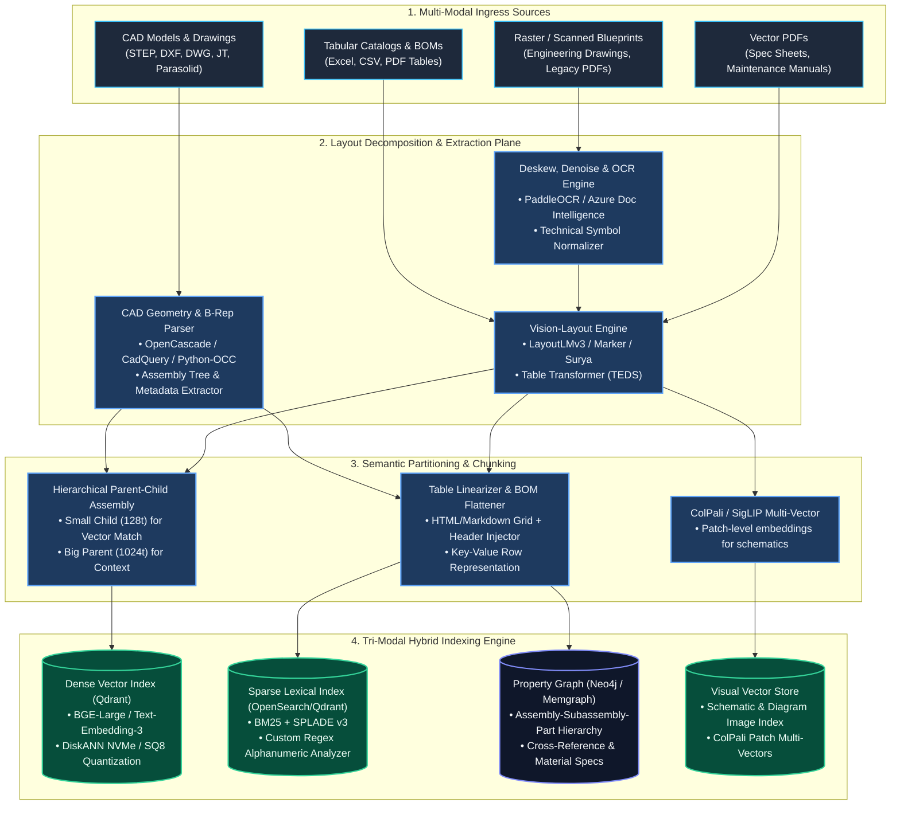
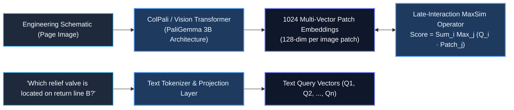
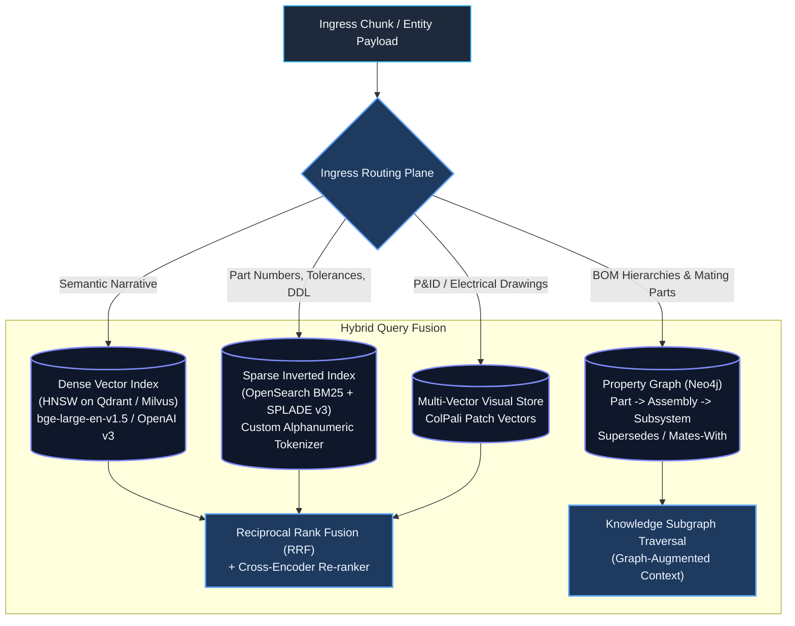
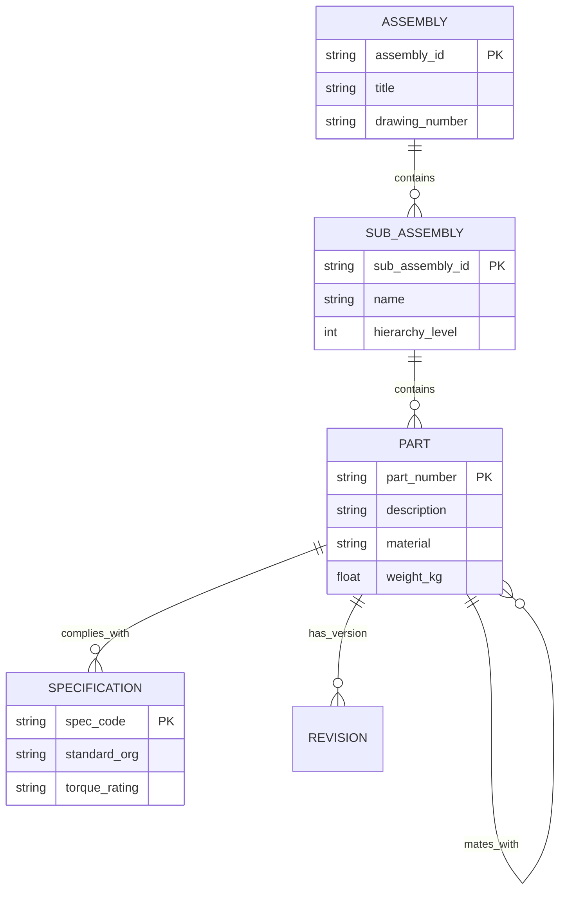

# Engineering Document Indexing Strategy: Unstructured PDFs, Schematics, CAD & Parts Catalogs

> **Document Type:** System Architecture & Technical Design Specification (TDS)  
> **Level:** Principal Data & AI Architect Reference Design  
> **Domain:** Heavy Industrial, Aerospace, Manufacturing & Mechanical/Electrical Engineering  
> **Document Scope:** Native PDFs, Scanned Drawings, Blueprints/P&IDs, 2D/3D CAD Assemblies, and Bill of Materials (BOM) Parts Catalogs  
> **Target Scale:** 25,000,000 documents (~120M vector embeddings, ~40M BOM entities), sub-100ms p95 hybrid retrieval SLA  
> **Companion Documents:** [evaluate_strategy.md](file:///Users/toanbui/dev/data_ai_engineer/docs/indexing/evaluate_strategy.md) | [golden_benchmark_strategy.md](file:///Users/toanbui/dev/data_ai_engineer/docs/indexing/golden_benchmark_strategy.md)

---

## 1. Executive Summary & Problem Framing

Engineering and industrial enterprises operate on highly dense, multi-modal, and mission-critical unstructured documentation. Unlike standard text corpora (e.g., news articles, wiki pages, marketing copy), technical engineering documents present unique retrieval challenges:

1. **High Visual & Structural Density**: Documents feature multi-column layouts, technical callouts, geometric dimensioning and tolerancing (GD&T) symbols, title blocks, and complex vector line drawings (P&IDs, electrical schematics).
2. **Tabular & Hierarchical Complexity**: Parts catalogs and Bill of Materials (BOM) span multi-page tables where cell interpretation depends on merged headers, parent assembly tags, and unit-of-measure specifications.
3. **Exact Token Sensitivity**: In engineering, missing a single hyphen or suffix (e.g., `MS21042-4` self-locking nut vs. `MS21042-5`) leads to catastrophic assembly failure. Pure dense vector search experiences semantic drift on alphanumeric part identifiers.
4. **CAD & Geometric Independence**: 3D assemblies (STEP, JT, IGES) and 2D vector blueprints (DXF, DWG) store spatial B-Rep (Boundary Representation) topology, feature trees, and metadata attributes that cannot be parsed by standard text extractors.



---

## 2. Ingestion & Multi-Modal Parsing Plane

### 2.1. Ingestion Modality Matrix

Different document formats must enter dedicated extraction pipelines rather than being routed through a single naive text parser.

| Modality | Ingress Formats | Extraction Stack | Primary Failure Mode | Mitigation Strategy |
| :--- | :--- | :--- | :--- | :--- |
| **Digital Native PDFs** | PDF (Text layer present) | `pypdfium2` + `pdfplumber` + Layout parser | Font encoding anomalies; text layer bounding box desynchronization | Fall back to OCR when glyph-to-unicode mapping produces garbled text (Mojibake). |
| **Scanned Blueprints & Schematics** | TIFF, Raster PDF, High-Res PNG (300–600 DPI) | Deskew + Sauvola Adaptive Thresholding + `PaddleOCR` / `Surya` | Broken character lines in dimensioning callouts; noise artifacts; orientation rotation | Run pre-OCR OpenCV pipeline (morphological line removal, auto-rotation via orientation detection). |
| **Engineering Tables & BOMs** | Embedded PDF tables, Scanned matrices | `Table Transformer` (TATR) + `unstructured` + `pdfda` | Spanning columns, missing borders, multiline cell descriptions collapsing into adjacent cells | Extract as semantic HTML `<table>` or Markdown AST with explicit row-level header anchoring. |
| **2D Vector Drawings** | DXF, DWG | `ezdxf` + LibreCAD headless | Exploded text geometry; block attributes lost in flat layer export | Traverse DXF block hierarchy, extracting `MTEXT`, `ATTRIB`, and dimension entities with layer tags. |
| **3D CAD Assemblies** | STEP (ISO 10303), JT, IGES | `OpenCascade` (pythonocc) + `trimesh` | Geometry without semantic text; massive file size (>1 GB per model) | Extract assembly product structure tree, part names, bounding box aspect ratios, volume, and material properties. |

---

### 2.2. Pre-Processing Pipeline for Scanned Engineering Blueprints

Engineering scans require image normalization before OCR and Layout Detection:

1. **Orientation & Deskewing**:
   * Detect title block orientation (standard bottom-right title block format ISO 7200 / ASME Y14.1M).
   * Apply Radon transform or Hough line transform to compute skew angle $\theta$; rotate image if $|\theta| > 0.5^\circ$.
2. **Adaptive Binarization**:
   * Standard Otsu binarization fails on blueprints with uneven lighting or yellowed paper.
   * Apply **Sauvola adaptive thresholding** with window size $w=25$, dynamic parameter $k=0.2$:
     $$T(x,y) = m(x,y) \cdot \left(1 + k \cdot \left(\frac{s(x,y)}{R} - 1\right)\right)$$
     where $m(x,y)$ is local mean, $s(x,y)$ is local standard deviation, and dynamic range $R=128$.
3. **Zone Isolation**:
   * Separate the canvas into **Title Block** (metadata, revs, tolerances), **BOM Table** (parts list), and **Drawing Field** (schematic view).

```python
import cv2
import numpy as np

def preprocess_engineering_scan(image_bytes: bytes) -> np.ndarray:
    """Preprocesses a raw scanned engineering drawing for OCR/VLM ingestion."""
    nparr = np.frombuffer(image_bytes, np.uint8)
    img = cv2.imdecode(nparr, cv2.IMREAD_GRAYSCALE)
    
    # 1. Background illumination correction (morphological close)
    kernel = cv2.getStructuringElement(cv2.MORPH_RECT, (30, 30))
    bg = cv2.morphologyEx(img, cv2.MORPH_DILATE, kernel)
    norm = cv2.divide(img, bg, scale=255)
    
    # 2. Deskew using Hough Lines
    edges = cv2.Canny(norm, 50, 150, apertureSize=3)
    lines = cv2.HoughLinesP(edges, 1, np.pi / 180, threshold=100, minLineLength=100, maxLineGap=10)
    
    angles = []
    if lines is not None:
        for line in lines:
            x1, y1, x2, y2 = line[0]
            angle = np.degrees(np.arctan2(y2 - y1, x2 - x1))
            if abs(angle) < 45:  # Only capture near-horizontal alignment lines
                angles.append(angle)
    
    if angles:
        median_angle = np.median(angles)
        (h, w) = norm.shape[:2]
        center = (w // 2, h // 2)
        M = cv2.getRotationMatrix2D(center, median_angle, 1.0)
        norm = cv2.warpAffine(norm, M, (w, h), flags=cv2.INTER_CUBIC, borderMode=cv2.BORDER_REPLICATE)
        
    # 3. Adaptive Thresholding for sharp technical line work
    binarized = cv2.adaptiveThreshold(
        norm, 255, cv2.ADAPTIVE_THRESH_GAUSSIAN_C, cv2.THRESH_BINARY, 21, 10
    )
    return binarized
```

---

## 3. Chunking & Semantic Representation Strategies

Standard token-window chunking (e.g., 500 tokens with 50-token overlap) destroys engineering documentation by splitting tables across rows and severing callout numbers from their part names.

### 3.1. Hierarchical Parent-Child (Small-to-Big) Chunking

To optimize both **retrieval accuracy** (pinpointing exact clauses) and **LLM synthesis** (supplying full context):

```
[ Document: Aerospace Actuator Service Manual ]
 └── Section: 3.0 Electro-Mechanical Actuator Overhaul
      └── Subsection: 3.2 Planetary Roller Screw Disassembly
           │
           ├── [ PARENT CHUNK (doc_771#sec_3_2, ~1,024 tokens) ]
           │   Context: Full overhaul procedure, mandatory warning callouts, PPE, required solvent specs.
           │   Payload Target: Stored in Redis Cache / Object Store.
           │
           ├── [ CHILD CHUNK 1 (doc_771#sec_3_2_c1, ~150 tokens) ]
           │   Content: Step 1-3: Removal of retaining ring MS16625-1100 using spanner tool ST-404.
           │   Index Target: Dense Vector Index + BM25.
           │
           └── [ CHILD CHUNK 2 (doc_771#sec_3_2_c2, ~140 tokens) ]
               Content: Inspection of roller screw threads for pitting >0.02mm. Reject limits.
               Index Target: Dense Vector Index + BM25.
```

* **Child Chunk (128–180 tokens)**: Embedded in the dense vector space and indexed in BM25. Focuses solely on high similarity matching.
* **Parent Chunk (800–1200 tokens)**: Re-hydrated at query time. Once a child matches, the retriever substitutes the child chunk with its parent section, ensuring the downstream LLM sees the complete procedure, warnings, and prerequisite tools.

---

### 3.2. Table Linearization & BOM Flattener

Parts catalogs and BOM tables must never be indexed as raw continuous text. If a table cell contains `0.05 mm`, the embedding vector is meaningless unless bound to the column `Radial Clearance` and row `Part Number: MS21042`.

#### Transformation Pattern: Hierarchical Key-Value Row Representation
Convert raw tabular structures into self-contained semantic records:

```json
{
  "document_id": "BOM-HYD-9942",
  "document_title": "Main Hydraulic Actuator Assembly - Revision D",
  "assembly_name": "Hydraulic Power Distribution Block",
  "part_number": "AN919-6D",
  "part_description": "Fitting, Reducer, External Thread, 3/8 to 1/4 Tube",
  "quantity": 4,
  "material": "Aluminum Alloy 2024-T851",
  "spec_standard": "ASME B1.1 / SAE-AS8879",
  "cad_callout_index": "Item 14",
  "torque_specification": "135-150 in-lbs lubricated",
  "supersedes": "AN919-6"
}
```

#### Natural Language Linearization for Vector Embedding:
For each row, generate a dense-friendly synthetic sentence alongside the structured JSON:
> *"Item 14: Part number AN919-6D is a Fitting, Reducer (3/8 to 1/4 Tube) manufactured from Aluminum Alloy 2024-T851. Used in Hydraulic Power Distribution Block with torque spec 135-150 in-lbs lubricated. Supersedes AN919-6."*

---

### 3.3. Multi-Vector Late Interaction for Schematics (ColPali / Visual Embeddings)

Traditional OCR completely fails on schematic drawings because spatial connections (which wire connects to which pin, which pipe feeds which pump) are topological, not textual.



* **ColPali Architecture**: Converts the visual page image directly into a grid of image patch tokens (e.g., $32 \times 32 = 1024$ patches).
* **Late Interaction (MaxSim)**:
  $$\text{Score}(Q, D) = \sum_{i=1}^{|Q|} \max_{j=1}^{|D|} \left( E_q(q_i) \cdot E_d(d_j)^\top \right)$$
  Enables the model to align the text token `"relief valve"` directly with the bounding region of the schematic symbol on the drawing.

---

## 4. Multi-Modal Indexing Architecture

A production enterprise system for engineering cannot rely on a single vector index. It requires a **Tri-Modal Index Tier**:



---

### 4.1. Sparse Tokenizer Tuning for Alphanumerics

Standard analyzers (like Lucene's standard tokenizer) split on hyphens, periods, and slashes. This destroys part numbers:
- `AN919-6D` becomes `["an919", "6d"]`
- `0.05mm` becomes `["0", "05mm"]` or `["05mm"]`

#### OpenSearch Custom Analyzer Configuration for Engineering Artifacts
```json
{
  "settings": {
    "analysis": {
      "char_filter": {
        "engineering_synonyms": {
          "type": "mapping",
          "mappings": [
            "Ø => diameter ",
            "± => plus_minus ",
            "° => deg "
          ]
        }
      },
      "tokenizer": {
        "part_number_tokenizer": {
          "type": "pattern",
          "pattern": "([A-Za-z0-9]+(?:[-_/.][A-Za-z0-9]+)*)"
        }
      },
      "filter": {
        "part_ngram": {
          "type": "edge_ngram",
          "min_gram": 3,
          "max_gram": 15
        }
      },
      "analyzer": {
        "engineering_part_analyzer": {
          "type": "custom",
          "char_filter": ["engineering_synonyms"],
          "tokenizer": "part_number_tokenizer",
          "filter": ["lowercase", "trim", "part_ngram"]
        }
      }
    }
  }
}
```

---

### 4.2. GraphRAG Schema for Bill of Materials (BOM)

Complex engineering assemblies represent hierarchical DAGs (Directed Acyclic Graphs). Answering queries like: *"What O-rings must be replaced when servicing the Low Pressure Fuel Pump?"* requires relational graph traversal.



#### Cypher Query for Graph Retrieval Injection:
```cypher
MATCH (p:PART {part_number: $target_part})
OPTIONAL MATCH (p)-[:MATES_WITH]->(m:PART)
OPTIONAL MATCH (p)-[:COMPLIES_WITH]->(s:SPECIFICATION)
OPTIONAL MATCH (parent:SUB_ASSEMBLY)-[:CONTAINS]->(p)
RETURN p.part_number AS Part,
       p.description AS Description,
       collect(DISTINCT m.part_number) AS MatingParts,
       collect(DISTINCT s.spec_code) AS Specs,
       parent.name AS ParentAssembly;
```

---

## 5. CAD & Geometric Feature Indexing

CAD models (STEP, JT, DWG) contain rich topological data that standard document ingestion pipelines ignore.

### 5.1. Geometric Feature Extraction Pipeline

```python
# Conceptual extraction pattern using OpenCASCADE (pythonocc)
from OCC.Core.STEPControl import STEPControl_Reader
from OCC.Core.IFSelect import IFSelect_RetDone
from OCC.Core.GProp import GProp_GProps
from OCC.Core.BRepGProp import brepgprop_VolumeProperties

def extract_cad_metadata(step_file_path: str) -> dict:
    step_reader = STEPControl_Reader()
    status = step_reader.ReadFile(step_file_path)
    
    if status != IFSelect_RetDone:
        raise ValueError(f"Failed to parse STEP file at: {step_file_path}")
        
    step_reader.TransferRoots()
    shape = step_reader.Shape()
    
    # Compute mass and volume properties
    props = GProp_GProps()
    brepgprop_VolumeProperties(shape, props)
    volume = props.Mass()
    center_of_gravity = props.CentreOfMass()
    
    return {
        "file_path": step_file_path,
        "volume_mm3": volume,
        "center_of_gravity": [
            center_of_gravity.X(),
            center_of_gravity.Y(),
            center_of_gravity.Z()
        ],
        "is_assembly": shape.ShapeType() == 0  # TopAbs_COMPOUND
    }
```

### 5.2. Multi-View Projection Rendering for Visual Search
For every 3D CAD model:
1. Render **6 canonical isometric and orthographic projections** (Front, Top, Right, Isometric 1, Isometric 2, Isometric 3) with flat technical shading.
2. Pass projection images through a vision encoder (`DINOv2` or `SigLIP`) to generate a global geometric shape embedding.
3. Index the shape embeddings into the visual vector index. This allows mechanical engineers to upload an image or sketch of a part and retrieve the matching 3D CAD part number.

---

## 6. Storage & FinOps Architecture

Indexing 25M engineering documents generates massive storage overhead. Below is the production storage layout:

| Tier | Storage Engine | Data Format | Compression / Quantization | Purpose |
| :--- | :--- | :--- | :--- | :--- |
| **Bronze Tier** | AWS S3 / Cloud Storage | Raw binary files (PDF, TIFF, STEP) | S3 Standard / Glacier Instant Retrieval | Immutable source of truth for replay & backfill. |
| **Silver Tier** | Apache Iceberg / Delta Lake | Parquet tables (Clean Markdown, AST, Tables) | Zstandard (zstd) compression | Canonical data lakehouse for downstream analytics & re-chunking. |
| **Gold Vector Tier** | Qdrant / Milvus on NVMe | Dense vector embeddings + payloads | **Scalar Quantization (SQ8)** + DiskANN | Sub-100ms vector search without holding unquantized vectors in RAM. |
| **Sparse Lexical** | OpenSearch Cluster | Lucene inverted indices | LZ4 compression + Block Tree terms | Alphanumeric part lookups, regex searches, SKU matching. |
| **Hot Parent Cache** | Redis Enterprise Cluster | Key-Value parent chunks (`parent_id -> text`) | Snappy compression, 48-hour LRU | Sub-5ms retrieval of parent context sections upon child match. |

### Memory Math & FinOps Calculation (Vector Tier)
- **Scale**: 120,000,000 child chunks.
- **Model**: `bge-large-en-v1.5` (1,024 dimensions, `float32` = 4 bytes per dimension).
- **Unquantized RAM Requirement**:
  $$\text{Vector RAM} = 120\text{M} \times 1024 \times 4\text{ bytes} \approx 491.5\text{ GB}$$
  $$\text{HNSW Overhead (30\%)} \approx 147.4\text{ GB} \implies \text{Total RAM} \approx 639\text{ GB}$$
  *Cost on AWS (2x `r6i.8xlarge` 256GB nodes)*: $\approx \$3,200/\text{month}$.
- **Optimized (Scalar Quantization SQ8 to `int8` + DiskANN on NVMe)**:
  $$\text{Vector RAM} = 120\text{M} \times 1024 \times 1\text{ byte} \approx 122.8\text{ GB}$$
  *Cost on AWS (1x `i3en.3xlarge` with NVMe offload)*: $\approx \$900/\text{month}$ (**72% infrastructure cost reduction**).

---

## 7. Architectural Decisions & Trade-Off Matrix

```mermaid
quadrantChart
    title Technical Strategy: Accuracy vs Implementation Complexity
    x-axis Low Implementation Complexity --> High Implementation Complexity
    y-axis Low Retrieval Precision --> High Retrieval Precision
    quadrant-1 High Precision / High Investment (Enterprise Standard)
    quadrant-2 High Precision / Low Complexity (Immediate Quick Wins)
    quadrant-3 Low Precision / Low Complexity (Legacy Pitfalls)
    quadrant-4 Low Precision / High Complexity (Anti-Patterns)
    "Naive Fixed-Token Chunking": [0.15, 0.20]
    "Pure Dense Vector (No BM25)": [0.25, 0.35]
    "Regex Limit Parsing": [0.20, 0.15]
    "Custom Part-Number Analyzer (BM25)": [0.35, 0.75]
    "Parent-Child Small-to-Big": [0.45, 0.85]
    "Tri-Modal (Vector + BM25 + Graph)": [0.85, 0.95]
    "ColPali Multi-Vector Schematics": [0.90, 0.90]
    "Full Manual 3D Mesh Parsing": [0.85, 0.40]
```

| Decision Point | Option A (Adopted) | Option B (Rejected) | Architectural Justification |
| :--- | :--- | :--- | :--- |
| **Vector Retrieval Scheme** | **Hybrid Search (Dense + Custom Sparse BM25 + RRF)** | Pure Dense Vector Search | Dense models fail on alphanumeric part identifiers, serial numbers, and standard tolerances (`DIN 912 M8`). |
| **Table Indexing** | **Row-level Key-Value Linearization** | Markdown grid string concatenation | Preserves column headers for every single cell; avoids cross-row dilution in dense embeddings. |
| **Schematic Understanding** | **ColPali Multi-Vector Late Interaction** | Standard OCR to Text Pipeline | Schematics are topological; text order does not capture circuit connectivity or flow direction. |
| **Part Relationships** | **Property Graph (BOM DAG in Neo4j)** | Relational SQL JOINs on Lakehouse | Graph traversal natively handles recursive parent-child assembly queries with sub-10ms query latency. |
| **Vector Index Storage** | **SQ8 Quantization on NVMe (DiskANN)** | In-Memory `float32` Flat Index | Reduces RAM footprint by >70% while maintaining >98% recall@10. |
