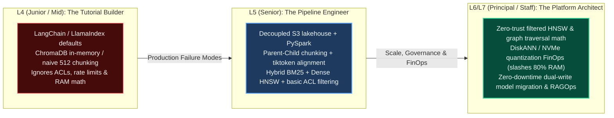
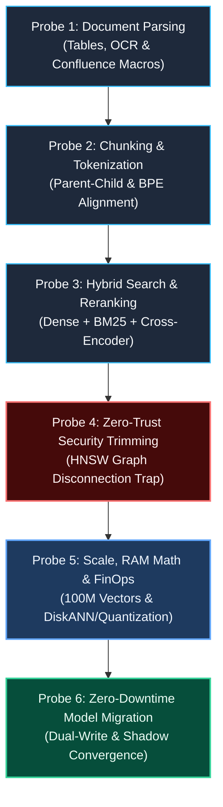
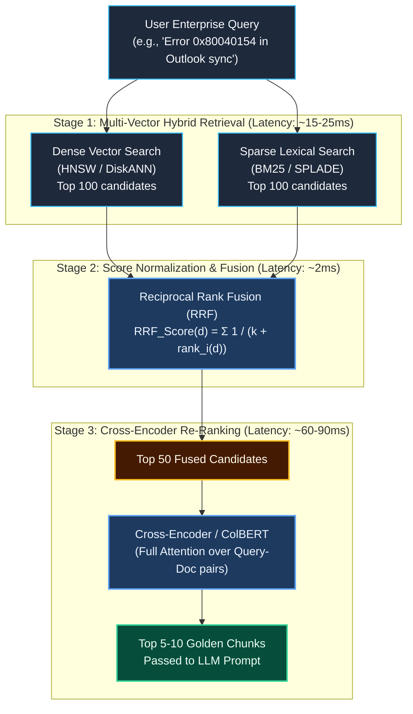
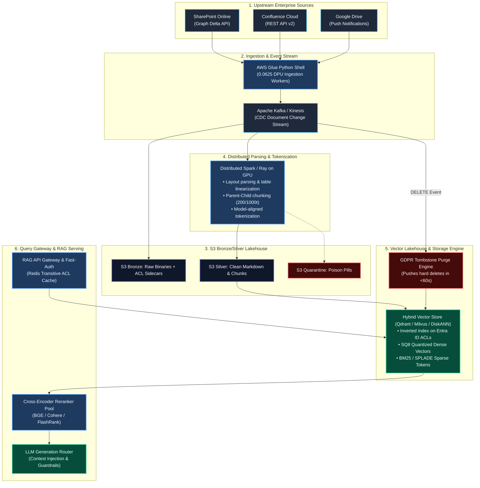

# Senior & Principal Data Engineer Technical Assessment: Enterprise RAG Systems

> **Document Type:** Technical Interview, Candidate Calibration & Architectural Evaluation Guide  
> **Target Roles:** Senior Data Engineer (L5), Principal / Staff Data & AI Architect (L6 / L7)  
> **Domain Focus:** Production-Grade Enterprise Retrieval-Augmented Generation (RAG), Distributed Document Ingestion, Hierarchical Chunking, Hybrid Search, Zero-Trust Security Trimming, Vector Lakehouses & FinOps  
> **Applicable Rules:** Conforms strictly to [.agents/rules/ai_data_architect_evaluator.md](file:///.agents/rules/ai_data_architect_evaluator.md) and [.agents/rules/data_ai_architect_persona.md](file:///.agents/rules/data_ai_architect_persona.md)

---

## 1. Candidate Leveling Matrix: "The Reality Filter"

When candidates claim on their resumes that they *"designed and built an enterprise RAG system"*, use this rubric to distinguish between **tutorial-level wrapper builders** (L3/L4), **competent component implementers** (L5 Senior), and **battle-tested distributed systems architects** (L6/L7 Principal/Staff).



| Dimension | Junior / Mid (L3 / L4) | Senior Data Engineer (L5) | Principal / Staff Engineer (L6 / L7) |
| :--- | :--- | :--- | :--- |
| **1. Architecture & Ingestion** | Uses `DirectoryLoader` into memory; in-flight direct push to vector DB. | Decoupled S3 Medallion Lakehouse; async distributed ingestion (Glue/Spark); poison-pill quarantine. | Multi-tenant lakehouse with CDC streaming, non-blocking quarantine side-outputs, and strict data contracts. |
| **2. Document Parsing & Structure** | Naive string splitting; regex text extraction; destroys tables & code blocks. | Layout-aware parsing (PyMuPDF, Docling); preserves markdown tables and Confluence XHTML macros. | Vision-language document parsers (ColPali/Docling); semantic AST tree preservation; table linearization. |
| **3. Chunking & Tokenization** | Fixed-size character/word split (e.g., `RecursiveCharacterTextSplitter(512)`). | Parent-Child (200-child / 1000-parent); BPE/tiktoken tokenizer alignment with embedding & generator models. | Contextual hierarchical chunking with document breadcrumbs; semantic boundary detection; token budget optimization. |
| **4. Retrieval & Search Topology** | Pure dense vector search; assumes cosine similarity solves all queries. | Hybrid search (Dense HNSW + Sparse BM25) combined via Reciprocal Rank Fusion (RRF); Cross-Encoder reranking. | Learned sparse embeddings (SPLADE) + DiskANN + ColBERT late interaction; adaptive query routing & HyDE expansion. |
| **5. Security Trimming & ACLs** | Ignored; assumes all documents in index are globally accessible. | Captures user/group IDs in metadata; post-retrieval Python filtering on top-$K$ candidates. | Resolves Entra ID/Confluence ACLs into security tokens; solves the **HNSW Graph Disconnection** problem during pre-filtering. |
| **6. Scale, Memory & FinOps** | Unaware of HNSW memory footprints; uses unquantized float32 in RAM. | Calculates raw vector RAM; tunes HNSW parameters ($M, efConstruction$); configures horizontal scaling. | Implements Scalar Quantization (SQ8) / PQ and DiskANN on NVMe; slashes infrastructure spend by 75–85% with <3ms penalty. |
| **7. Model Migration & Evolution** | Drops and recreates index; accepts full search downtime and re-crawls sources. | Batch re-indexing from S3; switches collection pointer via alias. | Zero-downtime dual-writing from CDC; shadow index backfilling; semantic parity validation prior to atomic alias swap. |
| **8. Evals, Observability & RAGOps** | Eyeballs 5 sample queries; relies on subjective user feedback. | Implements offline Ragas/TruLens evals (Faithfulness, Context Precision); basic OpenTelemetry tracing. | Automated synthetic golden test suites; CI/CD regression gates; latency budget tracking per retrieval stage; active learning loop. |

---

## 2. The "Build vs. Buy / Off-the-Shelf" Architectural Probe

### The Probe:
> *"Platforms like Amazon Bedrock Knowledge Bases, Azure AI Search, and Pinecone provide fully managed, turn-key RAG ingestion connectors for SharePoint, Confluence, and enterprise drives. Why would an enterprise choose to design and build a custom RAG data pipeline using S3, AWS Glue / Spark, and self-managed or dedicated vector stores rather than clicking 'Sync' on a managed service?"*

### What to Look For:
* **Senior (L5)**:
  * Identifies hard technical limits of managed services: file size restrictions (e.g., Bedrock caps files at 50 MB, failing on large architectural PDFs or training videos), lack of item-level Access Control List (ACL) extraction for security trimming, and inability to customize chunking boundaries or parse complex Confluence macros.
* **Principal / Staff (L6 / L7)**:
  * Articulates the **FinOps, governance, and architectural lock-in boundaries**:
    1. **Security & Zero-Trust Trimming**: Managed connectors often extract broad folder permissions, completely failing at item-level Entra ID Object IDs or Confluence page-level read restrictions. Ingesting without granular ACLs creates a severe data leak risk (e.g., exposing executive payroll spreadsheets).
    2. **FinOps & Cost Curves at Scale**: Managed services charge continuous OpenSearch Compute Units (OCUs) or sync fees. For 50M documents, managed RAG costs explode compared to an S3 Bronze Lakehouse + spot Glue Spark / Ray processing.
    3. **Embedding Model Portability**: Managed RAG locks documents into proprietary vendor vector indexes. If the company wants to switch embedding models or run fine-tuned domain models, it must re-crawl upstream sources. A custom S3 lakehouse allows zero-crawl re-embedding.
    4. **Hybrid Network Topology**: Managed SaaS connectors cannot reach air-gapped on-premises SharePoint Server or Confluence Data Center behind corporate firewalls.
* **Immediate Red Flags**:
  * *"I built custom because I prefer writing Python scripts rather than learning AWS console services."* (Shows lack of architectural justification and high risk of reinventing the wheel).
  * Has no idea that managed RAG connectors exist or cannot name their limitations.

---

## 3. Thematic Deep-Dive Technical Probes



---

### Probe 3.1: Document Parsing, Layout Extraction & Layout Noise

#### The Question:
> *"Enterprise documents from SharePoint and Confluence are notoriously messy: multi-column PDFs, financial spreadsheets, embedded charts, complex Confluence macros (`<ac:structured-macro>`), and scanned agreements. How did your ingestion pipeline process these diverse formats into a clean representation suitable for tokenization without injecting noisy tokens into the LLM context?"*

#### The Trap & Follow-Up:
> *"What happens when a document contains a 10-column financial comparison table spanning 3 pages? If you use standard text extraction, how does the model interpret table cells, and how do you prevent row/column relationship collapse?"*

#### Expected Senior vs. Principal Responses:
* **Senior Benchmark (L5)**:
  * Uses layout-aware parsers (e.g., `PyMuPDF`, `Docling`, `Unstructured.io`) instead of naive `pypdf` text dumps.
  * For Confluence, parses the storage XHTML tree using `BeautifulSoup` or `lxml` to strip layout macros, extracting clean code blocks (`<ac:plain-text-body>`) and converting headers into semantic Markdown.
  * For tables, extracts them into Markdown or HTML table syntax so the LLM can parse tabular structure.
* **Principal / Staff Benchmark (L6 / L7)**:
  * **Table Linearization & Enrichment**: Explains that raw Markdown tables spanning pages lose header context across page breaks. Discusses **table linearization** (pre-pending table caption, column headers, and row keys to each cell or row string: `[Year: 2025 | Region: APAC | Revenue: $4.2M]`) or passing the table through an SLM (e.g., Table-Transformer or GPT-4o-mini) to produce a semantic summary chunk alongside the raw table.
  * **Multimodal / Vision Ingestion**: For complex PDFs with diagrams and complex layouts, proposes **Vision-Language Document Models** (e.g., ColPali, Docling, Nougat) where document pages are processed as visual patches, avoiding brittle OCR heuristic pipelines entirely.
  * **Noise Token Elimination**: Identifies that navigational footers, repeated headers, page numbers, and Confluence user mention cards inflate token usage and degrade vector similarity; implements deterministic regex/AST cleaning before tokenization.
* **Red Flags**:
  * Uses simple `.extract_text()` from `pypdf` and is unaware that multi-column PDFs interleave text across columns into unintelligible gibberish.
  * Recommends feeding raw HTML/XML directly to embedding models without stripping markup tags.

---

### Probe 3.2: Chunking Strategy & Tokenizer Alignment

#### The Question:
> *"In production RAG, why is fixed-size chunking (e.g., 512 tokens with 50-token overlap) considered an anti-pattern for complex enterprise knowledge? What chunking topology did you architect, and how did you guarantee tokenizer fidelity across different models?"*

#### The Trap & Follow-Up:
> *"Your embedding model has a maximum context window of 512 tokens, but your downstream generation LLM has a 128k context window. If you chunk at 512 tokens, the LLM often lacks the surrounding context to answer multi-part questions. If you chunk at 2,000 tokens, the embedding vector gets diluted and similarity search precision collapses. How do you solve this fundamental tension?"*

```
[ Traditional Fixed Chunking (Diluted or Truncated) ]
┌─────────────────────────────────────────────────────────────┐
│ 512 tokens: Often splits sentences, paragraphs, and tables  │
└─────────────────────────────────────────────────────────────┘

[ Enterprise Parent-Child / Small-to-Big Chunking ]
┌─────────────────────────────────────────────────────────────┐
│ Parent Chunk (1,000 tokens): Retains full narrative context │
│   ┌──────────────────┐  ┌──────────────────┐               │
│   │ Child 1 (200 t)  │  │ Child 2 (200 t)  │  ...          │
│   └────────┬─────────┘  └────────┬─────────┘               │
└────────────┼─────────────────────┼─────────────────────────┘
             ▼                     ▼
     [ Vector Index ]      [ Vector Index ]
     (Dense Embedding)     (Dense Embedding)
             │
             └──────► On match: Fetch Parent Chunk (1,000 t) ──► Send to LLM
```

#### Expected Senior vs. Principal Responses:
* **Senior Benchmark (L5)**:
  * Identifies **Parent-Child (Small-to-Big) Chunking**:
    * Generates small **child chunks** (150–250 tokens) for granular vector search and dense similarity scoring.
    * Links each child chunk to a larger **parent chunk** (800–1,500 tokens) or section.
    * When a child chunk matches during retrieval, the pipeline swaps the child for its parent chunk before constructing the LLM prompt.
  * Mentions **Semantic Chunking**: Using sentence boundary detection and measuring cosine distance between consecutive sentence embeddings to split text only at natural topic transitions.
* **Principal / Staff Benchmark (L6 / L7)**:
  * **Document Breadcrumb & Context Injection**: Child chunks in isolation suffer from "lost context" (e.g., a child chunk says *"The revenue grew 14%"*—which company? which year?). The chunking engine injects hierarchical breadcrumbs at the start of every chunk: `[Source: Confluence | Space: Finance | Doc: Q3_2025_Earnings | Section: APAC Performance]`.
  * **Tokenizer Fidelity & Token Budgeting**:
    * Highlights the danger of **Tokenizer Mismatch**: Using Python `len(text.split())` or standard `tiktoken` (cl100k_base) to calculate token limits for an embedding model trained on a different vocabulary (e.g., BertTokenizer, LlamaTokenizer). If a 512-token chunk under `tiktoken` expands to 540 tokens under the model's native tokenizer, the trailing 28 tokens are silently truncated by the embedding model, losing critical information.
    * Implements token counting using the exact tokenizer model checkpoint, and configures hard assertion guards before vectorization.
* **Red Flags**:
  * Believes chunking is simply `text[:500]` character slicing.
  * Does not understand why embedding a 2,000-token chunk leads to semantic dilution (the "needle-in-a-haystack" vector averaging problem).

---

### Probe 3.3: Hybrid Search, Fusion Algorithms & Cross-Encoder Re-Ranking

#### The Question:
> *"Why does pure dense vector search (semantic similarity) fail on enterprise queries, and how did you design a hybrid retrieval and re-ranking topology to achieve >90% recall at sub-200ms latency?"*

#### The Trap & Follow-Up:
> *"When combining dense vector scores (cosine similarity between 0.0 and 1.0) with sparse lexical scores (BM25 scores ranging from 0.0 to 45.0+), how do you mathematically fuse the rankings without sparse scores dominating dense scores?"*



#### Expected Senior vs. Principal Responses:
* **Senior Benchmark (L5)**:
  * Explains failure modes of pure dense search: exact keywords, error codes (`ERR-404-B7`), SKU numbers, UUIDs, legal clause numbers, and acronyms are often smoothed out by dense embeddings.
  * Implements **Hybrid Search**: Combines Dense Vector (semantic meaning) with Sparse Lexical (BM25 for exact token matching).
  * Explains **Reciprocal Rank Fusion (RRF)**: Avoids score scale calibration issues entirely by ranking documents based on ordinal position rather than raw scores:
    $$\text{RRF\_Score}(d) = \sum_{m \in M} \frac{1}{k + \text{rank}_m(d)} \quad (k \approx 60)$$
  * Implements a **Cross-Encoder Re-ranker** (e.g., Cohere Rerank, BGE-Reranker-Large) on the top 50 fused candidates to extract the top 5–10 chunks for the LLM prompt.
* **Principal / Staff Benchmark (L6 / L7)**:
  * **Convex Combination with Z-Score / Min-Max Normalization**: Knows when RRF is suboptimal (e.g., when the top dense score is a 0.99 match but ranked #2, RRF treats the gap between #1 and #2 identically regardless of absolute confidence). Implements learned $\alpha$-weighted convex combination with dynamic score normalization:
    $$S(d) = \alpha \cdot \text{Norm}(S_{\text{dense}}) + (1 - \alpha) \cdot \text{Norm}(S_{\text{sparse}})$$
  * **Latency Budgeting & Late Interaction (ColBERT v2)**: Analyzes the latency trade-off of Cross-Encoders (80–150ms on CPU/GPU). Proposes **ColBERT v2 (Token-level MaxSim late interaction)** or small distilled cross-encoders (FlashRank / MiniLM) to fit within a strict 150ms end-to-end SLA.
  * **Query Intent Routing**: Classifies queries before retrieval: if a query is a pure SKU/UUID lookup, routes 100% of the weight to BM25/Elasticsearch; if the query is conceptual, routes to dense vector; if ambiguous, triggers full hybrid retrieval.
* **Red Flags**:
  * Directly sums raw cosine similarity (0.0 to 1.0) and BM25 score (0.0 to 50.0) without normalization or ranking fusion.
  * Suggests running a Cross-Encoder over the entire corpus of 10M documents (shows no understanding of quadratic $O(N^2)$ cross-attention compute complexity).

---

### Probe 3.4: The Enterprise Security Acid Test (Zero-Trust ACL Trimming & The HNSW Filter Trap)

#### The Question:
> *"In an enterprise with 50,000 employees and millions of documents across SharePoint and Confluence, an executive payroll spreadsheet must only be retrievable by HR executives. How did your RAG system implement item-level security trimming? Specifically, how did you avoid the classic 'HNSW Graph Disconnection' failure during pre-filtering?"*

#### The Trap & Follow-Up:
> *"If you use post-filtering (retrieve top 100 candidates, then discard documents the user cannot access), what happens when an employee queries a topic where the top 100 semantic matches belong to a restricted project they don't have access to?  
> And if you use naive pre-filtering on an HNSW vector index where the user only has access to 0.1% of the corpus, why does vector search fail or time out?"*

```
[ The HNSW Graph Disconnection Problem ]
Normal HNSW Navigable Small World:   With Naive Pre-Filtering (User has access to 0.1%):
    (A) ─── (B) ─── (C)                     (A) [LOCKED]   (B) [LOCKED]   (C) [LOCKED]
     │   ╲   │   ╱   │                                     
    (D) ─── (E) ─── (F)                     (D) [LOCKED]   (E) [ALLOWED]  (F) [LOCKED]
     │   ╱   │   ╲   │                                     
    (G) ─── (H) ─── (I)                     (G) [LOCKED]   (H) [LOCKED]   (I) [ALLOWED]
Greedy graph traversal hops                 Graph is broken! Traversal stops at (A),
smoothly across nearest neighbors.          cannot reach (E) or (I) -> ZERO RESULTS RETURNED!
```

#### Expected Senior vs. Principal Responses:
* **Senior Benchmark (L5)**:
  * Rejects **Post-Filtering** because of **Recall Collapse**: If all top-$K$ candidates retrieved by vector similarity belong to restricted files, filtering them out leaves 0 results for the user, even if authorized documents exist further down the index.
  * Rejects naive unindexed pre-filtering because linear scans over millions of vectors kill latency.
  * Captures Entra ID Security Group IDs (`group:GUID`) and User Principal Names (`user:UPN`) into the vector payload.
  * Uses vector databases with **Filtered HNSW support** (e.g., Qdrant, Milvus, OpenSearch with Lucene payload filters) that maintain inverted indexes on security tags.
* **Principal / Staff Benchmark (L6 / L7)**:
  * **The HNSW Disconnection Mathematics**: Explains that HNSW relies on Delaunay graph connectivity. When a filter eliminates 99.9% of nodes, the graph fragments into disconnected islands. Standard greedy beam search starts at entry points that may be blocked, terminating early and returning recall near zero.
  * **Architectural Solutions**:
    1. **Iterative Multi-Phase Traversal (Payload-Aware HNSW)**: As implemented in modern engines (e.g., Qdrant's Filtered HNSW), the search traverses the graph using unconstrained nodes as bridges, but only scores and collects nodes that satisfy the filter condition.
    2. **Inverted Index Pre-Filtering + Exact Rescore (Threshold Switching)**: If the selectivity of the security filter is very high (< 1,000 accessible documents for a specific user), bypass HNSW entirely! Perform a fast inverted index lookup on `allowed_principals` in <1ms, then run exact flat vector distance on the remaining small candidate subset.
    3. **Query-Time Security Token Expansion & Caching**: Users belong to nested Entra ID groups. At query time, resolving nested groups via Graph API adds 300ms of latency. The platform caches the user's flat transitive group expansion in Redis with a 15-minute TTL, passing `user_tokens = ['user:bob', 'group:eng', 'group:all_corp']` directly into the boolean filter clause.
* **Red Flags**:
  * Assumes security can be handled by adding *"Only show documents that Bob is allowed to see"* into the LLM system prompt (catastrophic prompt injection and privacy violation risk).
  * Advocates pure post-filtering without recognizing the recall collapse failure mode.

---

### Probe 3.5: Scale, RAM Mathematics & Vector FinOps

#### The Question:
> *"Your company has 100 million document chunks from SharePoint, Confluence, and Jira. You are selecting an embedding model (1536 dimensions, float32) and vector database architecture. Calculate the exact RAM required to host this index using in-memory HNSW. Then, propose an enterprise FinOps architecture to slash infrastructure costs by 70–80% without degrading search latency."*

#### Expected Calculation & Math:
$$\begin{aligned}
\text{Raw Vectors Size} &= 100{,}000{,}000 \times 1{,}536 \times 4 \text{ bytes (float32)} \\
&= 614{,}400{,}000{,}000 \text{ bytes} \approx \mathbf{614.4 \text{ GB}}
\end{aligned}$$

$$\begin{aligned}
\text{HNSW Graph Overhead} &\approx 1.5\times \text{ to } 2.0\times \text{ (for } M=16\text{ to } 32, efConstruction=200\text{)} \\
\text{Total In-Memory RAM} &\approx 614.4 \text{ GB} \times 1.6 \approx \mathbf{983 \text{ GB to } 1.2 \text{ TB of RAM}}
\end{aligned}$$

* In AWS, hosting 1.2 TB of RAM requires a cluster of `r7i.8xlarge` or `r6i.12xlarge` instances, costing **~$6,000 to $9,000/month** just for the vector database compute.

#### Expected Senior vs. Principal Responses:
* **Senior Benchmark (L5)**:
  * Performs the math correctly (distinguishes raw vector bytes from graph index overhead).
  * Proposes **Scalar Quantization (SQ8)**: Compresses `float32` (4 bytes) to `int8` (1 byte). Reduces raw vector RAM from 614 GB to ~153 GB (a 75% reduction), with minimal (<1–2%) recall loss.
* **Principal / Staff Benchmark (L6 / L7)**:
  * **Product Quantization (PQ) vs. Scalar Quantization (SQ8)**: Evaluates trade-offs. SQ8 is lossless enough for dense text retrieval, whereas PQ compresses further (e.g., 8x–16x) at the cost of noticeable recall degradation.
  * **DiskANN / NVMe-Backed Vector Layouts (LanceDB / Milvus / Qdrant on SSD)**:
    * Rejects keeping 1.2 TB of vector RAM permanently hot in memory.
    * Architects a **Disk-Backed Vector Engine**: The graph structure and compressed vectors (SQ8) remain in memory/page cache, while the full vectors reside on memory-mapped NVMe SSDs (`io2` or local NVMe on `i3en` instances).
    * During search, candidate exploration happens in compressed memory; only the top 100 candidate vectors are fetched from NVMe for exact re-ranking.
    * **FinOps Impact**: Reduces RAM requirement from 1.2 TB down to ~64 GB, slashing AWS infrastructure costs from ~$8,000/mo to <$1,500/mo while keeping p95 retrieval latency under 15ms.
* **Red Flags**:
  * Does not know that vectors are 4 bytes per dimension in `float32`.
  * Omits the HNSW graph overhead (believes RAM equals raw vector size).
  * Suggests using horizontal sharding across 50 memory-heavy instances without considering quantization or disk-backed alternatives.

---

### Probe 3.6: Zero-Downtime Embedding Model Migration & Vector Lakehouse CDC

#### The Question:
> *"Your enterprise RAG platform is live with 100M vectors embedded using `text-embedding-3-small` (1536 dimensions). The AI Research team fine-tunes a domain-specific embedding model (1024 dimensions) that boosts legal and financial retrieval accuracy by 25%. How do you migrate the production system to the new model with ZERO query downtime and ZERO search degradation?"*

#### Expected Senior vs. Principal Responses:
* **Senior Benchmark (L5)**:
  * Explains why you cannot mix vectors in the same collection: different models map text to incompatible geometric vector spaces; cosine similarity between model A and model B is mathematical garbage.
  * Creates a new collection (v2) in the vector store.
  * Runs a batch re-embedding job reading raw text from the S3 Bronze/Silver lakehouse and populating collection v2.
  * Updates an environment variable or collection alias pointer to route user traffic from v1 to v2.
* **Principal / Staff Benchmark (L6 / L7)**:
  * **The "In-Flight CDC Drift" Problem**: Identifies that while the batch backfill is running over 100M documents (which may take 12–24 hours on GPU clusters), thousands of edits, deletions, and additions are occurring in SharePoint and Confluence in real time. If you simply backfill and swap, edits made during the backfill will be lost or inconsistent.
  * **The Dual-Write & Shadow Index Pipeline**:
    ```
    [ Real-Time Document CDC Stream ]
                    │
                    ▼
          [ Ingestion Router ]
            │              │
            ▼              ▼
     [ Model v1 (1536d) ] [ Model v2 (1024d) ]  <── Dual-Write incoming changes
            │              │
            ▼              ▼
      [ Active v1 ]   [ Shadow v2 ]
            ▲              ▲
            │ (Reads)      │ (Async Historical Backfill from S3)
       [ AI Agent ]   [ Parity & Eval Validator ]
    ```
    1. **Dual-Writing**: Starts dual-writing all incoming incremental CDC events to both Model v1 (active) and Model v2 (shadow).
    2. **Asynchronous Historical Backfill**: Launches a distributed Spark/Ray cluster reading historical text from S3 Bronze Lakehouse, embedding via Model v2, and upserting into the Shadow Index with idempotent version checks.
    3. **Shadow Convergence & Parity Testing**: Runs automated golden eval queries against both v1 and v2 simultaneously, comparing ranking recall, NDCG@10, and latency.
    4. **Atomic Cutover & Drain**: Updates the production alias pointer to point to collection v2. Keeps collection v1 in read-only standby for 48 hours for immediate rollback capability before decommissioning.
* **Red Flags**:
  * Proposes taking a maintenance window and shutting down the search assistant for 24 hours while re-indexing.
  * Does not account for real-time document modifications occurring during the historical backfill.

---

## 4. Live Architecture Whiteboard Challenge: Enterprise RAG Platform

Give the candidate this prompt on a whiteboard or virtual architecture session:

### Challenge Prompt:
> *"Design the end-to-end data and AI architecture for an enterprise-wide RAG platform that ingests 50 million documents from Microsoft SharePoint, Atlassian Confluence, and Google Drive. The system must serve 5,000 internal AI agents and employees, enforce strict item-level zero-trust permissions (Entra ID ACLs), achieve p95 retrieval latency < 250ms, and maintain full compliance with GDPR 'Right to be Forgotten' (deletions reflected in search within 60 seconds)."*



### Architecture Scorecard & Key Deliverables to Probe:
1. **Decoupled S3 Staging**: Are raw binaries landed with sidecar metadata before processing?
2. **Security Trimming Pipeline**: Is user identity expanded to transitive Entra ID groups and applied via payload-aware inverted index filters?
3. **Chunking Fidelity**: Does the design use Parent-Child chunking with document breadcrumbs?
4. **GDPR SLA Compliance**: Does a `DELETE` CDC event bypass the batch chunking queue and trigger an immediate tombstone purge in the Vector DB within 60s?
5. **Observability & Guardrails**: Are PII masking (Presidio) and OpenTelemetry spans integrated across all pipeline hops?

---

## 5. Practical Coding & Debugging Challenge: Distributed Parent-Child Chunking

Have the candidate review or write a production-grade PySpark / Python distributed chunking UDF that adheres to enterprise tokenization standards.

### The Problem:
Write a Python class or PySpark UDF `HierarchicalDocumentChunker` that takes raw documents, extracts structural Markdown headers, and produces:
1. **Child Chunks**: Target ~200 tokens using the exact BPE tokenizer of the target embedding model (`tiktoken` `cl100k_base` or Hugging Face Fast Tokenizer).
2. **Parent Chunks**: Target ~1,000 tokens retaining full paragraph and section context.
3. **Context Breadcrumbs**: Automatically pre-pends document path and section header hierarchy (e.g., `[Doc: Architecture.md > # Storage > ## S3 Sink]`).
4. **Security Inheritance**: Passes through the document's `allowed_principals` array to every single child chunk.
5. **Memory Safety**: Avoids driver OOM by yielding iterators rather than collecting large lists in memory.

### Reference Implementation Benchmark:
```python
import tiktoken
from typing import List, Dict, Any, Generator

class HierarchicalDocumentChunker:
    def __init__(
        self,
        embedding_model_encoding: str = "cl100k_base",
        child_target_tokens: int = 200,
        parent_target_tokens: int = 1000,
        overlap_tokens: int = 25
    ):
        self.tokenizer = tiktoken.get_encoding(embedding_model_encoding)
        self.child_target = child_target_tokens
        self.parent_target = parent_target_tokens
        self.overlap = overlap_tokens

    def chunk_document(
        self,
        doc_id: str,
        breadcrumb_path: str,
        clean_markdown_text: str,
        allowed_principals: List[str]
    ) -> Generator[Dict[str, Any], None, None]:
        """
        Memory-safe generator producing Parent-Child chunks with strict
        tokenizer alignment and security ACL inheritance.
        """
        # 1. Tokenize entire text using the exact model vocabulary
        token_ids = self.tokenizer.encode(clean_markdown_text)
        total_tokens = len(token_ids)
        
        parent_idx = 0
        p_start = 0
        
        while p_start < total_tokens:
            p_end = min(p_start + self.parent_target, total_tokens)
            parent_token_ids = token_ids[p_start:p_end]
            parent_text = self.tokenizer.decode(parent_token_ids)
            parent_id = f"{doc_id}_p{parent_idx}"
            
            # 2. Slice parent into granular child chunks
            c_start = 0
            child_idx = 0
            parent_len = len(parent_token_ids)
            
            while c_start < parent_len:
                c_end = min(c_start + self.child_target, parent_len)
                child_tokens = parent_token_ids[c_start:c_end]
                
                # Contextual breadcrumb injection
                header_prefix = f"[{breadcrumb_path}]\n"
                child_text = header_prefix + self.tokenizer.decode(child_tokens)
                child_id = f"{parent_id}_c{child_idx}"
                
                yield {
                    "child_id": child_id,
                    "parent_id": parent_id,
                    "doc_id": doc_id,
                    "breadcrumb": breadcrumb_path,
                    "child_content": child_text,
                    "parent_content": parent_text,
                    "token_count": len(child_tokens),
                    "allowed_principals": allowed_principals  # Critical for ACL trimming
                }
                
                if c_end == parent_len:
                    break
                c_start += (self.child_target - self.overlap)
                child_idx += 1
                
            if p_end == total_tokens:
                break
            p_start += (self.parent_target - (self.overlap * 2))
            parent_idx += 1
```

---

## 6. Interviewer Evaluation Scorecard & Calibration Rubric

Use this weighted scoring rubric to calibrate candidate performance across the assessment.

| Evaluation Dimension | Weight | Senior Data Engineer (L5) Benchmark | Principal / Staff Architect (L6 / L7) Benchmark | Score |
| :--- | :---: | :--- | :--- | :---: |
| **1. Ingestion & Lakehouse Architecture** | 15% | Decouples extraction to S3; implements basic retries and ETag skipping. | End-to-end CDC streaming, Medallion Lakehouse layout, poison-pill quarantine, FinOps optimization. | / 15 |
| **2. Document Parsing & Structure** | 15% | Uses layout-aware parsers (`Docling`, `PyMuPDF`); parses Confluence XHTML. | Table linearization, multimodal vision parsers (ColPali), noise token stripping. | / 15 |
| **3. Chunking & Tokenization Fidelity** | 15% | Parent-child chunking; understands tokenizer mismatch between embedding and LLM. | Context breadcrumb injection, exact BPE vocabulary budgeting, semantic split boundaries. | / 15 |
| **4. Hybrid Search & Re-Ranking** | 15% | Combines BM25 and Dense HNSW via RRF; integrates Cross-Encoder re-rankers. | Normalization math (Z-Score), ColBERT v2 late interaction, query intent routing, sub-150ms SLA. | / 15 |
| **5. Zero-Trust Security Trimming** | 20% | Captures Entra ID SIDs; recognizes recall collapse in post-filtering. | Solves HNSW graph disconnection; implements iterative filtered traversal or threshold switching; caches Redis ACLs. | / 20 |
| **6. Scale, FinOps & Memory Math** | 10% | Calculates raw vector RAM; proposes Scalar Quantization (SQ8). | Evaluates SQ8 vs PQ; architects NVMe DiskANN / LanceDB layouts; slashes cloud spend by 75%+. | / 10 |
| **7. Migration, Evals & RAGOps** | 10% | Batch re-indexing from S3; runs offline Ragas benchmarks. | Zero-downtime dual-writing & shadow index convergence; CI/CD regression gates; latency tracing. | / 10 |
| **TOTAL SCORE** | **100%** | **Target: 70 – 84 points (Senior Hire)** | **Target: $\ge$ 85 points (Principal / Staff Hire)** | **/ 100** |

---

## 7. Authoritative References & Production Standards

* **Vector Search & Indexing Foundations:**
  * Malkov, Y. A., & Yashunin, D. A. (2018). *Efficient and Robust Approximate Nearest Neighbor Search Using Hierarchical Navigable Small World Graphs (HNSW)*. IEEE TPAMI.
  * Subramanya, S. J., et al. (2019). *DiskANN: Fast Accurate Bilateral Search on Billion-Point Datasets*. NeurIPS.
* **Hybrid Search & Ranking Fusion:**
  * Cormack, G. V., Clarke, C. L., & Buettcher, S. (2009). *Reciprocal Rank Fusion Outperforms Condorcet and Individual Rank Learning Methods*. ACM SIGIR.
  * Khattab, O., & Zaharia, M. (2020). *ColBERT: Efficient and Effective Passage Search via Contextualized Late Interaction over BERT*. ACM SIGIR.
* **Security & Filtered Search in Vector Databases:**
  * Qdrant Architecture Documentation: *Filtered Vector Search and Payload Indexes* ([qdrant.tech/documentation](https://qdrant.tech/documentation/concepts/indexing/)).
  * Milvus Vector Database Documentation: *Scalar Filtering and Inverted Indexes* ([milvus.io/docs](https://milvus.io/docs)).
* **Evaluation & RAGOps:**
  * Es, S., et al. (2023). *Ragas: Automated Evaluation of Retrieval Augmented Generation*. arXiv:2309.15217.
  * TruLens Documentation: *The RAG Triad of Metrics* ([trulens.org](https://www.trulens.org)).
