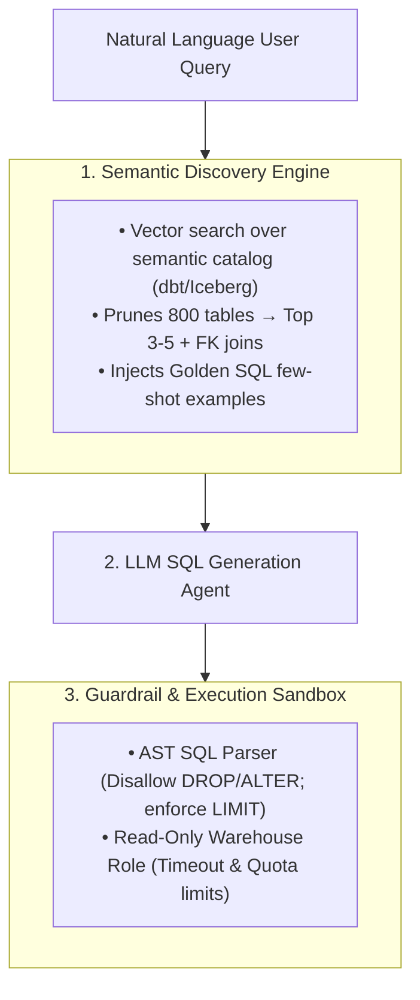

# System Design & Architecture Scenarios for Data Engineers (AI Agents)

This module contains 4 enterprise system design scenarios. Each scenario is designed for a **45–60 minute** interview and includes context, architecture diagrams, senior vs. staff expectations, and follow-up stress tests.

---

## Scenario 1: Real-Time Vector Sync & Zero-Downtime Model Migration

### 1. Context & Business Scale
* **Scale**: 200 million enterprise documents (Jira tickets, Confluence docs, ERP records) residing in an Apache Iceberg lakehouse.
* **Throughput**: ~15,000 updates/inserts per second streaming through Kafka via Debezium CDC.
* **Agent SLA**: Hybrid search (Dense Vector + BM25) latency < 200ms at p95 for a fleet of customer-facing AI agents.
* **Challenge**: The company is upgrading its embedding model from `text-embedding-3-small` (1536-dim) to an internal fine-tuned domain model (1024-dim). You must upgrade the system **with zero search downtime and zero query degradation**.

### 2. Architecture Blueprint
```
                  [Enterprise Sources (CDC / ERP / Docs)]
                                     │
                                     ▼
                          [Kafka Ingestion Topic]
                                     │
                    ┌────────────────┴────────────────┐
                    ▼                                 ▼
         [Flink Ingestion Engine]           [Iceberg Bronze Lakehouse]
         (Content-Hash Deduplication)
                    │
                    ▼
       [Embedding Inference Worker Pool] (Triton / vLLM Autoscaling)
                    │
        ┌───────────┴───────────┐
        ▼                       ▼
 [Primary Index (v1)]    [Shadow Index (v2)]
 (Active Agent Traffic)  (Dual-Write + Historical Backfill)
```

### 3. Senior vs. Staff Leveling Matrix

| Dimension | Senior Engineer (L4 / L5) | Staff Engineer (L6+) |
| :--- | :--- | :--- |
| **Ingestion Pipeline** | Builds Kafka $\to$ Flink $\to$ Vector DB pipeline. Batches embedding API calls to reduce HTTP overhead. | Implements **content-hash change detection** (avoids re-embedding identical text updates), backpressure flow control, and dynamic worker autoscaling. |
| **Zero-Downtime Migration** | Creates a new vector collection, runs a batch backfill job from Iceberg, and switches an alias pointer when done. | **Dual-Writing & Shadow Convergence**: Writes real-time CDC to both v1 and v2 while asynchronously backfilling historical data. Validates index convergence and semantic parity before traffic cutover. |
| **Storage & Cost Architecture** | Chooses a hosted vector DB (Pinecone/Milvus) with standard HNSW memory configuration. | **FinOps & Memory Math**: Calculates RAM costs ($200\text{M} \times 1536 \times 4\text{ bytes} \approx 1.2\text{TB}$ RAM + HNSW overhead $\approx 2.5\text{TB}$). Proposes disk-backed vector layouts (LanceDB / DiskANN on NVMe) to slash infrastructure costs by 70%. |

### 4. Interviewer Follow-Up Probes (Stress Tests)
* **Probe 1 (Backpressure & Rate Limits)**: *"If the downstream GPU embedding cluster experiences a 50% node crash during a peak ingestion spike, how does your pipeline prevent Kafka consumer lag from crashing upstream producers?"*
* **Probe 2 (Stale Deletions)**: *"A customer executes a GDPR 'Right to be Forgotten' request. How do you guarantee the document is purged from both the Iceberg historical tables and the real-time vector index within 60 seconds?"*

---

## Scenario 2: Multi-Tiered Memory & Checkpoint Engine for 10,000 Concurrent Agents

### 1. Context & Business Scale
* **Scale**: 10,000 concurrent long-running AI agents executing multi-step business workflows (e.g., automated insurance claims triage, financial auditing).
* **Workload**: Each agent executes 30 to 80 steps per job, with each step involving tool calls, intermediate reasoning traces, and external API responses.
* **Reliability SLA**: If an agent worker node crashes mid-execution, the agent must resume from its exact last step within <1 second without re-executing non-idempotent tool calls (e.g., credit card charges).

### 2. Architecture Blueprint
```
               [Agent Execution Fleet (10,000 Workers)]
                                   │
       ┌───────────────────────────┼───────────────────────────┐
       ▼                           ▼                           ▼
  [Hot Memory Tier]         [Warm Delta Tier]          [Cold Analytics Tier]
  - Redis Cluster           - ScyllaDB / DynamoDB      - S3 / Apache Iceberg
  - Active Session Context  - Step State Checkpoints   - Full Trajectory Replay
  - Latency: < 2ms          - Idempotency Tokens       - Eval Benchmarks & Fine-tuning
```

### 3. Senior vs. Staff Leveling Matrix

| Dimension | Senior Engineer (L4 / L5) | Staff Engineer (L6+) |
| :--- | :--- | :--- |
| **State Storage Design** | Stores serialized agent state JSON objects into Redis after each step, with a fallback Postgres DB. | **Tiered State Architecture**: Separates ephemeral scratchpad state (in-memory) from durable event-sourced state logs (ScyllaDB/DynamoDB) and analytical cold storage (Iceberg). |
| **Crash Recovery & Idempotency** | Uses database transactions and try/catch blocks to retry failed steps. | **Deterministic State Machine & Idempotency Keys**: Generates cryptographic execution keys (`hash(agent_id, workflow_id, step_idx)`) so external tool calls are never executed twice upon replay. |
| **Memory Pruning & Eviction** | Sets basic Redis TTLs (e.g., expire after 24 hours). | **Episodic Memory Compaction**: Implements background compaction jobs that summarize older reasoning traces into dense semantic summaries before moving to warm/cold storage. |

### 4. Interviewer Follow-Up Probes
* **Probe 1 (Split-Brain Prevention)**: *"If a network partition causes an agent worker to be presumed dead and a new worker is spawned, how do you prevent both workers from simultaneously executing tool calls for the same workflow?"*
* **Probe 2 (Cost & Storage Bloat)**: *"At 10,000 agents running continuously, trajectory data generates 5TB of state logs daily. How do you structure lifecycle policies to optimize query latency for active runs while keeping long-term eval storage cost-effective?"*

---

## Scenario 3: Enterprise Semantic Layer & Discovery Engine for Text-to-SQL Agents

### 1. Context & Business Scale
* **Scale**: 800-table enterprise Snowflake/BigQuery data warehouse with cryptic legacy schemas (e.g., column `c_stat_cd_01`, `tx_amt_usd_raw`).
* **Problem**: An AI Data Analyst Agent is deployed for business users to query data via natural language. The LLM cannot fit 800 table DDLs into its context window, and raw DDLs lack business definitions (e.g., "What is Net Churn Revenue?").

### 2. Architecture Blueprint



### 3. Senior vs. Staff Leveling Matrix

| Dimension | Senior Engineer (L4 / L5) | Staff Engineer (L6+) |
| :--- | :--- | :--- |
| **Catalog Discovery** | Embeds table DDLs into a vector store and retrieves the top-5 matching tables for prompt injection. | **Enriched Semantic Layer**: Indexes structured dbt documentation, metric definitions, column-level lineage, and data sample distributions rather than raw DDLs. |
| **Few-Shot Golden SQL Repo** | Hardcodes a few example SQL queries inside the system prompt. | **Dynamic Golden Query Retrieval**: Builds an indexed repository of human-verified SQL queries; retrieves semantically similar historical queries to guide complex analytical joins. |
| **Execution Security & Cost** | Appends `LIMIT 100` to the generated SQL string using regex. | **AST SQL Analysis & Policy Engine**: Parses queries into Abstract Syntax Trees (using `sqlglot`) to enforce partition filtering, block full-table scans, enforce column-level security, and estimate warehouse query cost. |

---

## Scenario 4: Real-Time Context Assembly Engine for Low-Latency Decision Agents

### 1. Context & Business Scale
* **Scale**: Real-time fraud detection & trading agent making decisions in < 50ms total SLA (Data retrieval budget: < 10ms).
* **Workload**: Combines static user profiles, dynamic streaming features (e.g., transaction count in last 5 minutes), and semantic similarity against known fraud patterns.

### 3. Senior vs. Staff Leveling Matrix

| Dimension | Senior Engineer (L4 / L5) | Staff Engineer (L6+) |
| :--- | :--- | :--- |
| **Feature Serving** | Uses Redis / DynamoDB for low-latency key-value lookups; loads batch features nightly from Snowflake. | **Unified Online/Offline Feature Store**: Implements Feast/Hopsworks with Flink computing streaming sliding-window aggregations directly into low-latency in-memory stores. |
| **Point-in-Time Correctness** | Mentions using timestamps to filter features. | **Time-Travel & Point-in-Time Joins**: Ensures that when agents evaluate historical cases during offline eval/training, there is zero data leakage from future events. |
