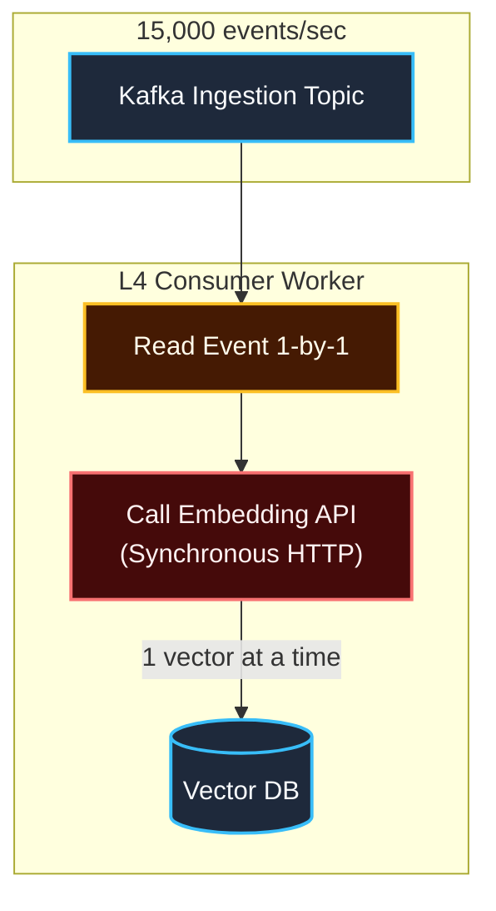
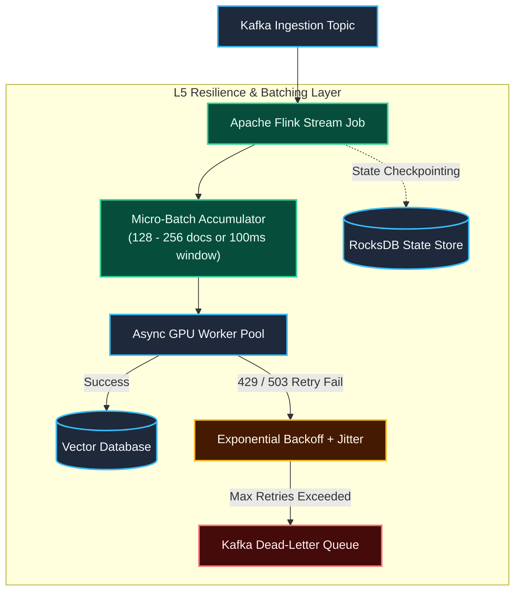
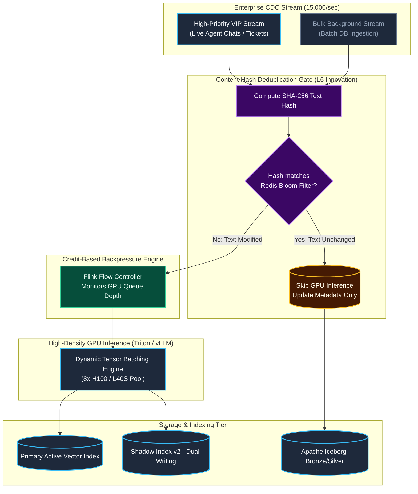

# Engineering Leveling Deep-Dive: Real-Time Ingestion Pipeline (Scenario 1)

This document provides a comprehensive architectural analysis and visual comparison of how **L4 (Mid-Level)**, **L5 (Senior)**, and **L6 (Staff)** Data Engineers design and build a high-throughput real-time ingestion pipeline for enterprise AI agent systems.

---

## 1. The Scenario & Problem Context

* **Workload**: 15,000 document change-events per second streaming from enterprise databases (Jira, Confluence, ERP) via Change Data Capture (CDC / Kafka).
* **Objective**: Generate vector embeddings for updated documents and sync them into a Vector Database (Qdrant / Milvus / LanceDB) with sub-second freshness.
* **Core Challenge**: Downstream GPU embedding inference is compute-heavy, expensive, and subject to rate limits and hardware bottlenecks.

---

## 2. Level-by-Level Architecture & Visual Flow

### 🔹 L4: Mid-Level Engineer ("Make It Work")
* **Approach**: Straightforward single-consumer script. Reads message, calls embedding API synchronously, and upserts to database.
* **Failure Modes**: Network saturation, severe consumer lag, 429 HTTP rate-limit errors, and memory crashes during traffic bursts.

---

### 🔹 L5: Senior Engineer ("Make It Fast & Resilient")
* **Approach**: Distributed stream processing (**Apache Flink**), micro-batching (128–256 docs), exponential retry backoff, Dead-Letter Queues (DLQ), and state checkpointing.
* **Capabilities**: Handles worker node crashes without data loss; scales horizontally via Kubernetes pod autoscaling.

---

### 🔹 L6: Staff Engineer ("Make It Cost-Efficient, Scalable & Zero-Waste")
* **Approach**: **Zero-Waste Content-Hash Deduplication**, Dual Priority-Tiered Queues, Credit-Based Backpressure Flow Control, and Triton/vLLM GPU cluster orchestration.
* **Business Impact**: Slashes GPU compute costs by ~80%, guarantees zero 429 rate-limit crashes, and ensures interactive agent queries are never blocked by background data syncs.

---

## 3. Comprehensive Leveling Comparison Matrix

### 1. Ingestion & Calling Strategy
* **L4 (Mid-Level):** 1-by-1 synchronous HTTP calls.
* **L5 (Senior):** Micro-batches (128–256 docs per request).
* **L6 (Staff):** Dynamic micro-batching + connection pooling + asynchronous I/O.

### 2. Redundant Update Handling (FinOps)
* **L4 (Mid-Level):** Re-embeds every single update blindly.
* **L5 (Senior):** Re-embeds every update in batches.
* **L6 (Staff):** **Content-Hash Deduplication Gate** (calculates `SHA-256(text)`; skips GPU embedding if text is unchanged, saving ~80% GPU cost).

### 3. Stream Engine & State Store
* **L4 (Mid-Level):** Basic Python script / Kafka consumer.
* **L5 (Senior):** Apache Flink with RocksDB state checkpointing.
* **L6 (Staff):** Flink with credit-based flow control and partition lag telemetry.

### 4. Error & Bottleneck Handling
* **L4 (Mid-Level):** Basic `try/except` or crashes on 429.
* **L5 (Senior):** Exponential retry backoff with jitter + Dead-Letter Queue (DLQ).
* **L6 (Staff):** Circuit breakers, graceful traffic shedding, and failover models.

### 5. Traffic Prioritization & Isolation
* **L4 (Mid-Level):** All events mixed in a single topic.
* **L5 (Senior):** Increases consumer pods via HPA.
* **L6 (Staff):** **Dual Priority Tiers** (separates real-time VIP agent streams from bulk background sync).

### 6. Model Upgrade Strategy
* **L4 (Mid-Level):** Drops index and re-indexes from scratch (hours of downtime).
* **L5 (Senior):** Builds new index in background, then switches DNS/alias pointer.
* **L6 (Staff):** **Zero-Downtime Dual-Writing & Shadow Convergence** (writes real-time CDC to both versions while backfilling).

---

## 4. FinOps Impact Analysis: The Cost of Architecture

Financial impact of each engineering design at enterprise scale (15,000 events/sec, where 80% are metadata-only updates):

| Level | Ingestion Load | Required Hardware | Estimated Cost/Mo |
| :--- | :--- | :--- | :--- |
| **L4 (Mid-Level)** | 15,000 calls/sec (Unbatched) | System crashes | **N/A (Outage)** |
| **L5 (Senior)** | 15,000 docs/sec (Batched) | ~16x H100 GPUs | **~$45,000 / mo** |
| **L6 (Staff)** | 3,000 docs/sec (Deduplicated)| ~4x H100 GPUs | **~$11,000 / mo** |

> **Financial Impact:** The L6 Staff Architecture saves **~$34,000/month ($408,000/year)** in GPU compute!

---

## 5. Interviewer Evaluation Cheat Sheet

When asking candidates to design Scenario 1, listen for these telltale transition moments:

* **Moving from L4 $\to$ L5**:
  * The candidate immediately flags: *"Calling the embedding API for single documents will create huge network overhead; we must micro-batch in groups of 128."*
  * The candidate brings up **Kafka offset commits and Flink checkpoints** to prevent data loss on worker restart.

* **Moving from L5 $\to$ L6**:
  * The candidate proactively asks: *"In enterprise CDC, most database updates don't alter the actual text. Are we hashing the content to avoid re-embedding unchanged records?"*
  * The candidate designs **dual-writing and shadow indexing** without prompting to ensure model upgrades happen with zero downtime.
  * The candidate calculates GPU server costs and mentions backpressure flow control to protect the inference cluster.
