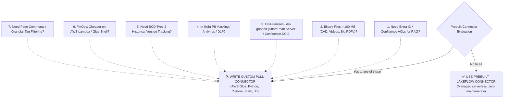

# Senior/Staff Data Engineer Technical Assessment: Custom Knowledge Connectors (SharePoint & Confluence)

> **Document Type:** Technical Interview & Candidate Calibration Guide  
> **Target Roles:** Senior Data Engineer (L5), Staff Data Engineer (L6)  
> **Domain Focus:** Custom Ingestion Connectors for Enterprise Knowledge Systems (Microsoft SharePoint & Atlassian Confluence) into a Data Lakehouse (S3 / Delta Lake / Iceberg)

---

## 1. Candidate Leveling Matrix: "The Reality Filter"

When candidates claim on their resumes that they *"designed and built custom connectors to ingest SharePoint and Confluence data into a Data Lakehouse"*, use this rubric to distinguish script wrappers from true distributed systems engineers.

```
┌─────────────────┬───────────────────────────────────┬───────────────────────────────────┬───────────────────────────────────┐
│ Evaluation Area │ L4 (Junior / Mid Data Engineer)   │ L5 (Senior Data Engineer)         │ L6 (Staff / Principal Engineer)   │
├─────────────────┼───────────────────────────────────┼───────────────────────────────────┼───────────────────────────────────┤
│ Architectural   │ Reinvents the wheel without       │ Identifies specific platform gaps │ Knows precise technical & legal   │
│ Justification   │ knowing prebuilt tools exist.     │ (e.g. 100MB limits, ACLs for RAG).│ boundaries (cost, DLP, VPC, ACLs).│
├─────────────────┼───────────────────────────────────┼───────────────────────────────────┼───────────────────────────────────┤
│ SharePoint Sync │ Recursive folder traversal with   │ Microsoft Graph `/delta` queries; │ Delta Link state machine with     │
│ Strategy        │ `os.walk` or simple GET loops.    │ stores delta tokens in database.  │ HTTP 410 self-healing baselines.  │
├─────────────────┼───────────────────────────────────┼───────────────────────────────────┼───────────────────────────────────┤
│ Memory & Buffer │ `response.content` in RAM or      │ Temp files on disk (`/tmp`) with  │ Zero-RAM chunked streaming direct │
│ Management      │ loading entire binary in memory.  │ multi-part S3 uploads.            │ to S3 (`upload_fileobj`/raw stream│
├─────────────────┼───────────────────────────────────┼───────────────────────────────────┼───────────────────────────────────┤
│ Rate Limiting   │ Naive `time.sleep()` or unhandled │ Basic exponential backoff on 429  │ Token-bucket rate limiter + full  │
│ (HTTP 429)      │ crashes on Graph/Atlassian limits.│ with `Retry-After` header parsing.│ jitter + proactive capacity pool. │
├─────────────────┼───────────────────────────────────┼───────────────────────────────────┼───────────────────────────────────┤
│ Security & ACLs │ Ignored; ingests files only       │ Basic user email permissions      │ Extracts Entra ID SIDs / groups & │
│ (Governance)    │ without access control metadata.  │ captured in separate table.       │ builds permission bitmap for RAG. │
├─────────────────┼───────────────────────────────────┼───────────────────────────────────┼───────────────────────────────────┤
│ Confluence Body │ Naive text extraction or plain    │ Ingests Storage XHTML; basic      │ Ingests Storage XHTML + ADF JSON; │
│ Parsing         │ HTML tags dumped as string.       │ macro stripping via regex/parser. │ strips UI macros, keeps hierarchy.│
├─────────────────┼───────────────────────────────────┼───────────────────────────────────┼───────────────────────────────────┤
│ Idempotency &   │ Blind overwrites on every run;    │ Checks modified timestamps before │ ETag / version cache gates before │
│ FinOps          │ re-downloads millions of files.   │ invoking download streams.        │ network call; zero-waste compute. │
└─────────────────┴───────────────────────────────────┴───────────────────────────────────┴───────────────────────────────────┘
```

---

## 2. The "Build vs. Buy" Assessment: Why Write Custom Pull Connectors?

Platforms like Databricks (Lakeflow Connect), Fivetran, and Airbyte provide prebuilt SaaS connectors for SharePoint and Confluence. A senior/staff engineer must be able to articulate **why** their team wrote a custom pull connector rather than using an off-the-shelf solution.

### The 7 Validated Production Drivers for Custom Connectors:



1. **Security Trimming & ACL Extraction for Enterprise RAG:**
   * *The Gap:* Prebuilt connectors (including Databricks Lakeflow) **do not ingest item-level Access Control Lists (ACLs)**.
   * *The Impact:* Without ACL extraction, an internal GenAI chatbot will expose confidential HR or M&A documents to unauthorized users.
   * *Custom Solution:* Custom connectors explicitly query `/permissions` (SharePoint) and `/restrictions` (Confluence) to write sidecar ACL bitmaps.
2. **Large Binary File Limits (> 100 MB):**
   * *The Gap:* Managed connectors load files into memory as single records. Official Databricks documentation states: *"Files larger than 100 MB can cause updates to fail due to memory limits"*.
   * *Custom Solution:* Custom connectors use **Zero-RAM chunked streaming** (`upload_fileobj` from `resp.raw`) to stream multi-gigabyte files into S3 with ~8 MB of RAM buffer.
3. **On-Premises & Private Network Topologies:**
   * *The Gap:* Managed SaaS connectors only support cloud endpoints (**SharePoint Online** and **Confluence Cloud**).
   * *Custom Solution:* Highly regulated enterprises with **SharePoint Server On-Premises** or **Confluence Data Center** behind corporate firewalls require custom workers deployed inside private VPCs/VNets.
4. **In-Flight Data Governance & Sanitization:**
   * *The Gap:* Prebuilt connectors dump raw files directly into storage without in-flight inspection.
   * *Custom Solution:* Custom connectors perform in-flight PII masking, ClamAV antivirus scanning, and canonical text hash deduplication *before* files touch the lakehouse.
5. **Historical Version Auditing (SCD Type 2):**
   * *The Gap:* Lakeflow SharePoint only supports `SCD_TYPE_1` (overwriting on update) for unstructured files and `APPEND_ONLY` for structured files.
   * *Custom Solution:* Custom connectors maintain immutable historical snapshots with effective date ranges (`valid_from`, `valid_to`, `is_current`).
6. **FinOps & Infrastructure Cost Optimization:**
   * *The Gap:* Spinning up Databricks Serverless or DLT pipelines for 20 low-frequency SharePoint sites incurs minimum DBU and compute charges.
   * *Custom Solution:* An **AWS Glue Python Shell job (0.0625 DPU $\approx \$0.0027/\text{hr}$)** or **AWS Lambda** polls and syncs changes for pennies per month.
7. **Granular Content Elements & Tag Filtering:**
   * *The Gap:* Prebuilt Confluence connectors do not ingest **page comments** or support filtering by tags/labels; prebuilt SharePoint connectors do not support individual file targeting.
   * *Custom Solution:* Custom pull connectors query specific labels, extract threaded discussion comments, and sync targeted paths.

---

### Probe 2.0: The "Build vs. Prebuilt" Justification Probe
* **Question to Candidate:**  
  *"Databricks provides native Lakeflow Connect for SharePoint and Confluence. Why didn't you just use that? What specific technical or governance constraints forced you to build a custom pull connector?"*

* **Ideal Senior / Staff Answer:**
  * Shows deep awareness of managed tools and immediately articulates the specific architectural boundaries:
    1. *"Our primary use case was building an enterprise RAG assistant, and Lakeflow does not ingest file-level Entra ID ACLs or Confluence page restrictions, creating a massive data leak risk."*
    2. *"We had thousands of architectural CAD diagrams and training videos exceeding 100 MB, which causes OOM failures on managed Spark binary readers."*
    3. *"Our Confluence instance was hosted on-premises on Confluence Data Center, which is unsupported by managed cloud SaaS connectors."*

* **Red Flag (L4):**  
  *"I didn't know Databricks had a connector, so I just wrote a Python script with requests."* (Indicates lack of technical awareness and high risk of reinventing the wheel).

---

## 3. Microsoft SharePoint Deep-Dive Probes

### Probe 3.1: Incremental Sync Protocol & Delta Tokens
* **Question to Candidate:**  
  *"In an enterprise tenant with 500,000 files across multiple SharePoint document libraries, how did your connector discover incremental changes without recursively traversing the full folder tree on every sync?"*

* **Ideal Senior / Staff Answer:**
  * Uses the **Microsoft Graph API Delta Query Protocol** (`/sites/{site-id}/drives/{drive-id}/root/delta`).
  * Follows `@odata.nextLink` pagination to drain batches during a sync cycle.
  * Captures and atomically persists the terminal `@odata.deltaLink` (an opaque state token) into persistent storage (S3 state file, DynamoDB, or Delta table).
  * On subsequent runs, passing `deltaLink` causes Microsoft Graph to return **only** files created, modified, or deleted since that exact watermark.

* **Follow-Up Stress Test (The Trap):**  
  *"What happens if your pipeline is paused for 45 days, and on resume, Microsoft Graph returns `HTTP 410 Gone` on your stored delta token?"*
  * **Strong Answer (L5/L6):** `HTTP 410` indicates that the delta token has expired because the tenant's transaction retention window (typically 30–60 days) was exceeded. The connector must catch `410`, invalidate the stored cursor, restart a baseline delta crawl, and use ETag/hash checks against the Lakehouse to prevent redundant binary downloads.
  * **Red Flag (L4):** *"The pipeline crashes with an uncaught exception, and someone needs to manually drop and recreate the table."*

---

### Probe 3.2: Memory Management & Large Binary Ingestion (Zero-RAM Buffer)
* **Question to Candidate:**  
  *"How did your connector stream a 2 GB video or a 500 MB CAD file inside a memory-constrained container (e.g., AWS Glue Python Shell with 1 GB RAM or Kubernetes Pod with strict cgroups)?"*

* **Ideal Senior / Staff Answer:**
  * **Never** buffer the response in memory via `response.content` or `response.text` (instant Out-Of-Memory / OOM crash).
  * **Avoid writing to local disk (`/tmp`)** because ephemeral container disk will saturate when running multi-threaded parallel downloads.
  * Uses **memory-safe chunked streaming** from the Graph download URL directly into cloud storage:
    ```python
    # Streaming direct-to-S3 with zero RAM buffer
    with http_session.get(download_url, stream=True) as stream_resp:
        stream_resp.raise_for_status()
        s3_client.upload_fileobj(
            Fileobj=stream_resp.raw,
            Bucket="enterprise-lakehouse-raw",
            Key=f"sharepoint/{site_id}/{item_id}/{file_name}",
            ExtraArgs={"ContentType": mime_type}
        )
    ```

---

### Probe 3.3: Microsoft Entra ID (Azure AD) ACLs & Security Trimming
* **Question to Candidate:**  
  *"If this data lands in a Lakehouse to power an enterprise RAG assistant, how did your connector extract permissions so that a regular employee cannot query executive payroll spreadsheets?"*

* **Ideal Senior / Staff Answer:**
  * File-level ingestion without ACL extraction is a major security and compliance violation.
  * The connector must query `/sites/{site-id}/drive/items/{item-id}/permissions`.
  * Extracts the `grantedToV2` object containing:
    * User Principal Names (`user:jane.doe@company.com`)
    * Entra ID Security Group Object IDs (`group:4a123456-7890-...`)
  * Writes a **Sidecar Metadata JSON** or appends an `allowed_principals` array column in Delta Lake:
    ```json
    {
      "doc_id": "01ABCD...",
      "file_name": "Q3_Executive_Compensation.xlsx",
      "allowed_principals": [
        "group:8e45f210-91a2-4a0b-bc11-123456789abc",
        "user:cfo@company.com"
      ],
      "inherited_from_parent": true
    }
    ```

---

### Probe 3.4: Deletion & Move Semantics
* **Question to Candidate:**  
  *"How did your connector handle a user renaming a file, moving it to a new folder, or deleting it entirely?"*

* **Ideal Senior / Staff Answer:**
  * **Deletions:** Microsoft Graph Delta emits an item with `@removed: {"reason": "deleted"}`. The connector must write an explicit **Tombstone marker** (`/DELETED` file or Delta soft-delete record) to trigger vector index purging and maintain GDPR compliance.
  * **Renames / Moves:** Graph API returns the existing unique `item_id` with an updated `parentReference.id` or `name`. The connector updates metadata pointers rather than downloading the entire file binary again.

---

## 4. Atlassian Confluence Deep-Dive Probes

### Probe 4.1: Content Formats & Macro Extraction
* **Question to Candidate:**  
  *"Confluence pages contain complex UI macros, code blocks, info panels, and expand sections. What exact format did your connector extract, and how did you clean it for the Lakehouse?"*

* **Ideal Senior / Staff Answer:**
  * Confluence REST API v2 provides multiple formats via `?body-format=storage`:
    * `storage`: Raw Confluence XHTML (the authoritative source representation).
    * `atlas_doc_format` (ADF): Atlassian Document Format JSON (used in Cloud editor).
  * **Parsing & Cleaning:** Raw storage XHTML contains proprietary tags (e.g., `<ac:structured-macro>`, `<ac:parameter>`). The pipeline must parse the XHTML tree (using BeautifulSoup, lxml, or custom AST) to:
    1. Extract code blocks (`<ac:plain-text-body>`) and table structures cleanly.
    2. Strip navigation macros, user mention cards, and layout wrappers.
    3. Retain clean semantic Markdown or plaintext for downstream chunking.

---

### Probe 4.2: Page Tree Hierarchy Preservation
* **Question to Candidate:**  
  *"How did you preserve parent-child page hierarchies (e.g., Engineering > Architecture > Data Ingestion) for breadcrumb navigation in the search index?"*

* **Ideal Senior / Staff Answer:**
  * The connector captures `parentId`, `parentType`, and `spaceId` on each page payload.
  * Emits these fields into the Lakehouse schema.
  * Downstream transformation builds an adjacency list or path string (e.g., `/Engineering/Architecture/Data_Ingestion`) using recursive Spark SQL queries or topological graph sorting.

---

### Probe 4.3: Incremental Sync & Version Caching
* **Question to Candidate:**  
  *"How did your Confluence connector track incremental page updates without re-fetching thousands of unchanged pages?"*

* **Ideal Senior / Staff Answer:**
  * Uses `/api/v2/pages?limit=50&sort=modified-date` filtered by a persistent watermark (`last_sync_timestamp`).
  * Compares `version.createdAt` against the watermark.
  * Stores `version.number` as an ETag. Before downloading the storage body payload, it checks if `version.number` matches the stored S3 metadata. If matched, it marks the record as `SKIPPED` in sub-milliseconds.

---

### Probe 4.4: Confluence Restrictions (Security Trimming)
* **Question to Candidate:**  
  *"How did your connector capture Confluence access restrictions?"*

* **Ideal Senior / Staff Answer:**
  * Confluence uses a two-tier security model: **Space-Level Permissions** and **Page-Level Restrictions**.
  * The connector queries `/api/v2/pages/{page_id}/restrictions` for `read` operations.
  * If restrictions exist, it extracts restricted user Account IDs and group names.
  * If restrictions are absent, it assigns default space authorization (`confluence:space:{space_key}`).

---

## 5. Cross-Cutting Distributed Systems & FinOps Probes

### Probe 5.1: Rate Limiting & Throttling (HTTP 429 Interceptors)
* **Question to Candidate:**  
  *"Both Microsoft Graph and Atlassian Cloud enforce aggressive request throttling. How did your connector prevent 429 cascades across concurrent worker threads?"*

* **Ideal Senior / Staff Answer:**
  * **Token-Bucket Rate Limiter:** Implements a proactive rate limiter (e.g., max 10–15 req/sec per tenant) to avoid hitting quotas in the first place.
  * **Reactive Interceptor with Jitter:** When `HTTP 429` occurs, it reads the `Retry-After` header and sleeps with **Full Randomized Exponential Jitter**:
    $$\text{Sleep} = \text{base\_delay} \times 2^{\text{attempt}} + \text{Uniform}(0.1, 0.5) \times \text{sleep\_time}$$
  * **Red Flag:** Fixed `time.sleep(5)` without jitter (causes the "Thundering Herd" problem where all concurrent threads wake up simultaneously and hammer the API again).

---

### Probe 5.2: Exactly-Once Ingestion & Atomic Checkpoints
* **Question to Candidate:**  
  *"If an AWS Glue / Spark worker pod crashes after downloading 7,500 files out of a 10,000-file batch, how do you guarantee exactly-once state without duplicating files or missing updates?"*

* **Ideal Senior / Staff Answer:**
  * **Atomic 'Commit-After-Write':** The delta cursor or timestamp watermark is **never updated** at the start of a batch; it is committed atomically to S3/Delta *only after* the full page batch has been processed and verified.
  * **Deterministic Path Hashing:** Storage keys are strictly deterministic (e.g., `s3://bucket/raw/sharepoint/{site_id}/{item_id}/{file_name}`).
  * **Pre-Download ETag Check:** When the replacement worker restarts, it checks existing S3 metadata ETags in sub-milliseconds and skips re-downloading files that were already successfully written.

---

### Probe 5.3: Corrupt Data Quarantine (Poison Pill Handling)
* **Question to Candidate:**  
  *"What happens when SharePoint returns a corrupted 0-byte file, an encrypted PDF, or an unparseable JSON payload?"*

* **Ideal Senior / Staff Answer:**
  * Never allow a single bad record to raise an uncaught exception and crash the entire streaming batch.
  * **Non-Blocking Quarantine Side-Output:**
    1. The exception is caught at the item level.
    2. The raw payload, error message, and full stack trace are written to a dedicated quarantine prefix (`quarantine/{source}/{item_id}/error.json`).
    3. Increments a `quarantined_docs` telemetry metric and continues processing valid records.

---

## 6. Live Coding & Architecture Whiteboard Challenge

Give the candidate this prompt on a whiteboard or live coding session:

### Challenge Prompt:
> *"Design and write a production-grade Python class `SharePointConnector` that executes an incremental delta sync from Microsoft Graph API into Amazon S3. The solution must support: (1) Graph Delta query pagination, (2) Zero-RAM chunked streaming direct to S3, (3) ETag-based idempotency to skip unchanged files, (4) HTTP 429 retry with jitter, and (5) Atomic cursor checkpointing."*

### Reference Implementation Checklist:
* [ ] Uses `requests.Session` with connection pooling.
* [ ] Traverses `@odata.nextLink` and saves `@odata.deltaLink`.
* [ ] Streams download URLs using `stream=True` and `boto3.s3.upload_fileobj(resp.raw, ...)`.
* [ ] Checks existing S3 metadata ETag to distinguish `INSERT`, `UPDATE`, and `SKIP`.
* [ ] Captures `HTTP 429` and reads `Retry-After` header.
* [ ] Writes sidecar `metadata.json` containing Entra ID permissions.
* [ ] Isolates errors into a `quarantine/` prefix without breaking the loop.

---

## 7. Interviewer Evaluation Scorecard

```
+-----------------------------------------------------------------------------------------------+
|                                CANDIDATE EVALUATION SCORECARD                                 |
+--------------------------+-------+------------------------------------------------------------+
| Technical Competency     | Score | Evaluation Criteria                                        |
+--------------------------+-------+------------------------------------------------------------+
| 1. Build vs Buy Logic    | / 15  | Articulates why custom is needed (ACLs, 100MB, on-prem,DLP)|
| 2. API Protocol Mastery  | / 20  | Deep knowledge of Graph Delta queries, ADF/XHTML, HTTP 410 |
| 3. Memory & I/O Safety   | / 20  | Zero-RAM chunked streaming; no memory buffer blowups       |
| 4. Concurrency & Rate    | / 15  | Token-bucket limiting; exponential backoff + full jitter   |
| 5. Security Trimming     | / 15  | Extracts Entra ID SIDs & Confluence user/group ACLs        |
| 6. State & Idempotency   | / 15  | Deterministic keys, ETag caching, atomic checkpoint commits|
+--------------------------+-------+------------------------------------------------------------+
| TOTAL SCORE              | / 100 | ≥ 85: Strong Hire (Staff) | 70-84: Hire (Senior) | < 70: No|
+--------------------------+-------+------------------------------------------------------------+
```
